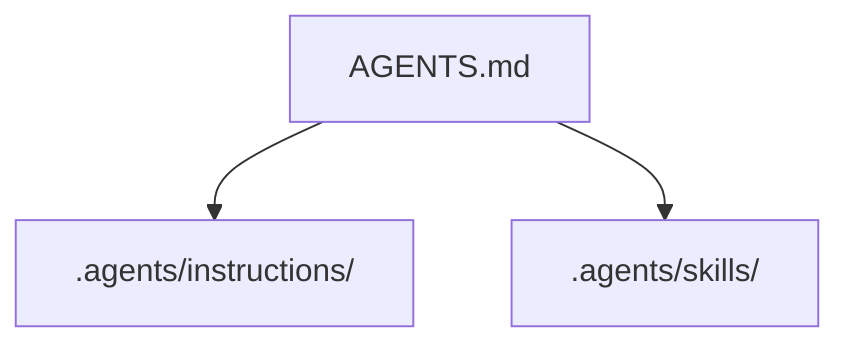
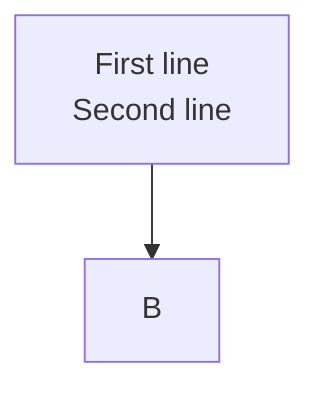
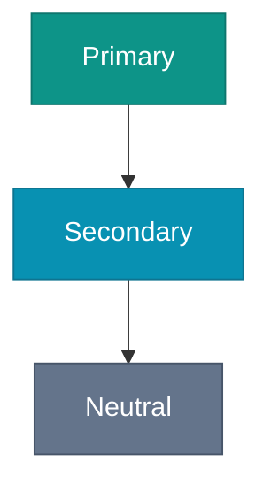

# VitePress Conventions

## Configuration

Config lives at `.vitepress/config.mts`. Key settings:

```ts
srcDir: 'content'   // VitePress reads pages from content/, not root or docs/
```

`docs/` is reserved for project documentation (ADRs, architecture overview). Do not change `srcDir`.

The Mermaid plugin is wired via `withMermaid()` wrapping `defineConfig()`. Do not unwrap it.

## Content files

All book prose lives under `content/`. File paths become URL paths:

```
content/index.md              → /
content/foundation/index.md   → /foundation/
content/foundation/why.md     → /foundation/why
```

Use `index.md` as the landing page for each topic directory.

## Sidebar

The sidebar is configured manually in `.vitepress/config.mts` under `themeConfig.sidebar`. It does not auto-generate from the file tree. Update the sidebar when adding or removing content files. The `update-sidebar` skill can regenerate it.

Sidebar format:
```ts
sidebar: [
  {
    text: 'Foundation',
    items: [
      { text: 'Why Structure Matters', link: '/foundation/why-structure' },
    ]
  }
]
```

## Mermaid diagrams

Use fenced code blocks with the `mermaid` language tag. No SVG exports — diagrams are source-only.

````md

````

For line breaks inside node labels, use `<br>`, not `\n`:

````md

````

### Diagram styling

Every diagram uses the same three-color palette so the book reads as one set and renders on both the light and dark theme. The colors are solid mid-tone fills with white text, which holds contrast on either background. Do not use pale pastel fills or leave category nodes the default color: those wash out on one theme or the other.

Declare the palette with `classDef` at the top of the diagram and tag nodes with `:::class`:

````md

````

These are the only three fills in use across the book:

| Fill | Stroke | Text | Role |
| --- | --- | --- | --- |
| `#0d9488` (teal) | `#0f766e` | `#fff` | primary subject: intent, behavioral change, the Intent Engineering path |
| `#0891b2` (cyan) | `#0e7490` | `#fff` | secondary or one-off element: specs, docs |
| `#64748b` (slate) | `#475569` | `#fff` | neutral or pre-existing context: existing SDLC, trunk, structural change |

Class names are local to each diagram and name the role there (`behavioral`, `docs`, `existing`, `intent`); the fills stay fixed. Pure process or input nodes (a "Write spec" step, a `main` sink) can stay unstyled.

## Frontmatter

Regular chapter pages need no frontmatter. The home page (`content/index.md`) uses `layout: home` with a `hero` block.

Do not add `title` or `description` frontmatter to chapter pages — the page H1 is the title.

## Build commands

```bash
npm run docs:dev      # dev server at http://localhost:5173 (hot reload)
npm run docs:build    # production build → .vitepress/dist/
npm run docs:preview  # serve .vitepress/dist/ locally
```

The build output goes to `.vitepress/dist/`. This directory is gitignored. GitHub Actions deploys it via `upload-pages-artifact`.

## Adding a new chapter

1. Create the `.md` file under the correct `content/<topic>/` directory
2. Add it to the sidebar in `.vitepress/config.mts`
3. Verify with `npm run docs:build`
