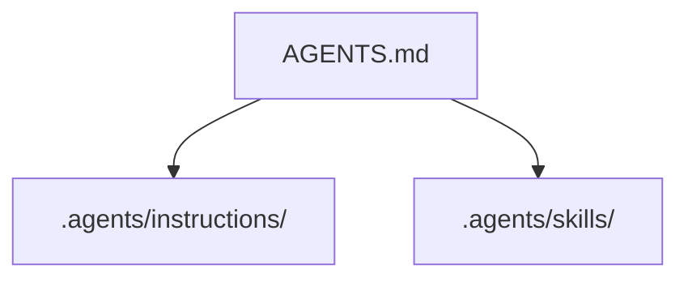

# VitePress Conventions

## Configuration

Config lives at `.vitepress/config.mts`. Key settings:

```ts
srcDir: 'content'   // VitePress reads pages from content/, not root or docs/
```

`docs/` is reserved for ASE documentation (ADRs, architecture overview). Do not change `srcDir`.

The Mermaid plugin is wired via `withMermaid()` wrapping `defineConfig()`. Do not unwrap it.

## Content files

All book prose lives under `content/`. File paths become URL paths:

```
content/index.md              → /
content/foundation/index.md   → /foundation/
content/foundation/why.md     → /foundation/why
```

Use `index.md` as the landing page for each topic directory.

## Sidebar

The sidebar is configured manually in `.vitepress/config.mts` under `themeConfig.sidebar`. It does not auto-generate from the file tree. Update the sidebar when adding or removing content files. The `update-sidebar` skill can regenerate it.

Sidebar format:
```ts
sidebar: [
  {
    text: 'Foundation',
    items: [
      { text: 'Why Structure Matters', link: '/foundation/why-structure' },
    ]
  }
]
```

## Mermaid diagrams

Use fenced code blocks with the `mermaid` language tag. No SVG exports — diagrams are source-only.

````md

````

## Frontmatter

Regular chapter pages need no frontmatter. The home page (`content/index.md`) uses `layout: home` with a `hero` block.

Do not add `title` or `description` frontmatter to chapter pages — the page H1 is the title.

## Build commands

```bash
npm run docs:dev      # dev server at http://localhost:5173 (hot reload)
npm run docs:build    # production build → .vitepress/dist/
npm run docs:preview  # serve .vitepress/dist/ locally
```

The build output goes to `.vitepress/dist/`. This directory is gitignored. GitHub Actions deploys it via `upload-pages-artifact`.

## Adding a new chapter

1. Create the `.md` file under the correct `content/<topic>/` directory
2. Add it to the sidebar in `.vitepress/config.mts`
3. Verify with `npm run docs:build`
