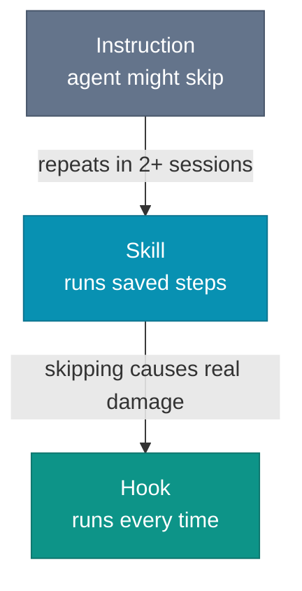

# Skills, Commands, and Hooks

The same workflow has more than one home, and where you put it decides whether it runs.

Take a concrete one: after modifying `api-spec.yaml`, regenerate the TypeScript types so the client stays in sync with the contract.

Write it as an instruction, a line in `AGENTS.md` or an instruction file, and you have described the workflow. The agent loads the instruction, reads "regenerate the types after editing the spec", and decides whether this is the moment to act. Type it as a prompt at the moment, and nothing fundamental changes: the agent still decides. Both are advisory.

In a session focused on making a failing test pass, the agent renames a field in `api-spec.yaml` and skips the regeneration. The generated types still describe the old field, every file that imports them still compiles, and the test goes green. The drift surfaces later, at runtime, when the client reads a field the server no longer sends.

Write it as a skill and you have automated the workflow. A skill is a procedure the agent runs as discrete steps, not prose it weighs against the task in front of it. Expose that skill as a command, and a developer fires the same steps by hand. Write it as a hook and the decision disappears: the script runs on the triggering event whether the agent considered it or not.

Instructions and prompts describe the work. This chapter is about the three mechanisms that make it run: skills, commands, and hooks.

## Skills: automate the work you keep repeating

A skill is pure automation. Take a workflow you run the same way every time, cutting a release, regenerating types from a spec, refreshing a changelog, rebuilding a status report, and write the steps down as a procedure the agent executes. None of those steps demands judgment. They wrap the creative work, the rote part a shell script would handle if a shell script knew what to do with a malformed file.

The hub chapter placed skills in `.agents/skills/` and drew the line against instructions: an instruction says how the repo works, a skill does one repeatable task. The harder question is what makes one skill execute the same steps every run while another leaves the agent to guess what the steps were.

A skill runs two ways. You trigger it explicitly, typing its name as a slash command the moment you want it. Or the agent triggers it implicitly, matching the task in front of it against the skill's one-line description and reaching for the file on its own. A vague description fires the wrong skill, or never fires at all. Same steps either way, two trigger paths.

Whichever path fires, the agent runs what the file spells out and improvises the rest.

What separates a skill that runs the same way every time from one the agent reconstructs on the fly is specificity. Spell out discrete, checkable steps instead of prose: not "regenerate the types", but "run `npm run generate:types`, confirm `tsc --noEmit` passes with zero errors, and fix any import paths still pointing at the stale file". Give it a completion condition, so done means zero errors and not new files on disk. Name the failure you expect, so a malformed spec makes the agent stop and report instead of hand-editing the generated types by guesswork.

You do not have to write any of this yourself. Set the agent in plan mode. Describe the workflow to the agent, tell it you want a reusable skill file to invoke as a slash command, and let it draft the Markdown. Review the output, fix the steps that are wrong, and commit. The agent that wrote the skill is the agent that will run it, and it tends to know its own edge cases.

*Sources: Anthropic, "Building effective agents" (Dec 2024), workflows as predefined code paths versus agents that direct their own process.*

## Commands: a skill you trigger by hand

A command is not a second kind of thing to build. Take any skill, type its name as a slash command, and you have invoked it by hand instead of waiting for the agent to reach for it. Same file, same steps. The only thing that changed is who pulled the trigger.

So why have them? The agent will not always recognize the moment. You finished the change, and you want the release cut now, not whenever some future task description happens to match. Typing `/generate-types` runs the procedure on demand.

The trigger is not always a human too. When an external program drives the agent, a CI step, or a script wrapping the CLI, it needs a deterministic handle to call by name. It invokes `/generate-types` and gets that exact procedure, instead of feeding the agent a prose task and hoping it reaches for the right skill.

Give the command a name you will remember under pressure. `/generate-types` is one you reach for. `/synchronize-openapi-typescript-types` is one you look up. Each tool exposes its own command surface, and the key differs, but every one of them fires the same skill file, not a separate command definition you maintain alongside it.

## Agent-facing commands need an explicit contract

A command written for a person stalls an agent at the first prompt. The command prints a progress bar, asks `Continue? [y/N]`, mixes logs into the output, and waits. The agent has no stable place to read the result from and no stable way to tell failure from chatter.

This book uses a simple contract for agent-facing commands. It is a practical pattern, not a field standard.

- Logs, progress bars, and JSON land in one stream. The agent has to guess which line is the answer.
- The command asks `Continue? [y/N]` and waits. The agent hangs.
- The command deletes data as soon as it runs. The agent has no safe way to check its inputs first.
- The command fails with `bad request` or exit code `1`. The agent still does not know what to fix.

The agent-facing version should do four plain things instead:

- Print the result to `stdout`, and nothing else.
- Print warnings and diagnostics to `stderr`.
- Fail instead of prompting.
- Offer a safe check before the real command runs.

Then add three controls:

- A manifest command listing available commands and required flags
- Stable error codes separating `missing file` from `missing auth`
- One explicit next step in the result when the follow-up is obvious

A short command surface is enough:

```text
tool submit --agent --dry-run
tool agent manifest
```

The output should read like data, not terminal noise:

```json
{
  "command": "submit",
  "inputs": { "dataset": "dataset-42" },
  "result": "blocked",
  "errors": [
    {
      "code": "OBJECT_MISSING",
      "message": "3 files are missing from dataset-42",
      "remediation": "Run `tool dataset inspect dataset-42`"
    }
  ],
  "nextActions": [
    "tool dataset inspect dataset-42"
  ]
}
```

The failure mode is concrete. A human-oriented CLI prints `Continue? [y/N]` and waits forever. An agent-facing CLI exits at once with `CONFIRMATION_REQUIRED` and names the missing flag. A human-oriented CLI writes warnings into the same stream as the JSON. An agent-facing CLI keeps `stdout` clean and puts the warnings on `stderr`.

This is not polish, but control. An agent should not scrape help text to discover which command lists datasets, which one mutates state, or which missing input blocked the run. The command surface should say so directly.

*Sources: Anthropic, "Building effective agents" (Dec 2024), predefined workflows, and deterministic paths. The command contract in this section is this book's synthesis.*

## Hooks: determinism, like a database trigger

A skill runs only when it is triggered, and the trigger gets missed two ways. You forget the command. Or the agent edits the spec, never registers the edit as the event that should run the skill, and the drift it would have caught ships.

A hook does not wait and does not choose. It fires on the event, every time, the way a database trigger fires on every INSERT whether the application remembered to call it or not. Edit a `.py` file, the formatter runs. Stage a commit, the secret scan runs. The agent does not get to decide.

That is the whole reason hooks exist next to skills. A skill automates the work. A hook removes the decision to run it. When skipping a step once costs more than running it every time, you want the trigger, not the reminder.

Keep each hook narrow. A hook that runs `ruff` on every modified Python file does one thing and fails clearly when that thing fails. A hook that runs the full test suite on every edit blocks the agent at every step, and a blocked agent gets the hook disabled. A hook prevents one specific drift. It does not rerun CI.

Hook syntax is tool-specific. As of mid-2026, a hook written for Claude Code does not drop into Cursor or Copilot unchanged, and one that blocks unexpectedly is awkward to debug. Expect those details to shift as the tooling matures. Start with the one check you cannot afford to skip. Add a second only after the first has caught real drift without blocking the agent into disabling it.

*Sources: Anthropic, "Building effective agents" (Dec 2024), predefined deterministic paths versus leaving the choice to the agent.*

## Which one, and when

Each mechanism fails differently when it is missing. Without the instruction, the agent does not know the convention and improvises. Without the skill, it knows what to do but re-derives the steps every session and sometimes gets them wrong. Without the hook, it knows what to do and usually does it, and "usually" is the problem for the steps that cannot be skipped.

Stack them in that order. Get the instruction right first: specific, testable, covering the agent's defaults. Add a skill when the same procedure shows up in more than two sessions. Add a hook when skipping the procedure causes real damage rather than drift.



The cost is real, so weigh it. A simple workflow you run once a month does not need a skill, the instruction covers it. A check that fails once a quarter does not need a hook, because code review catches it. Below that line, the wiring costs more than the drift it prevents.

Frequency is not the only reason to write a skill. A release procedure whose steps must run in a fixed order, where publishing before the signing step ships an unsigned artifact, belongs in a skill even if you rarely cut a release. The skill pins the correct order, so the agent and every developer run it the same way instead of reconstructing it under pressure.

The practical test: if the agent gets the procedure wrong twice, write the skill. Write it sooner when one wrong run is too expensive to risk even once, like that release. If the agent skips it and something breaks, write the hook. Until then, an instruction and a code review are enough.

A skill is only as reliable as the context that triggers it. The agent renames a field in `api-spec.yaml` in hour one. An hour later the window has filled with test output and diffs, that edit has scrolled out of context, and the agent moves to the next task without ever connecting it to the regenerate-types skill. The skill was written correctly and never fired, because the change that should have triggered it is no longer in front of the agent.

The procedure was never the hard part. Keeping the agent's context intact is.
