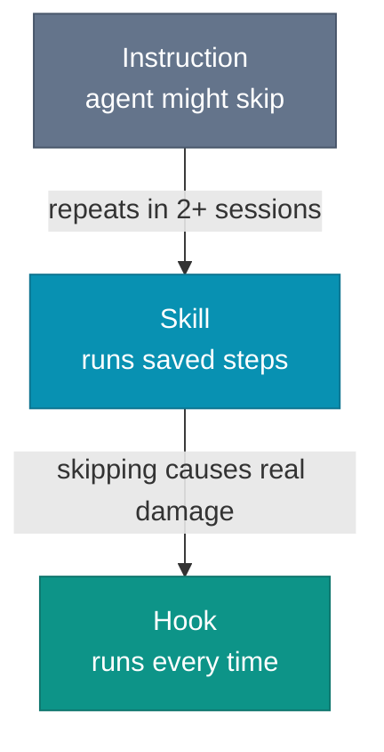

# Skills, Commands, and Hooks

The same workflow has more than one home, and where you put it decides whether it runs.

Take a concrete example: after modifying `api-spec.yaml`, regenerate the TypeScript types so the client stays in sync with the contract.

Write it as an instruction and you have described the workflow. The agent reads "regenerate the types after editing the spec" and decides whether this is the moment to act. Write it as a skill and you have automated the workflow. Expose that skill as a command and a developer fires the same steps by hand. Write it as a hook and the decision disappears.

Instructions and prompts describe the work. This chapter is about the three mechanisms that make it run: skills, commands, and hooks.

## Skills: automate the work you keep repeating

A skill is pure automation. Take a workflow you run the same way every time, like cutting a release, regenerating types from a spec, refreshing a changelog, or rebuilding a status report, and write the steps down as a procedure the agent executes.

The difference between a reliable skill and a vague one is specificity. Spell out discrete, checkable steps instead of prose: not "regenerate the types", but "run `npm run generate:types`, confirm `tsc --noEmit` passes with zero errors, and fix any import paths still pointing at the stale file". Give it a completion condition. Name the failure you expect.

A skill runs two ways. You trigger it explicitly, typing its name as a slash command when you want it. Or the agent triggers it implicitly, matching the task in front of it against the skill's one-line description and reaching for the file on its own.

You do not have to write every skill by hand. Describe the workflow to the agent, tell it you want a reusable skill file, let it draft the Markdown, then review the result like any other generated artifact.

*Sources: Anthropic, "Building effective agents" (December 2024), workflows as predefined code paths versus agents that direct their own process.*

## Commands: a skill you trigger by hand

A command is not a second kind of thing to build. Take any skill, type its name as a slash command, and you have invoked it by hand instead of waiting for the agent to reach for it.

Commands matter because the agent will not always recognize the moment. You finished the change and want the release cut now, not whenever some future task description happens to match.

The trigger is not always a human. When an external program drives the agent, a CI step or a script wrapping the CLI, it needs a deterministic handle to call by name.

Give the command a name you will remember under pressure. `/generate-types` is one you reach for. `/synchronize-openapi-typescript-types` is one you look up.

## Agent-facing commands need an explicit contract

A command written for a person stalls an agent at the first prompt. The command prints a progress bar, asks `Continue? [y/N]`, mixes logs into the output, and waits.

This book uses a simple contract for agent-facing commands. It is a practical pattern, not a field standard.

The agent-facing version should do four plain things:

- Print the result to `stdout`, and nothing else
- Print warnings and diagnostics to `stderr`
- Fail instead of prompting
- Offer a safe check before the real command runs

Then add three controls:

- A manifest command listing available commands and required flags
- Stable error codes separating `missing file` from `missing auth`
- One explicit next step in the result when the follow-up is obvious

A short command set is enough:

```text
tool submit --agent --dry-run
tool agent manifest
```

The output should read like data, not terminal noise:

```json
{
  "command": "submit",
  "inputs": { "dataset": "dataset-42" },
  "result": "blocked",
  "errors": [
    {
      "code": "OBJECT_MISSING",
      "message": "3 files are missing from dataset-42",
      "remediation": "Run `tool dataset inspect dataset-42`"
    }
  ],
  "nextActions": [
    "tool dataset inspect dataset-42"
  ]
}
```

This is not polish. It is control. An agent should not have to scrape help text to discover which command lists datasets, which one mutates state, or which missing input blocked the run.

*Sources: Anthropic, "Building effective agents" (December 2024), predefined workflows, and deterministic paths. The command contract in this section is this book's synthesis.*

## Hooks: determinism, like a database trigger

A skill runs only when it is triggered, and the trigger gets missed two ways. You forget the command. Or the agent edits the spec, never registers the edit as the event that should run the skill, and the drift it would have caught ships.

A hook does not wait and does not choose. It fires on the event, every time, the way a database trigger fires on every `INSERT` whether the application remembered to call it or not. Edit a `.py` file, the formatter runs. Stage a commit, the secret scan runs.

Hooks exist next to skills for exactly this reason. A skill automates the work. A hook removes the decision to run it.

Keep each hook narrow. A hook that runs `ruff` on every modified Python file does one thing and fails clearly when that thing fails. A hook that runs the full test suite on every edit blocks the agent at every step and usually gets disabled.

Hook syntax is tool-specific. As of mid-2026, a hook written for Claude Code does not drop into Cursor or Copilot unchanged, and one that blocks unexpectedly is awkward to debug. Start with the one check you cannot afford to skip.

*Sources: Anthropic, "Building effective agents" (December 2024), predefined deterministic paths versus leaving the choice to the agent.*

## Which one, and when

Each mechanism fails differently when it is missing. Without the instruction, the agent does not know the convention and improvises. Without the skill, it knows what to do but re-derives the steps every session and sometimes gets them wrong. The hook is the only one that holds under pressure.

Stack them in that order. Get the instruction right first: specific, testable, covering the agent's defaults. Add a skill when the same procedure shows up in more than two sessions. Add a hook when skipping the procedure causes real damage rather than mild drift.



The cost is real, so weigh it. A simple workflow you run once a month does not need a skill. A check that fails once a quarter usually does not need a hook.

Frequency is not the only reason to write a skill. A release procedure whose steps must run in a fixed order belongs in a skill even if you rarely cut a release.

Use a simple threshold. If the agent gets the procedure wrong twice, write the skill. If the agent skips the procedure and something breaks, write the hook. Until then, an instruction and code review are usually enough.

A skill is only as reliable as the context that triggers it. The agent renames a field in `api-spec.yaml` in hour one. An hour later the window has filled with test output and diffs, that edit has scrolled out of context, and the agent moves on without ever connecting it to the regenerate-types skill.

The procedure was never the hard part. Keeping the agent's context intact is.
