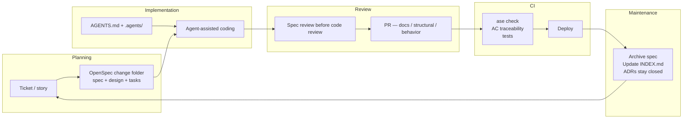

# The Map — ASE and the SDLC

The pitch most agentic-engineering material makes is implicit: throw out your SDLC and adopt the new one. New ceremonies. New artefacts. New review process. Your existing tooling becomes legacy on contact.

That pitch dies on first contact with any team that has working CI, an established review culture, and a Jira board people actually use. So this book makes a different pitch.

ASE extends the SDLC. The ceremonies stay. The artefacts inside them change.

## The map

Five phases, none of them new. Inside each, ASE adds artefacts that make agentic work more legible.

## Planning: from ticket to spec

The change starts the way it always has. A ticket. A story. A Linear card. OpenSpec adds a sibling artefact — `openspec/changes/<name>/` — containing a proposal, a delta spec, a design doc, and a tasks file. The ticket is still the unit of tracking. The spec is the unit of intent.

Not every change earns a spec. A typo fix does not. A dependency bump does not. Anything that touches behaviour, architecture, or that you intend to hand to an agent — write the spec first. The Spec-Driven topic covers when and how. The principle here is narrower: planning is where intent gets fixed, and fixed intent is what the agent works from.

*Sources: Farley, *Modern Software Engineering* (Addison-Wesley, 2021) — intent over artefact.*

## Implementation: brief the agent through the repo

When the agent starts implementing, it loads `AGENTS.md` first. From there it finds the relevant instructions, the architecture overview, and the spec for the current change. The briefing is in the repo. It is not delivered through a chat message that disappears when the session ends.

The contrast matters at scale. A briefing in a chat session works for one developer for one hour. A briefing in `AGENTS.md` and `.agents/instructions/` works for every agent session, every developer, every CI run, on every machine. Same briefing, every time. The repo is the briefing.

## Review: intent first, diff second

Two reviews per PR, not one. The spec delta says what the change is supposed to do. The diff says what got built. Review the spec first — does the intent match what was agreed? Then review the diff — does the implementation match the intent?

This sequencing is cheap to adopt and surprisingly effective. A reviewer who reads the diff first anchors on whether the code is well-written. A reviewer who reads the spec first asks whether the *change* is the right change at all. The first version of the question rarely gets asked when the diff is already in front of you.

PR taxonomy keeps the review focused. A `docs`-only PR does not need behaviour scrutiny. A `behavior` PR does not get cluttered by formatting changes that should have been their own `structural` PR. The Quality topic covers taxonomy in detail.

## CI: the pipeline checks the conventions

`ase check` runs on every push. It validates that `AGENTS.md` is present and well-formed. That `docs/README.md` and `docs/INDEX.md` exist. That ADRs follow MADR. That spec scenarios have AC IDs and test declarations. Not a new pipeline — a new check inside the pipeline you already have.

AC traceability links scenarios to tests. A test marked `@pytest.mark.ac("SCAFFOLD-001")` proves that scenario when it passes. The traceability survives spec archival; six months later, the audit trail still answers "which test covered this?" without grep guessing.

*Sources: Microsoft, "An AI-led SDLC" (2026). IBM, "AI in SDLC" (ongoing). continuousdelivery.com — Farley and Humble.*

## Maintenance: the step everyone skips

After a change ships, archive the spec. Update `docs/INDEX.md` if any docs files moved. Leave ADRs closed. Update `AGENTS.md` if the change altered a convention.

This is the step where ASE most reliably falls apart in practice. Archiving takes two minutes. The cost of skipping it shows up months later, when the agent reads four half-implemented proposals as live context and produces code that satisfies none of them. By then archiving costs an afternoon of triage instead of two minutes per change.

`ase check` catches some of this — `docs-index-stale` flags the index that does not match the file tree. It cannot catch the design doc that should have become an ADR, or the convention that quietly changed without a corresponding `AGENTS.md` edit. That part stays human.

## What stays the same

The sprint process. The PR workflow. The Jira board. The deployment pipeline. None of these change. ASE adds artefacts inside existing steps and one CI check.

This is a deliberate constraint. New ceremonies age fast. Existing ones already have tooling, muscle memory, and review culture. ASE borrows that infrastructure rather than asking the team to rebuild it.
