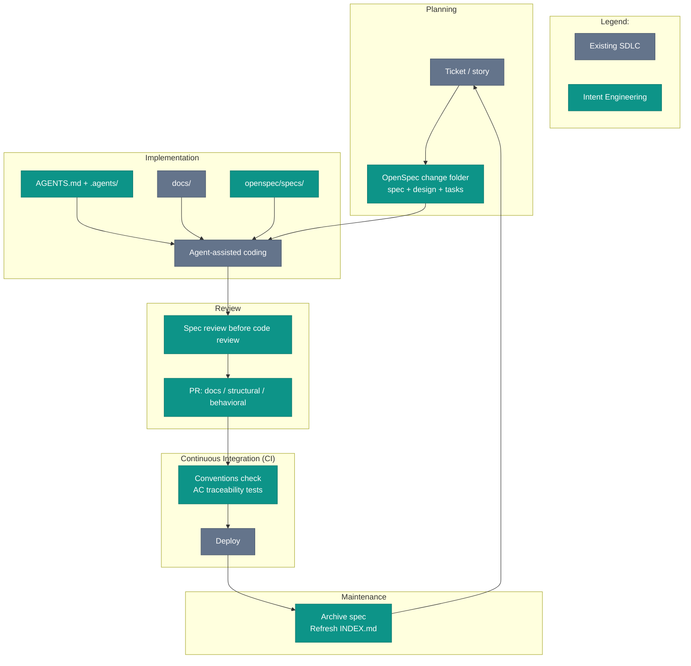

# Intent Engineering and the SDLC

This chapter rejects a tempting pitch: replace your SDLC with a new one. New ceremonies, new artifacts, new review process. Existing tooling becomes legacy on contact.

The pitch fails where engineering process already has teeth: Continuous Integration (CI) catches mistakes, reviewers defend standards, and the Jira board drives planning. This chapter makes the opposite move. Keep the delivery loop. Change the artifacts moving through the loop.

This book uses Spec-Driven Development for the broader practice of _writing intent before writing code_. Intent Engineering is this book's version of the practice. The Software Development Life Cycle (SDLC) stays in place.

*Sources: Sommerville, Software Engineering (10th ed., Pearson, 2015), ch. 2, the SDLC as the structured sequence from idea to production.*

## The map

Read the diagram as an overlay. Gray marks existing process or repo context. Teal marks Intent Engineering context, an intent artifact, a review step, or a check.

The phases are familiar. The overlay changes what evidence each phase leaves behind.

## Planning: from ticket to spec

The change starts in the usual place: a ticket, a story, a Linear card. In this book's OpenSpec workflow, the sibling artifact is `openspec/changes/<name>/`: `proposal.md`, delta specs (one per capability under `specs/`), `tasks.md`, and optionally `design.md`. The ticket tracks the work. The spec captures intent.

Most changes do not need a spec. Typo fixes and dependency bumps should stay light. Bugs need judgment. If correct behavior is obvious, skip the spec. If reconstructing intended behavior is the hard part, put the reasoning in a spec before restoring the code.

Architecture changes and agent-led implementation need the target before code exists. Without a target, the agent fills the empty space with plausible work nobody requested.

*Sources: Farley, Modern Software Engineering (Addison-Wesley, 2021), intent over artifact.*

## Implementation: brief the agent through the repo

Once the spec exists, the agent needs the repo briefing: `AGENTS.md`, `.agents/`, project docs under `docs/`, canonical specs under `openspec/specs/`, and the spec for the current change. `AGENTS.md` loads first and points outward. From there the agent finds the relevant instructions, docs, and specs.

Chat briefings decay at the session boundary. Committed instructions, docs, and specs give every session the same starting point: developer, agent, CI run, laptop, and fresh clone. Same briefing, every time. The repo becomes the briefing.

## Review: intent first, code second

The agent commits. The PR opens. A normal review path collapses intent and code into one diff conversation. Intent Engineering separates them.

The spec delta says what the change is supposed to do. The code diff says what got built. Read the spec first. Does intent match agreement? Then read the code. Does implementation match intent?

The sequence moves one question earlier: are we building the right change at all? Once the diff dominates the screen, the question gets expensive. [Code Review for Agent-Generated Code](../team/code-review-agent-code) takes up the mechanics of making spec-first review the default path.

PR taxonomy gives the reviewer a second guardrail. A `docs`-only PR does not need behavior scrutiny. A `behavioral` PR does not belong in the same diff as formatting churn. The taxonomy sounds bureaucratic. In practice, names are cheaper than mixed diffs.

## CI: the pipeline checks the conventions

A conventions check runs on every push. The check validates `AGENTS.md`, the presence of `docs/README.md` and `docs/INDEX.md`, Markdown ADR (MADR) format for Architectural Decision Records (ADRs), and stable Acceptance Criterion IDs (AC IDs) with test declarations on spec scenarios. Not a new pipeline. A new check inside the pipeline you already have.

AC traceability links scenarios to tests. A passing test marked `@pytest.mark.ac("SCAFFOLD-001")` proves the named scenario. The traceability survives spec archival. Later, the audit trail still answers "which test covered this?" without grep guessing.

*Sources: Dave Farley and Jez Humble, continuousdelivery.com (ongoing), CI as the gate run on every push. Microsoft, "An AI-led SDLC" (2026); IBM, "AI in SDLC" (ongoing), the broader move to fold AI-era checks into the existing pipeline rather than standing up a new one.*

## Maintenance: the step everyone skips

After a change ships, archive the spec. Update `docs/INDEX.md` when docs move. Leave ADRs closed. Update `AGENTS.md` when a convention changes.

Maintenance is where Intent Engineering often falls apart. Skipped archive work looks harmless at first. The cost shows up later, when the agent reads half-implemented proposals as live context and writes code for a change nobody is making anymore. By then archive work has become triage.

Checks catch the mechanical part. An index-staleness rule compares the index with the file tree. No check knows a design doc deserved ADR promotion or an undocumented convention changed. Judgment stays human.

## Tooling

If you want to see this in practice, `iec check` runs these conventions checks on every push in this book's companion repo: `AGENTS.md` presence, MADR format for ADRs, AC traceability from scenarios to tests, and index staleness. This is one implementation of the gate, not a requirement for the practice. See [Companion Repo](../appendices/companion-repo) for the repo layout.

## Why not add ceremonies

New ceremonies have a half-life. Teams adopt them with enthusiasm and drift back under deadline pressure. Intent Engineering sidesteps the churn by plugging into ceremonies with tooling, habit, and buy-in. A smaller ask survives longer.

The remaining failure mode is the gap between claimed process and repo evidence. When a team adds spec review to the PR checklist and skips the step under pressure, the practice exists in intention only. The map cannot expose the gap. Repo evidence has to.
