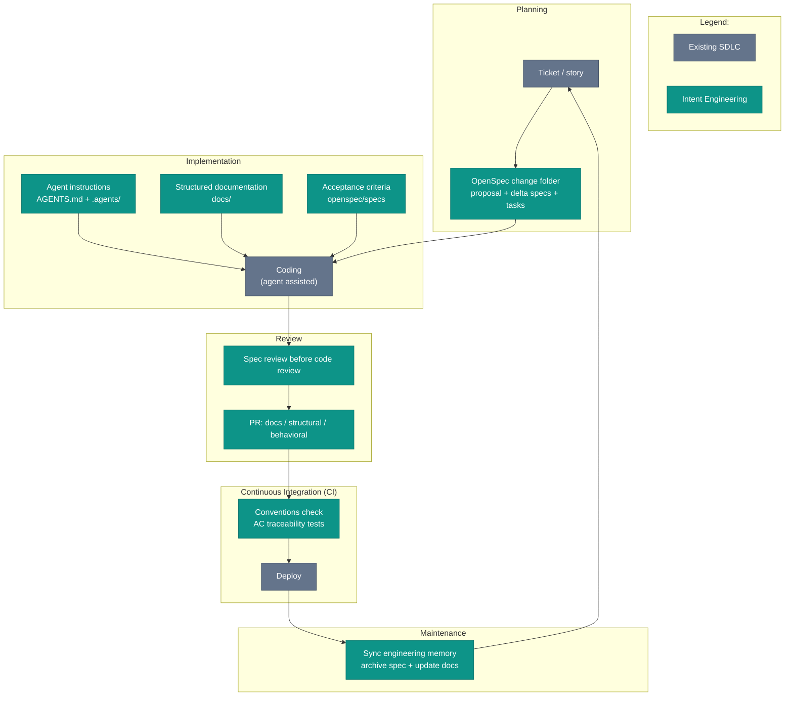

# Intent Engineering and the SDLC

This chapter rejects a tempting pitch: replace your SDLC with a new one. New ceremonies, new artifacts, a new review process. Existing tooling becomes legacy on contact.

The pitch fails where the engineering process already has teeth: Continuous Integration (CI) catches mistakes, reviewers defend standards, and the Jira board drives planning. This chapter makes the opposite move. Keep the delivery flow. Change the artifacts moving through that flow.

This book uses Spec-Driven Development for the broader practice of _writing intent before writing code_. Intent Engineering is this book's version of the practice. The Software Development Life Cycle (SDLC) stays in place.

*Sources: Sommerville, Software Engineering (10th ed., Pearson, 2015), ch. 2, the SDLC as the structured sequence from idea to production.*

## The map

Read the diagram as an overlay: gray marks the existing process, and teal marks the Intent Engineering context, artifact, review step, or check added to that flow.

Rename the payment adapter and merge the release. Leave `docs/architecture/README.md` pointing at `payments/adapters/legacy`. The next agent follows the page, imports a dead path, and opens a change for the system you no longer have.

## Planning: from ticket to spec

The change starts in the usual place: a ticket, a story, a Linear card. In this book's OpenSpec workflow, the sibling artifact is `openspec/changes/<name>/`: `proposal.md`, delta specs (one per capability under `specs/`), `tasks.md`, and optionally `design.md`. The ticket tracks the work. The spec carries the acceptance criteria for the change, and the design intent those criteria serve lives in `docs/`.

Most changes do not need a spec. Typo fixes and dependency bumps should stay light. Bugs need judgment. If the correct behavior is obvious, skip the spec. If reconstructing the intended behavior is the hard part, put the reasoning in a spec before restoring the code.

Architecture changes and agent-led implementation need the target before code exists. The SDLC point is placement: where the target enters the delivery flow, who reviews it, and what carries forward after merge.

*Sources: Farley, Modern Software Engineering (Addison-Wesley, 2021), intent over artifact.*

## Implementation: use the repo context

During implementation, the agent enters the coding step through the repo context: `AGENTS.md`, `.agents/`, project docs under `docs/`, canonical specs under `openspec/specs/`, and the spec for the current change.

[Why Structure Matters](./why-structure) explains the deeper rule: the repo is the context. The SDLC map only needs the placement because implementation is where durable context meets code generation.

## Review: intent first, code second

Once a PR exists, a normal review path collapses intent and code into one conversation centered on the code diff. Intent Engineering separates them.

The spec delta answers one question, the code diff answers another. First: does the intent match agreement? Then: does the implementation match the approved intent?

The sequence moves one question earlier: are we building the right change at all? Once the diff view dominates the screen, the question gets expensive. [Code Review for Agent-Generated Code](../team/code-review-agent-code) takes up the mechanics of making spec-first review the default path.

PR taxonomy gives the reviewer a second guardrail: a `docs`-only PR skips behavior scrutiny, and a `behavioral` PR does not belong in the same code diff as formatting churn. The taxonomy sounds bureaucratic. In practice, names are cheaper than mixed diffs.

## CI: the pipeline checks the conventions

In this book's workflow, a convention check runs on every push and validates `AGENTS.md`, the presence of `docs/README.md` and `docs/INDEX.md`, Markdown Architectural Decision Record (MADR) format for ADRs, and stable Acceptance Criterion IDs (AC IDs) with test declarations on spec scenarios. This is not a new pipeline, only a new check inside the pipeline you already have.

AC traceability links scenarios to tests: a passing test marked `@pytest.mark.ac("SCAFFOLD-001")` proves the named scenario, and the traceability remains after spec archival. Later, the audit trail still answers "which test covered this?" without grep guessing.

*Sources: Dave Farley and Jez Humble, continuousdelivery.com (ongoing), CI as the gate run on every push. Microsoft, "An AI-led SDLC" (2026, vendor-authored); IBM, "AI in SDLC" (ongoing, vendor-authored), vendor framing of folding AI-era checks into the existing pipeline rather than standing up a new one.*

## Maintenance: synchronize engineering memory

After a change ships, archive the spec, update `docs/INDEX.md` when docs move, mark Architectural Decision Records (ADRs) accepted or rejected, and leave them. If a decision reverses, supersede with a new ADR. Never rewrite the original.

Update agent instructions when a convention changes. Agent instructions are code, and code changes go through a pull request. That is how the team reviews the change and stays informed that agent behavior has shifted. On a solo project the PR is optional, but the principle holds.

Archive work is the small part. The larger question is whether the repo now describes the system that shipped. This book calls the step to synchronize engineering memory. An ADR records one decision. The rest of the memory lives in the architecture overview, design docs, diagrams, Application Programming Interface (API) contracts, README files, INDEX files, and agent instructions.

ISO/IEC/IEEE 42010 distinguishes the architecture from an architecture description expressing it. This book narrows the idea to the repo-local artifacts a coding agent reads and writes against: engineering memory.

After implementation, the agent has the code diff and the spec near at hand. Use that moment. Ask for the memory artifacts the change invalidated: an ADR needing a status change, a design doc with the old flow, a diagram still showing the removed component, an instruction file naming the old command. Small fixes stay in the pull request. Larger architecture cleanup gets a follow-up with an owner.

Do not let the agent silently rewrite the system record. The synchronization is part of the release work, but review still owns the truth. A coding agent with write access to the architecture docs is useful. A coding agent with unchecked authority over the architecture docs is how stale memory becomes fabricated memory, which is a worse incident with nicer Markdown.

Skipped archive work looks harmless at first. The cost shows up later, when half-implemented proposals still look live or a design doc still describes the system you replaced. Skipped engineering-memory work fails the same way, with a longer fuse: the code changed, the durable context did not, and later work starts from the wrong system.

Checks catch the mechanical part: an index-staleness rule compares the index with the file tree, but no check knows if a design doc deserved ADR promotion or an undocumented convention changed. The judgment still stays with the developer and reviewer.

*Sources: Michael Nygard, "Documenting Architecture Decisions" (Cognitect, 2011), a reversed decision becomes a new superseding ADR rather than an edit to the original. ISO/IEC/IEEE 42010:2022, architecture description as the artifact expression of architecture. The archive-on-ship discipline, engineering-memory synchronization step, and agent-assisted review boundary are this book's workflow synthesis.*

## Tooling

`iec check` is a CLI tool that validates these conventions locally or in CI. It is one implementation of the gate, not a requirement for the practice. See [Companion Repo](../appendices/companion-repo) for the repo layout.

## Why not add ceremonies

New ceremonies have a half-life. Teams adopt them with enthusiasm and drift back under deadline pressure. The design is to sidestep the churn by plugging into existing ceremonies rather than replacing them. A smaller ask lasts longer.

*Sources: Farley, Modern Software Engineering (Addison-Wesley, 2021), sustainable process over heavyweight ceremony.*

When a team adds spec review to the PR checklist and skips the step under pressure, the practice exists in intention only. No process map catches that. The missing archived spec does. The harder question is whether the team knows it is missing. That question sharpens in codebases where the decisions were never written down at all.
