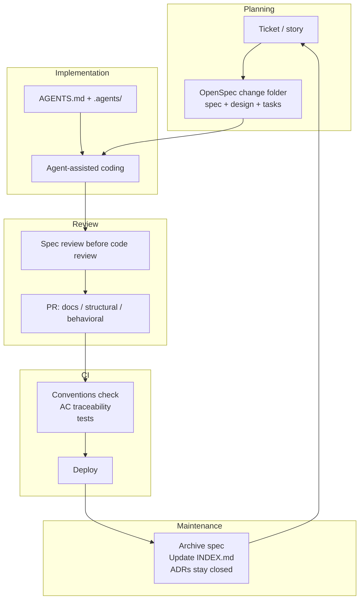

# The Map: Intent Engineering and the SDLC

The pitch most agentic-engineering material makes is implicit: throw out your SDLC and adopt the new one. New ceremonies. New artifacts. New review process. Your existing tooling becomes legacy on contact.

The Software Development Life Cycle is the structured sequence a team runs to take software from idea to production: plan, build, review, integrate, deploy, maintain. Every team runs some version of it, whether they call it that or not.

That pitch dies on first contact with any team with working CI, an established review culture, and a Jira board people use. So this book makes a different pitch.

Intent Engineering extends the SDLC. The ceremonies stay. The artifacts inside them change.

*Sources: Sommerville, Software Engineering (10th ed., Pearson, 2015), ch. 2, the SDLC as the structured sequence from idea to production.*

## The map

Five phases, none of them new. Inside each, Intent Engineering adds exactly one thing.

## Planning: from ticket to spec

The change starts the way it always has. A ticket. A story. A Linear card. OpenSpec adds a sibling artifact, `openspec/changes/<name>/`, containing a proposal, a delta spec, a design doc, and a tasks file. The ticket is still the unit of tracking. The spec is the unit of intent.

Not every change earns a spec. A typo fix does not. A dependency bump does not. A bug fix is less clear-cut: if the correct behavior is self-evident, skip it; if figuring out what the system was supposed to do is the hard part, that reasoning belongs in a spec before anyone writes a line to restore it. Anything touching architecture, or intended for an agent to implement: write the spec first. Planning is where intent gets fixed. Fixed intent is what the agent works from. Unfixed intent is what makes the agent produce code nobody wanted.

*Sources: Farley, Modern Software Engineering (Addison-Wesley, 2021), intent over artifact.*

## Implementation: brief the agent through the repo

With the spec in place, the agent needs to find it, along with the architecture overview, the constraints, and the conventions for the codebase it is about to change. That is what `AGENTS.md` is for. It loads first. From there it finds the relevant instructions and the spec for the current change. The briefing is in the repo, not in a chat message that disappears when the session ends.

The contrast matters at scale. A briefing in a chat session works for one developer for one hour. A briefing in `AGENTS.md` and `.agents/instructions/` works for every agent session, every developer, every CI run, on every machine. Same briefing, every time. The repo is the briefing.

## Review: intent first, code second

The agent commits. The PR opens. Most teams treat what comes next as one step. Intent Engineering treats it as two.

The spec delta says what the change is supposed to do. The code diff says what got built. Review the spec first. Does the intent match what was agreed? Then review the code diff. Does the implementation match the intent?

This sequencing is cheap to adopt and surprisingly effective: a reviewer who reads the spec first asks whether the change is the right change at all, a question that rarely gets asked once the diff is in front of you. Why it works and how to make it the default rather than the disciplined choice is the subject of [Code Review for Agent-Generated Code](../team/code-review-agent-code).

PR taxonomy keeps the review focused. A `docs`-only PR does not need behavior scrutiny. A `behavioral` PR does not get cluttered by formatting changes that should have been their own `structural` PR. The taxonomy sounds bureaucratic. In practice it is PR discipline with names.

## CI: the pipeline checks the conventions

A conventions check runs on every push. It validates that `AGENTS.md` is present and well-formed, that `docs/README.md` and `docs/INDEX.md` exist, that Architectural Decision Records (ADRs) follow Markdown ADR (MADR) format, and that spec scenarios carry stable Acceptance Criterion IDs (AC IDs) and test declarations. Not a new pipeline. A new check inside the pipeline you already have.

AC traceability links scenarios to tests. A test marked `@pytest.mark.ac("SCAFFOLD-001")` proves that scenario when it passes. The traceability survives spec archival. Six months later, the audit trail still answers "which test covered this?" without grep guessing.

*Sources: Dave Farley and Jez Humble, continuousdelivery.com (ongoing), CI as the gate run on every push. Microsoft, "An AI-led SDLC" (2026); IBM, "AI in SDLC" (ongoing), the broader move to fold AI-era checks into the existing pipeline rather than standing up a new one.*

## Maintenance: the step everyone skips

After a change ships, archive the spec. Update `docs/INDEX.md` if any docs files moved. Leave ADRs closed. Update `AGENTS.md` if the change altered a convention.

This is the step where Intent Engineering most reliably falls apart in practice. Archiving takes two minutes. The cost of skipping it shows up months later, when the agent reads four half-implemented proposals as live context and produces code that satisfies none of them. By then archiving costs an afternoon of triage instead of two minutes per change.

A conventions check catches some of this. An index-staleness rule flags the index that does not match the file tree. The check cannot catch the design doc that should have become an ADR, or the convention that quietly changed without a corresponding `AGENTS.md` edit. That part stays human.

## Tooling

If you want to see this in practice, `iec check` runs these conventions checks on every push in this book's companion repo: `AGENTS.md` presence, MADR format for ADRs, AC traceability from scenarios to tests, and index staleness. It is one implementation of the gate, not a requirement for the practice. See [Companion Repo](../appendices/companion-repo) for how to browse it.

## Why not add ceremonies

New ceremonies have a half-life. Teams adopt them at the start of a quarter and drift back under deadline pressure six months later. Intent Engineering sidesteps this by plugging into the ceremonies that already have tooling, habit, and buy-in. The ask is smaller. The persistence is better.

What still fails is the gap between what a team believes it is doing and what the repo shows it does. A team that added spec review to its PR process but skips it under pressure did not adopt the practice. It adopted the intent. No SDLC map tells you the difference, and nothing in the map closes that gap on its own.
