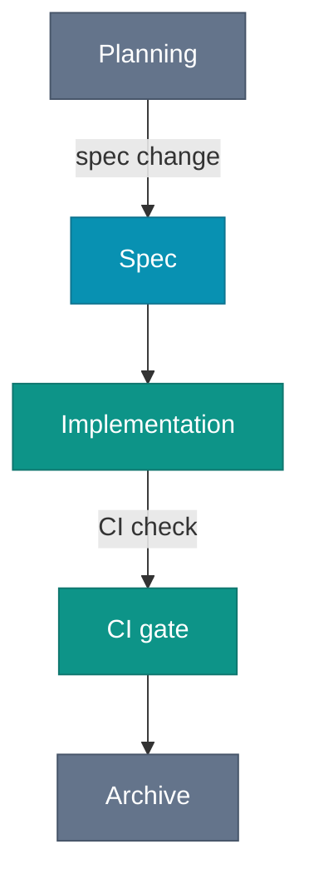

# Plain-Text-as-Code

The architecture diagram for your most important service is in a PowerPoint file on a laptop that left the company two months ago. The decision to use eventual consistency was made in a slide review nobody recorded. The retry policy is documented in a Confluence page whose last edit date is 2023.

Do not rely on the agent reading PowerPoint files or replaying slide reviews. The Confluence page might be reachable through a connector, but only if the agent knows the page exists, knows to look there, and has permissions. The developer who joined yesterday meets the same gates.

If the agent needs it, it lives in the repo. If it lives in the repo, it lives in plain text. That is the rule, and almost every other Intent Engineering Foundation practice is downstream of it.

## The constraint

Plain text means a format a human reads in a terminal, a Git diff shows line by line, and a language model processes without conversion: Markdown for prose, Mermaid for diagrams, and Markdown Architectural Decision Records (MADR) for decisions. Nothing exotic.

This is not a migration project. The document starts in the repo, evolves there, and is reviewed in the same PR as the code it describes. If someone needs the same content in Confluence, in a PowerPoint deck, or on a wiki, produce an export, a one-way snapshot. The repo is the source of truth. Everything else is derivative output.

Docs-as-code is the established version of this idea, narrowed here to one rule and extended past prose to diagrams and decisions. The book author's Plain Text as Code Manifest (github.com/Plain-Text-as-Code) is the fuller statement. This chapter applies it to the Intent Engineering Foundation. The boundary is easy to write down and hard to enforce: which formats belong, and where in the repo they live.

*Sources: Write the Docs, "Docs as Code" guide (writethedocs.org/guide/docs-as-code, ongoing), docs-as-code as the established practice this extends. Plain Text as Code Manifest (github.com/Plain-Text-as-Code, ongoing), the book author's statement of the philosophy.*

## Markdown for prose

Markdown is an unremarkable choice. Major Git hosts render it, and a terminal still shows a readable source when no renderer is available. AsciiDoc is stronger on semantics, includes, tables, and reusable attributes. Markdown still wins on tooling support. Pick the format your repo tooling and agent already parse reliably, not the one that would have won a cleaner design review. The discipline matters more than the markup language.

If a decision or convention needs to exist, it lives in a Markdown file in `docs/` or `AGENTS.md`. PR descriptions are too hard for the agent to find, and description quality is too uneven to rely on. Commit messages are not better: some developers write essays, others write `fix`, and the log is not a reliable index of decisions. Code comments are worse because a coding agent treats code as freely modifiable and rewrites or removes comments without hesitation. Humans expect documentation, not annotations buried in source files. Put the decision in a file, with a name, at a known location.

**The question:** does the agent reach it in a fresh session with no chat history, only the repo? If not, it is not documented. Where it lives and how carefully it was written do not matter.

*Sources: Write the Docs, "Docs as Code" guide (writethedocs.org/guide/docs-as-code, ongoing), docs-as-code as the established practice behind the Markdown-in-repo discipline. The AsciiDoc comparison is this book's synthesis.*

## Mermaid for diagrams

A C4 diagram in draw.io is opaque to agents and unreviewed by humans. The file format describes shape positions and styles, not graph semantics, and nobody opens the source to verify a PR description's claim that the architecture changed.

Mermaid is different. The syntax encodes the graph itself, not a picture of boxes and arrows, but the relationships. The same diagram, as a source and as a render:

Mermaid diagram embedded in Markdown:

````mmd

````

Diagram rendered by Mermaid:


The syntax is compact enough to write by hand once you know it. For larger diagrams, `mermaid.live` gives a browser preview: paste, edit, copy back. The source stays next to the document describing the system. When the architecture moves, the diagram changes in the same commit, and the PR review covers both artifacts together.

Agents default to ASCII art when asked for a diagram in plain text. Push back on that default. ASCII art carries no semantic structure. Topology does not extract cleanly, connections do not validate mechanically, and it renders as a wall of punctuation in every tool that matters. Mermaid takes roughly the same number of characters, renders as a real diagram on GitHub and in many IDEs with a Mermaid plugin, and produces a queryable artifact. Ask for Mermaid explicitly, using agent instructions. Sometimes the layout is off. In that case, ask the agent to improve the layout of the Mermaid diagram.

Mermaid covers [28 diagram types](https://mermaid.ai/open-source/intro/index.html) as of mid-2026, including the UML staples (class, sequence, state, and ER) and even Gantt, C4, and mind map. Not every type is rendered by every IDE plugin or Git vendor today, but Mermaid is widely adopted and support keeps expanding. Use the type that fits the thing you are describing rather than forcing everything through `graph TD`.

D2 is the more interesting format on its merits, but as of mid-2026, no major Git vendor renders it inline. A D2 block shows up as a code listing in a PR review, not a diagram. Mermaid is the right call for now.

The C4 model gives a useful set of diagram types (**C**ontext, **C**ontainer, **C**omponent, **C**ode) that map cleanly onto `docs/architecture/README.md` (architecture overview) and per-feature design docs. Structurizr defines those models in a text DSL rather than a drawing tool, the same plain-text-as-code move applied to architecture. Diagrams show structure. They do not explain why the structure is what it is.

*Sources: Mermaid (mermaid.ai), the diagram format used throughout. Mermaid live editor (mermaid.live), the editing escape hatch. Mermaid diagram types (mermaid.ai/open-source/intro/index.html), 28 diagram types as of mid-2026. D2 (d2lang.com), the alternative format not yet rendered inline by Git hosts as of mid-2026. C4 model, Simon Brown (c4model.com), the diagram types mapping to architecture docs. Structurizr, Simon Brown (docs.structurizr.com), C4 models authored as a text DSL.*

## ADRs as plain text

Architectural Decision Records (ADRs) and the MADR template they use are introduced in [Document Types](/foundation/document-types). What matters here is the plain-text shape: a Markdown file with fixed front matter and headings that a check validates mechanically. A minimal example:

```markdown
---
status: accepted
date: 2026-06-04
---

# Use Mermaid for architecture diagrams

## Context and Problem Statement

The team needs a diagramming format that diffs cleanly in PRs,
renders on GitHub, and is readable by coding agents without conversion.

## Considered Options

- Mermaid: plain text, renders on GitHub, 28 diagram types
- draw.io: rich GUI, binary format, opaque to agents
- ASCII art: no tooling required, no semantic structure

## Decision Outcome

Chosen option: Mermaid. It satisfies all three constraints.

### Consequences

- Layout is agent-controlled and occasionally needs correction.
```

A linter reads this ADR the way it reads code: front matter present, required headings in place, `status` drawn from a known set. The alternative is freeform decision records with no template, where every record tells a different kind of story and no rule fits all of them. Templated ADRs follow a known shape, so CI validates them. A freeform record gives the check nothing to grab.

Tight enough to validate mechanically. Loose enough that nobody avoids it. The AC ID convention later in the book makes the same bet. For ADR lifespans and the full MADR rationale, see [Document Types](/foundation/document-types).

*Sources: Michael Nygard, "Documenting Architecture Decisions" (cognitect.com/blog, November 2011), the ADR practice origin. Oliver Kopp, Anita Armbruster, Olaf Zimmermann, MADR template (adr.github.io/madr, ongoing) and "Markdown Architectural Decision Records" CEUR-WS Vol-2072 (2018), the template used throughout.*

## What it is not

Plain-text-as-code is not documentation-first development. Writing the document before the code belongs to the Spec-Driven topic. The plain-text rule is narrower: once the artifact exists, the repo stores it as plain text.

This rule does not replace knowledge-management tools or ticket systems. Confluence, Notion, Jira, Linear, and similar tools serve a different audience: customers, stakeholders, and non-developers who need page comments, discussion threads, and low-friction editing. Repo documentation is internal by default. It is written for the agent and the developers working alongside it, not for external readers. Both layers stay useful.

The boundary is the agent: if it needs the information to reason correctly, it goes in the repo. A Jira ticket that contains an architectural decision is not documentation. It is a decision waiting to become an ADR.

## The compound effect

A team that practices this consistently accumulates structured context. Each ADR records a decision the agent reads instead of inventing. Skill files add repeatable procedures the agent invokes by name. The architecture overview gains entries as the system grows. After months, a new agent, or a new developer, loads the relevant context in minutes rather than days, because the decisions, constraints, and workflows are in committed files. The formats are settled. What remains is the harder question: where in the commit, review, and deploy path do these documents get written, and who ensures they stay current when the code moves on without them.
