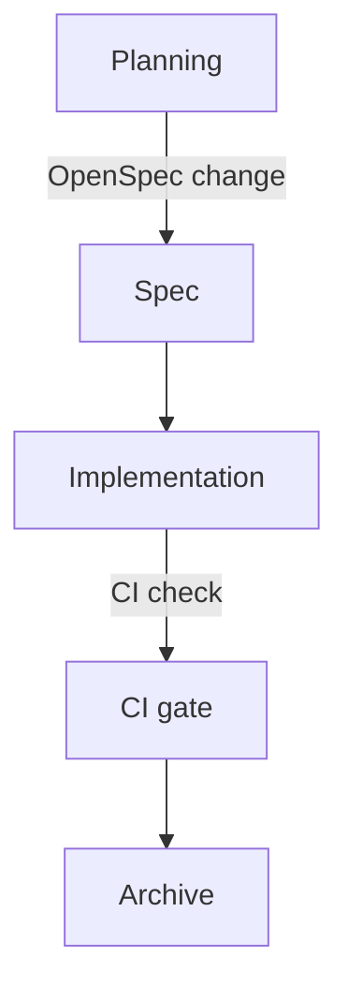

# Plain-Text-as-Code

The architecture diagram for your most important service is in a PowerPoint file on a laptop that left the company two months ago. And the decision to use eventual consistency was made in a slide review nobody recorded. The retry policy is documented in a Confluence page whose last edit date is 2023.

Your agent cannot read the PowerPoint file or replay the slide review. The Confluence page is technically reachable through an Atlassian MCP: if the agent knows the page exists, if it knows to look there, if its permissions reach that far, if a 2023 edit is still trustworthy. The developer who joined yesterday meets the same gates.

If the agent needs it, it lives in the repo. If it lives in the repo, it lives in plain text. That is the rule, and almost every other Intent Engineering Foundation practice is downstream of it.

## The constraint

Plain text means a format a human reads in a terminal, a Git diff shows line-by-line, and a language model processes without conversion. Markdown for prose. Mermaid for diagrams. Markdown Architectural Decision Records (MADR) for the decisions. Nothing exotic.

It is not a migration. The document lives in the repo from creation, evolves there, and is reviewed in the same PR as the code it describes. If someone needs it in Confluence, in a PowerPoint deck, or on a wiki, that is an export — a one-way snapshot made when needed. The repo is the source of truth; everything else is a derivative.

The fuller statement of the philosophy is in the Plain Text as Code Manifest (github.com/Plain-Text-as-Code); this chapter is its application to the Intent Engineering Foundation.

*Sources: Plain Text as Code Manifest (github.com/Plain-Text-as-Code, ongoing), the plain-text-as-code philosophy. Write the Docs, "Docs as Code" guide (writethedocs.org/guide/docs-as-code, ongoing), docs-as-code as established practice.*

## Markdown for prose

Markdown is the unremarkable choice: renders on every major Git host, readable without a renderer, no tooling required to write. AsciiDoc is the better format on its merits, with richer semantics, real includes, proper tables, and attributes that survive transformation. But Markdown wins the ecosystem fight, and every model trained in the last few years has read more of it than any other markup. Pick what your tools and your agent already speak, not the format that would have won a fair design review. The interesting part is the discipline.

If a decision or convention needs to exist, it lives in a Markdown file in `docs/` or `AGENTS.md`. Not in a PR description: the agent rarely knows which closed PR to read, and description quality is too uneven to rely on. Not in a commit message: some developers write essays, others write `fix` — the log is not a reliable index of decisions. Not in a code comment: a coding agent treats code as freely modifiable — comments get rewritten or removed without hesitation. Humans expect documentation, not annotations buried in source files. In a file, with a name, at a known location.

**The question:** can the agent reach it in a fresh session with no chat history, only the repo? If not, it is not documented — regardless of where it lives or how carefully it was written.

## Mermaid for diagrams

A C4 diagram in draw.io is opaque to agents and unreviewed by humans. The file format describes shape positions and styles, not graph semantics, and nobody opens the source to verify a PR description's claim that the architecture changed.

Mermaid is different. The syntax encodes the graph itself — not a picture of boxes and arrows, but the relationships. The same diagram, as a source and as a render:

Mermaid diagram embedded in Markdown:

````mmd

````

Diagram rendered by Mermaid:


The syntax is compact enough to hand code once you know it. For anything more involved, mermaid.live gives a live preview in the browser — paste, edit, copy back. The source travels with the document that describes the system. When the architecture moves, the diagram moves in the same commit, and the PR review covers both.

Agents default to ASCII art when asked for a diagram in plain text. Push back on that default. ASCII art carries no semantic structure — topology cannot be extracted, connections cannot be validated, and it renders as a wall of punctuation in every tool that matters. Mermaid takes roughly the same number of characters, renders as a real diagram in GitHub and in every major IDE with a Mermaid plugin, and produces a queryable artifact. Ask for Mermaid explicitly (using agent instructions); current models produce it well. Sometimes the layout is off. In that case, ask the agent to improve the layout of the Mermaid diagram.

Mermaid covers [28 diagram types](https://mermaid.ai/open-source/intro/index.html), including the UML staples — class, sequence, state, and ER — and even Gantt, C4, and mind map. Not every type is rendered by every IDE plugin or Git vendor today, but Mermaid is widely adopted and support keeps expanding. Use the type that fits the thing you are describing rather than forcing everything through `graph TD`.

D2 is the more interesting format on its merits, but no major Git vendor renders it inline yet. A D2 block shows up as a code listing in a PR review, not a diagram. Mermaid is the right call for now.

The C4 model gives a useful set of diagram types (**C**ontext, **C**ontainer, **C**omponent, **C**ode) that map cleanly onto `docs/architecture/README.md` (architecture overview) and per-feature design docs.

*Sources: Mermaid (mermaid.ai), the diagram format used throughout. Mermaid live editor (mermaid.live), the editing escape hatch. Mermaid diagram types (mermaid.ai/open-source/intro/index.html), 28 diagram types as of mid-2026. D2 (d2lang.com), the alternative format not yet rendered by Git hosts. C4 model, Simon Brown (c4model.com), the diagram types mapping to architecture docs. Structurizr (docs.structurizr.com), C4 tooling.*

## MADR for decisions

The MADR template (context, considered options, decision outcome, consequences) produces Architectural Decision Records (ADRs) that share a consistent shape. Consistent shape means the agent parses without understanding prose, and a human scans ten ADRs in two minutes to find the relevant one. A minimal example:

```markdown
---
status: accepted
date: 2026-06-04
---

# Use Mermaid for architecture diagrams

## Context and Problem Statement

The team needs a diagramming format that diffs cleanly in PRs,
renders on GitHub, and can be read by coding agents without conversion.

## Considered Options

- Mermaid: plain text, renders on GitHub, 28 diagram types
- draw.io: rich GUI, binary format, opaque to agents
- ASCII art: no tooling required, no semantic structure

## Decision Outcome

Chosen option: Mermaid. It satisfies all three constraints.

### Consequences

- Layout is agent-controlled and occasionally needs correction.
```

The agent finds the decision in a known field. It does not have to read the reasoning to extract the conclusion. Neither does the developer who joins on Monday.

The alternative is prose-format decision records with no template, which produce ADRs that each tell a different kind of story and resist any structural validation. A format check on ADRs is possible because templated ADRs follow a known shape. Freeform ones cannot be validated.

Tight enough to validate mechanically; loose enough that nobody avoids it. The AC ID convention later in the book makes the same bet.

## What it is not

Plain-text-as-code is not documentation-first development. Writing the document before the code is a spec practice, covered in the Spec-Driven topic. The plain-text rule is narrower: whatever exists must exist in the repo as plain text.

It is also not a replacement for knowledge management tools or ticket systems. Confluence, Notion, Jira, Linear, and their peers serve a different audience: customers, stakeholders, and non-developers who benefit from inline comments, page-level discussions, and lower barriers to contribution. Repo documentation is internal by default — it is written for the agent and the developers working alongside it, not for external readers. The two coexist.

The boundary is the agent: if it needs the information to reason correctly, it goes in the repo. A Jira ticket that contains an architectural decision is not documentation — it is a decision waiting to become an ADR.

## The compound effect

A team that practices this consistently accumulates structured context. Each ADR adds to the agent's understanding of the system's history. Each skill file adds a workflow the agent invokes. The architecture overview grows richer as the system grows. After six months, the repo briefs a new agent (or a new developer) in minutes rather than days, because the briefing is the repo. What remains is understanding where to fit this into the workflow the team already runs.
