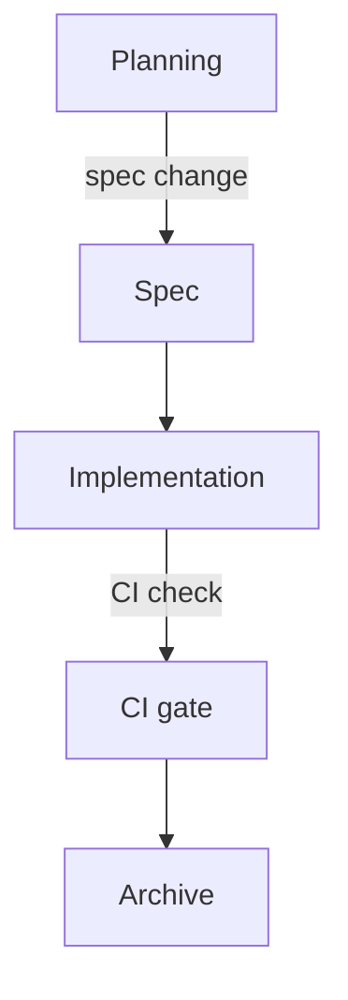

# Plain-Text-as-Code

The architecture diagram for your most important service is in a PowerPoint file on a laptop that left the company two months ago. And the decision to use eventual consistency was made in a slide review nobody recorded. The retry policy is documented in a Confluence page whose last edit date is 2023.

Your agent cannot read the PowerPoint file or replay the slide review. The Confluence page is technically reachable through an Atlassian MCP: if the agent knows the page exists, if it knows to look there, if its permissions reach that far, if a 2023 edit is still trustworthy. The developer who joined yesterday meets the same gates.

If the agent needs it, it lives in the repo. If it lives in the repo, it lives in plain text. That is the rule, and almost every other Intent Engineering Foundation practice is downstream of it.

## The constraint

Plain text means a format a human reads in a terminal, a Git diff shows line-by-line, and a language model processes without conversion: Markdown for prose, Mermaid for diagrams, Markdown Architectural Decision Records (MADR) for the decisions. Nothing exotic.

It is not a migration. The document lives in the repo from creation, evolves there, and is reviewed in the same PR as the code it describes. If someone needs it in Confluence, in a PowerPoint deck, or on a wiki, that is an export, a one-way snapshot made when needed. The repo is the source of truth. Everything else is a derivative.

Docs-as-code is the established version of this idea, narrowed here to one rule and extended past prose to diagrams and decisions. The book author's Plain Text as Code Manifest (github.com/Plain-Text-as-Code) is the fuller statement. This chapter applies it to the Intent Engineering Foundation. The boundary is easier to state than to enforce: which formats belong, and where in the repo they live.

*Sources: Write the Docs, "Docs as Code" guide (writethedocs.org/guide/docs-as-code, ongoing), docs-as-code as the established practice this extends. Plain Text as Code Manifest (github.com/Plain-Text-as-Code, ongoing), the book author's statement of the philosophy.*

## Markdown for prose

Markdown is the unremarkable choice. It renders on every major Git host and stays readable without a renderer at all. AsciiDoc is the better format on its merits, with richer semantics, real includes, proper tables, and attributes that survive transformation. But Markdown wins the ecosystem fight. As of mid-2026, it is effectively universal in public codebases and current models handle it fluently. Pick what your tools and your agent already speak, not the format that would have won a fair design review. The interesting part is the discipline.

If a decision or convention needs to exist, it lives in a Markdown file in `docs/` or `AGENTS.md`. PR descriptions are too hard for the agent to find, and description quality is too uneven to rely on. Commit messages are no better: some developers write essays, others write `fix`, and the log is not a reliable index of decisions. Code comments are worse, because a coding agent treats code as freely modifiable and rewrites or removes comments without hesitation. Humans expect documentation, not annotations buried in source files. Put the decision in a file, with a name, at a known location.

**The question:** can the agent reach it in a fresh session with no chat history, only the repo? If not, it is not documented. Where it lives and how carefully it was written do not matter.

*Sources: Write the Docs, "Docs as Code" guide (writethedocs.org/guide/docs-as-code, ongoing), docs-as-code as the established practice behind the Markdown-in-repo discipline. The AsciiDoc comparison is this book's synthesis.*

## Mermaid for diagrams

A C4 diagram in draw.io is opaque to agents and unreviewed by humans. The file format describes shape positions and styles, not graph semantics, and nobody opens the source to verify a PR description's claim that the architecture changed.

Mermaid is different. The syntax encodes the graph itself: not a picture of boxes and arrows, but the relationships. The same diagram, as a source and as a render:

Mermaid diagram embedded in Markdown:

````mmd

````

Diagram rendered by Mermaid:


The syntax is compact enough to hand code once you know it. For anything more involved, mermaid.live gives a live preview in the browser: paste, edit, copy back. The source travels with the document that describes the system. When the architecture moves, the diagram moves in the same commit, and the PR review covers both.

Agents default to ASCII art when asked for a diagram in plain text. Push back on that default. ASCII art carries no semantic structure. Topology cannot be extracted, connections cannot be validated, and it renders as a wall of punctuation in every tool that matters. Mermaid takes roughly the same number of characters, renders as a real diagram in GitHub and in every major IDE with a Mermaid plugin, and produces a queryable artifact. Ask for Mermaid explicitly, using agent instructions. Current models produce it well. Sometimes the layout is off. In that case, ask the agent to improve the layout of the Mermaid diagram.

Mermaid covers [28 diagram types](https://mermaid.ai/open-source/intro/index.html) as of mid-2026, including the UML staples (class, sequence, state, and ER) and even Gantt, C4, and mind map. Not every type is rendered by every IDE plugin or Git vendor today, but Mermaid is widely adopted and support keeps expanding. Use the type that fits the thing you are describing rather than forcing everything through `graph TD`.

D2 is the more interesting format on its merits, but as of mid-2026, no major Git vendor renders it inline. A D2 block shows up as a code listing in a PR review, not a diagram. Mermaid is the right call for now.

The C4 model gives a useful set of diagram types (**C**ontext, **C**ontainer, **C**omponent, **C**ode) that map cleanly onto `docs/architecture/README.md` (architecture overview) and per-feature design docs. Structurizr defines those models in a text DSL rather than a drawing tool, the same plain-text-as-code move applied to architecture. Diagrams show structure. They do not explain why the structure is what it is.

*Sources: Mermaid (mermaid.ai), the diagram format used throughout. Mermaid live editor (mermaid.live), the editing escape hatch. Mermaid diagram types (mermaid.ai/open-source/intro/index.html), 28 diagram types as of mid-2026. D2 (d2lang.com), the alternative format not yet rendered inline by Git hosts as of mid-2026. C4 model, Simon Brown (c4model.com), the diagram types mapping to architecture docs. Structurizr, Simon Brown (docs.structurizr.com), C4 models authored as a text DSL.*

## MADR for decisions

An Architectural Decision Record (ADR) records a decision. MADR makes it a plain Markdown file: front matter for `status` and `date`, fixed headings for context, options, and outcome. Document Types covers why that shape helps a reader. What earns it a place here is narrower: a format check can enforce a fixed shape. A minimal example:

```markdown
---
status: accepted
date: 2026-06-04
---

# Use Mermaid for architecture diagrams

## Context and Problem Statement

The team needs a diagramming format that diffs cleanly in PRs,
renders on GitHub, and can be read by coding agents without conversion.

## Considered Options

- Mermaid: plain text, renders on GitHub, 28 diagram types
- draw.io: rich GUI, binary format, opaque to agents
- ASCII art: no tooling required, no semantic structure

## Decision Outcome

Chosen option: Mermaid. It satisfies all three constraints.

### Consequences

- Layout is agent-controlled and occasionally needs correction.
```

A linter reads this ADR the way it reads code: front matter present, required headings in place, `status` drawn from a known set. The alternative is freeform decision records with no template, where every record tells a different kind of story and no rule fits all of them. Templated ADRs follow a known shape, so CI validates them. A freeform record gives the check nothing to grab.

Tight enough to validate mechanically. Loose enough that nobody avoids it. The AC ID convention later in the book makes the same bet.

*Sources: Michael Nygard, "Documenting Architecture Decisions" (cognitect.com/blog, Nov 2011), the ADR practice origin. Oliver Kopp, Anita Armbruster, Olaf Zimmermann, MADR template (adr.github.io/madr, ongoing) and "Markdown Architectural Decision Records" CEUR-WS Vol-2072 (2018), the template used throughout.*

## What it is not

Plain-text-as-code is not documentation-first development. Writing the document before the code is a spec practice, covered in the Spec-Driven topic. The plain-text rule is narrower: whatever exists must exist in the repo as plain text.

It is also not a replacement for knowledge management tools or ticket systems. Confluence, Notion, Jira, Linear, and their peers serve a different audience: customers, stakeholders, and non-developers who benefit from inline comments, page-level discussions, and lower barriers to contribution. Repo documentation is internal by default. It is written for the agent and the developers working alongside it, not for external readers. The two coexist.

The boundary is the agent: if it needs the information to reason correctly, it goes in the repo. A Jira ticket that contains an architectural decision is not documentation. It is a decision waiting to become an ADR.

## The compound effect

A team that practices this consistently accumulates structured context. ADRs build up the agent's picture of system history. Skill files add workflows it can invoke, and the architecture overview grows richer as the system grows. After six months, the repo briefs a new agent (or a new developer) in minutes rather than days, because the briefing is the repo. The formats are settled. What remains is the harder question: where in the commit, review, and deploy loop do these documents get written, and who ensures they stay current when the code moves on without them.
