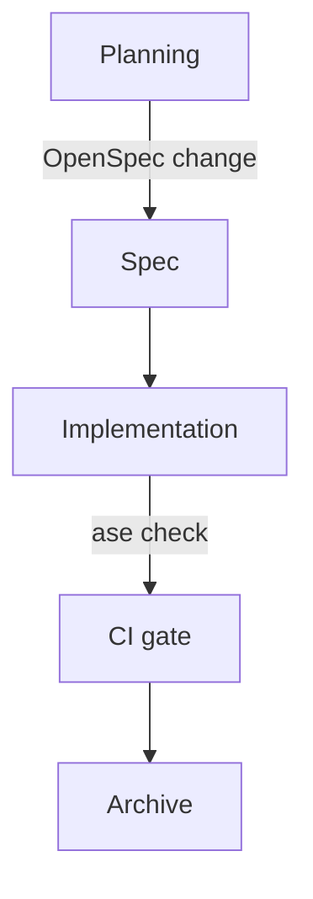

# Plain-Text-as-Code

The architecture diagram for your most important service is in a Keynote file on a laptop that left the company two months ago. The decision to use eventual consistency was made in a slide review nobody recorded. The retry policy is documented in a Confluence page whose last edit date is 2023.

Your agent cannot read any of these. Neither can the developer who joined yesterday.

If the agent needs it, it lives in the repo. If it lives in the repo, it lives in plain text. That is the rule, and almost every other Foundation practice is downstream of it.

## The constraint

Plain text means a format a human can read in a terminal, a Git diff can show line-by-line, and a language model can process without conversion. Markdown for prose. Mermaid for diagrams. MADR-structured Markdown for decision records. Nothing exotic.

It does not mean exporting your Confluence space to Markdown once and committing it. One-off exports drift from reality the moment they land — the source-of-truth question is unresolved, and within a quarter the wiki and the export disagree. Plain-text-as-code is a practice, not a migration. The document lives in the repo from creation, evolves alongside the code it describes, and is reviewed in the same PR.

*Sources: Write the Docs, "Docs as Code" guide (writethedocs.org/guide/docs-as-code, ongoing).*

## Markdown for prose

Markdown is the unremarkable choice — renders on every Git host, readable without a renderer, no tooling required to write. The interesting part is the discipline.

If a decision or convention needs to exist, it lives in a Markdown file in `docs/` or `AGENTS.md`. Not in a PR description; the agent cannot search closed PRs. Not in a commit message; commits are write-once and unreadable in isolation. Not in a code comment; comments rot with the code they describe and cannot be read without the surrounding file. In a file, with a name, at a known location.

The test is operational, not aesthetic: can the agent find this in a session that started thirty seconds ago, with no chat history, only the repo? If the answer is no, the information is not really documented.

## Mermaid for diagrams

A C4 diagram in draw.io is invisible to agents and unreviewed by humans — nobody opens the source file to confirm a PR description's claim that the architecture changed. A Mermaid diagram in the repo is diffable:

Mermaid renders in GitHub, in VitePress, in most modern IDE preview panes. The source travels with the document that describes the system. When the architecture moves, the diagram moves in the same commit, and the PR review covers both.

The C4 model gives a useful set of diagram types — Context, Container, Component, Code — that map cleanly onto `docs/README.md` (architecture overview) and per-feature design docs. Structurizr provides DSL tooling for maintaining C4 models as code if the diagrams grow large enough to need it. Most repos do not.

*Sources: Mermaid (mermaid.js.org). C4 model — Simon Brown (c4model.com). Structurizr (docs.structurizr.com).*

## MADR for decisions

The MADR template — context, considered options, decision outcome, consequences — produces ADRs that look the same as each other. Consistent shape means the agent can parse without understanding prose, and a human can scan ten ADRs in two minutes to find the relevant one.

The alternative is prose-format decision records with no template, which produces ADRs that each tell a different kind of story and resist any structural validation. `ase check`'s `adr-format` check exists because templated ADRs can be validated; freeform ones cannot.

This is a pattern: structure the substrate enough that machines can reason about it, leave the contents free enough that humans can write it without ceremony. The same principle shows up in the AC ID convention later in the book.

## What it is not

Plain-text-as-code is not documentation-first development. Writing the document before the code is a *spec* practice, covered in the Spec-Driven topic. The plain-text rule is narrower: whatever exists must exist in the repo as plain text. A team that documents after the fact still satisfies it, as long as the documentation lands in the repo before the next PR.

It is also not a wiki ban. Wikis are fine for team announcements, meeting notes, link collections, things that do not need to be read by an agent reasoning about the codebase. The boundary is the agent: if the agent needs it, it goes in the repo.

## The compound effect

A team that practices this consistently accumulates structured context. Each ADR adds to the agent's understanding of the system's history. Each skill file adds a workflow the agent can invoke. The architecture overview grows richer as the system grows. After six months, the repo briefs a new agent — or a new developer — in minutes rather than days, because the briefing is the repo.
