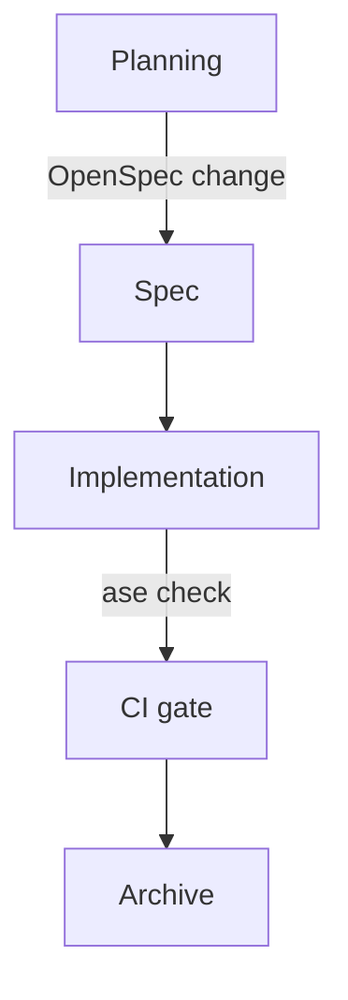

# Plain-Text-as-Code

Your agent reads your repo. It cannot open your Confluence instance, search your internal wiki, browse the slides from last quarter's architecture review, or read the comments in closed Jira tickets. If something important is not in the repository as a plain text file, your agent does not know about it.

This is not a limitation of the agent. It is a limitation of where the information lives.

## The constraint

Everything the agent needs to reason about your system must be in the repo. Everything in the repo must be in plain text. This is the plain-text-as-code principle, and it is the substrate on which all Foundation practices rest.

Plain text means: a format a human can read in a terminal, a Git diff can show line-by-line, and a language model can process without conversion. Markdown for prose. Mermaid for diagrams. MADR-structured Markdown for decision records.

It does not mean: exporting your Confluence page to Markdown once and committing it. One-off exports drift from reality immediately. Plain-text-as-code is a practice — the document lives in the repo from the moment it is created, is updated alongside the code it describes, and is reviewed in the same PR.

*Sources: Write the Docs, "Docs as Code" guide (writethedocs.org/guide/docs-as-code, ongoing).*

## Markdown for prose

Markdown is the default for everything textual: architecture overviews, ADRs, design docs, specs, AGENTS.md, skill files. The reasons are unremarkable — it renders on every Git host, it is readable without a renderer, and it does not require any tooling to write.

The discipline is the part worth noting: if a decision or convention needs to exist, it belongs in a Markdown file in `docs/` or `AGENTS.md`. Not in a PR description (which the agent cannot search). Not in a commit message (ditto). Not in a comment (which rots with the code and cannot be read in isolation). In a file, with a name, at a known location.

## Mermaid for diagrams

Architecture diagrams that live in Keynote or draw.io are invisible to agents and unreviewed by humans. A Mermaid diagram committed as source is diffable:

Mermaid renders in GitHub's Markdown viewer, in VitePress, and in most modern IDEs with a preview pane. The source travels with the document that describes the system. When the system changes, the diagram changes in the same commit.

The C4 model (Simon Brown) gives a useful set of diagram types for software architecture: Context, Container, Component, and Code. These map well onto the architecture overview (`docs/README.md`) and per-feature design docs (`docs/design/`). Structurizr provides tooling for maintaining C4 models as code.

*Sources: Mermaid (mermaid.js.org, ongoing). C4 model — Simon Brown (c4model.com, ongoing). Structurizr (docs.structurizr.com, ongoing).*

## MADR for decisions

The MADR (Markdown Architectural Decision Record) template structures ADRs with consistent sections: context, considered options, decision outcome, consequences, pros and cons. Consistent structure means the agent can parse an ADR without understanding prose, and a human can scan ten ADRs in two minutes.

The alternative — prose-format decision records with no template — produces ADRs that look different from each other, are harder to scan, and resist automated validation. The MADR format is a deliberate constraint that makes the records machine-readable without losing human readability.

## What plain-text-as-code is not

It is not documentation-first development. Writing the document before the code is a spec practice (covered in the Spec-Driven topic). Plain-text-as-code only says: whatever exists must be in the repo as plain text. A team that documents after the fact is still practicing plain-text-as-code as long as the documentation lives in the repo.

It is not a wiki ban. Internal wikis are fine for team announcements, meeting notes, and links. They are not the right home for architecture decisions, conventions, or anything an agent needs to read. The rule is simple: if the agent needs it, it lives in the repo.

## The compound return

A repo that consistently practices plain-text-as-code accumulates structured context over time. Each ADR adds to the agent's understanding of the system's history. Each skill file adds a workflow the agent can invoke. The architecture overview grows richer as the system grows. After six months of consistent practice, the repo briefs a new agent — or a new developer — in minutes rather than days.
