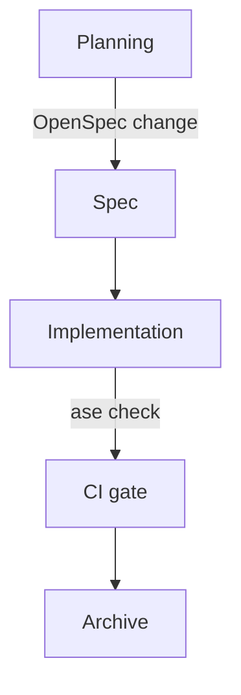

# Plain-Text-as-Code

The architecture diagram for your most important service is in a Keynote file on a laptop that left the company two months ago. The decision to use eventual consistency was made in a slide review nobody recorded. The retry policy is documented in a Confluence page whose last edit date is 2023.

Your agent cannot read the Keynote file or replay the slide review. The Confluence page is technically reachable through an Atlassian MCP: if the agent knows the page exists, if it knows to look there, if its permissions reach that far, if a 2023 edit is still trustworthy. The developer who joined yesterday meets the same gates.

If the agent needs it, it lives in the repo. If it lives in the repo, it lives in plain text. That is the rule, and almost every other Agentic Software Engineering (ASE) Foundation practice is downstream of it.

## The constraint

Plain text means a format a human reads in a terminal, a Git diff shows line-by-line, and a language model processes without conversion. Markdown for prose. Mermaid for diagrams. Markdown Architectural Decision Records (MADR) for the decisions. Nothing exotic.

It does not mean exporting your Confluence space to Markdown once and committing it. One-off exports drift from reality the moment they land. The source-of-truth question is unresolved, and within a quarter the wiki and the export disagree. Plain-text-as-code is a practice, not a migration. The document lives in the repo from creation, evolves alongside the code it describes, and is reviewed in the same PR.

The fuller statement of the philosophy is in the Plain Text as Code Manifest (github.com/Plain-Text-as-Code); this chapter is its application to the ASE Foundation.

Sources: Plain Text as Code Manifest (github.com/Plain-Text-as-Code, ongoing), the plain-text-as-code philosophy. Write the Docs, "Docs as Code" guide (writethedocs.org/guide/docs-as-code, ongoing), docs-as-code as established practice.

## Markdown for prose

Markdown is the unremarkable choice: renders on every Git host, readable without a renderer, no tooling required to write. AsciiDoc is the better format on its merits, with richer semantics, real includes, proper tables, and attributes that survive transformation. But Markdown wins the ecosystem fight, and every model trained in the last few years has read more of it than any other markup. Pick what your tools and your agent already speak, not the format that would have won a fair design review. The interesting part is the discipline.

If a decision or convention needs to exist, it lives in a Markdown file in `docs/` or `AGENTS.md`. Not in a PR description; description quality is uneven, and even with a GitHub MCP the agent rarely knows which closed PR to read. Not in a commit message; commit quality is uneven on any team: some developers write essays, others write `fix`. The log is not a reliable place to find decisions. Not in a code comment; comments rot with the code they describe and cannot be read without the surrounding file. In a file, with a name, at a known location.

The test is operational, not aesthetic: can the agent find this in a session that started thirty seconds ago, with no chat history, only the repo? If the answer is no, the information is not documented.

## Mermaid for diagrams

A C4 diagram in draw.io is opaque to agents and unreviewed by humans. The file format describes shape positions and styles, not graph semantics, and nobody opens the source to verify a PR description's claim that the architecture changed.

Mermaid is different. The source is plain text that diffs cleanly, and the syntax encodes the graph itself. `graph TD; A --> B` describes a graph with two nodes and one directed edge, not a picture of two boxes and an arrow:

GitHub renders Mermaid out of the box, and VitePress does the same with one plugin. For editing without local tooling, mermaid.live is the escape hatch. The source travels with the document that describes the system. When the architecture moves, the diagram moves in the same commit, and the PR review covers both.

Agents default to ASCII art when asked for a diagram in plain text. Sometimes the result is fine for a one-off illustration. Often the characters do not quite line up in monospace, and the next person, human or agent, has to nudge them back into place. The deeper problem is that ASCII art is a picture made of punctuation, with no structure underneath; the next agent reading the file sees a wall of `|` and `+`, not a graph. Mermaid takes roughly the same number of characters and produces a renderable, queryable artifact. Ask for Mermaid explicitly; current models produce it well.

Mermaid covers more than 26 diagram types, including sequence, state, ER, Gantt, C4, and mindmap. GitHub renders most of them today. Use the type that fits the thing you are describing rather than forcing everything through `graph TD`.

D2 is the more interesting format on its merits, but no major Git vendor renders it inline yet. A D2 block shows up as a code listing in PR review, not a diagram. Mermaid is the right call for now.

The C4 model gives a useful set of diagram types (Context, Container, Component, Code) that map cleanly onto `docs/README.md` (architecture overview) and per-feature design docs.

Sources: Mermaid (mermaid.js.org), the diagram format used throughout. Mermaid live editor (mermaid.live), the editing escape hatch. Mermaid diagram catalogue (mermaid.js.org/ecosystem/tutorials.html), the 26+ diagram types. D2 (d2lang.com), the alternative format not yet rendered by Git hosts. C4 model, Simon Brown (c4model.com), the diagram types mapping to architecture docs. Structurizr (docs.structurizr.com), C4 tooling.

## MADR for decisions

The MADR template (context, considered options, decision outcome, consequences) produces Architectural Decision Records (ADRs) that share a consistent shape. Consistent shape means the agent parses without understanding prose, and a human scans ten ADRs in two minutes to find the relevant one.

The alternative is prose-format decision records with no template, which produce ADRs that each tell a different kind of story and resist any structural validation. `ase check`'s `adr-format` check exists because templated ADRs are validated; freeform ones cannot be.

The template does enough for validation; the contents stay free enough to write without ceremony. The same principle shows up in the Acceptance Criterion ID (AC ID) convention later in the book.

## What it is not

Plain-text-as-code is not documentation-first development. Writing the document before the code is a spec practice, covered in the Spec-Driven topic. The plain-text rule is narrower: whatever exists must exist in the repo as plain text. A team that documents after the fact still satisfies it, as long as the documentation lands in the repo before the next PR.

It is also not a wiki ban. Wikis are fine for team announcements, meeting notes, link collections, things that do not need to be read by an agent reasoning about the codebase. The boundary is the agent: if the agent needs it, it goes in the repo.

## The compound effect

A team that practices this consistently accumulates structured context. Each ADR adds to the agent's understanding of the system's history. Each skill file adds a workflow the agent invokes. The architecture overview grows richer as the system grows. After six months, the repo briefs a new agent (or a new developer) in minutes rather than days, because the briefing is the repo. What remains is understanding where to fit this into the workflow the team already runs.
