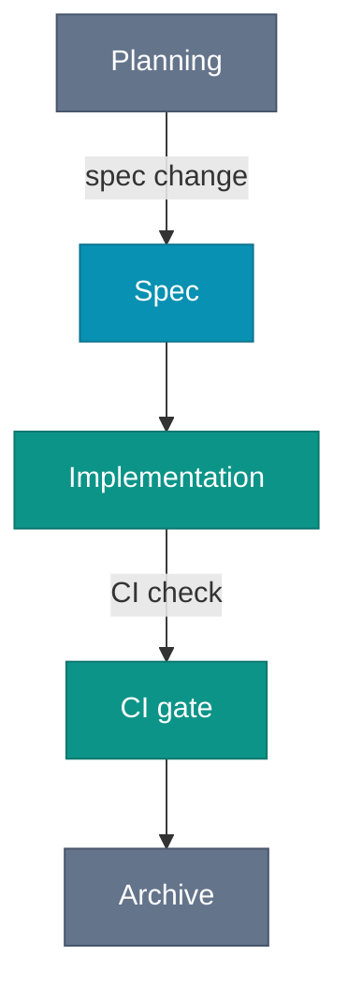

# Plain-Text-as-Code

I have spent forty years watching useful engineering work disappear into Word documents, PowerPoint decks, Visio files, and whichever proprietary tool was fashionable at the time. The files are often still around. Opening them is another matter. You need the right application and license, sometimes on an old laptop nobody wants to touch. A connector puts one more dependency between the developer and the decision.

I want the source to remain readable with a text editor. Not necessarily `vi`. I do not like `vi`, although plenty of developers do. No expensive tool or bloated editing environment should stand between a developer and the architecture.

If the agent needs the information, put the source in the repo as plain text. Almost every other Intent Engineering Foundation practice depends on this constraint.

## The constraint

Plain text means a format a human reads in a terminal, a Git diff shows line by line, and a language model processes without conversion: Markdown for prose, Mermaid for diagrams, and Markdown Architectural Decision Records (MADR) for decisions. Nothing exotic.

This is also my refusal to let the tool become the work. Rich editors make it tempting to fuss with formatting and animation while the meaning stays vague. Developers need to know what was decided and where the boundaries sit. The diagram only needs to show the relationships clearly. When a presentation or this book needs a rendered image, I prefer SVG because it scales and travels well. I still keep the maintained source in a diffable form.

This is not a migration project. The document starts in the repo, evolves there, and is reviewed in the same PR as the code it describes. If someone needs the same content in Confluence, in a PowerPoint deck, or on a wiki, produce an export, a one-way snapshot. The repo is the source of truth; everything else is derivative output.

Docs-as-code is the established version of this idea, narrowed here to one rule and extended past prose to diagrams and decisions. I care enough about this rule to have written it down as a manifest: the Plain Text as Code Manifest (github.com/Plain-Text-as-Code) is the fuller statement, and this chapter applies it to the Intent Engineering Foundation. The boundary is easy to write down and hard to enforce: which formats belong, and where in the repo they live.

*Sources: Write the Docs, "Docs as Code" guide (writethedocs.org/guide/docs-as-code, ongoing), docs-as-code as the established practice this extends. Plain Text as Code Manifest (github.com/Plain-Text-as-Code, ongoing), the book author's statement of the philosophy.*

## Markdown for prose

Markdown is an unremarkable choice. Major Git hosts render it, and a terminal still shows a readable source when no renderer is available. AsciiDoc is stronger on semantics, includes, tables, and reusable attributes. Markdown still wins on tooling support. Pick the format your repo tooling and agent already parse reliably, not the one that would have won a cleaner design review. The discipline matters more than the markup language.

If a decision or convention needs to exist, it lives in a Markdown file in `docs/` or `AGENTS.md`. PR descriptions are too hard for the agent to find, and description quality is too uneven to rely on. Commit messages are not better: some developers write essays, others write `fix`, and the log is not a reliable index of decisions. Code comments are worse because a coding agent treats code as freely modifiable and rewrites or removes comments without hesitation. Humans expect documentation, not annotations buried in source files. Put the decision in a file, with a name, at a known location.

Test the location with a fresh session. If the agent has only the repo, does it find the decision? If not, the team has stored the information but has not made it part of the engineering workspace.

*Sources: Write the Docs, "Docs as Code" guide (writethedocs.org/guide/docs-as-code, ongoing), docs-as-code as the established practice behind the Markdown-in-repo discipline. The AsciiDoc comparison is this book's synthesis.*

## Mermaid for diagrams

A C4 diagram in draw.io is opaque to agents and unreviewed by humans. The file format describes shape positions and styles, not graph semantics, and nobody opens the source to verify a PR description's claim that the architecture changed.

Mermaid is different: the syntax encodes the graph itself, not a picture of boxes and arrows but the relationships. The same diagram, as a source and as a render:

Mermaid diagram embedded in Markdown:

````mmd

```mermaid
graph TD
    classDef stage fill:#0d9488,stroke:#0f766e,color:#fff
    classDef spec fill:#0891b2,stroke:#0e7490,color:#fff
    classDef bookend fill:#64748b,stroke:#475569,color:#fff

    A[Planning]:::bookend -->|spec change| B[Spec]:::spec
    B --> C[Implementation]:::stage
    C -->|CI check| D[CI gate]:::stage
    D --> E[Archive]:::bookend
```
````

Diagram rendered by Mermaid:


```mermaid
graph TD
    classDef stage fill:#0d9488,stroke:#0f766e,color:#fff
    classDef spec fill:#0891b2,stroke:#0e7490,color:#fff
    classDef bookend fill:#64748b,stroke:#475569,color:#fff

    A[Planning]:::bookend -->|spec change| B[Spec]:::spec
    B --> C[Implementation]:::stage
    C -->|CI check| D[CI gate]:::stage
    D --> E[Archive]:::bookend
```

The syntax is compact enough to write by hand once you know it. For larger diagrams, `mermaid.live` gives a browser preview: paste, edit, copy back. The source stays next to the document describing the system. When the architecture moves, the diagram changes in the same commit, and the PR review covers both artifacts together.

Agents default to ASCII art when asked for a diagram in plain text. Push back on that default. ASCII art carries no semantic structure. Topology does not extract cleanly, connections do not validate mechanically, and it renders as a wall of punctuation in every tool that matters. Mermaid takes roughly the same number of characters, renders as a real diagram on GitHub and in many IDEs with a Mermaid plugin, and produces a queryable artifact. Ask for Mermaid explicitly, using agent instructions. Sometimes the layout is off. In that case, ask the agent to improve the layout of the Mermaid diagram.

Mermaid covers [28 diagram types](https://mermaid.ai/open-source/intro/index.html) as of mid-2026, including the UML staples (class, sequence, state, and ER) and even Gantt, C4, and mind map. Not every type is rendered by every IDE plugin or Git vendor today, but Mermaid is widely adopted and support keeps expanding. Use the type that fits the thing you are describing rather than forcing everything through `graph TD`.

D2 is the more interesting format on its merits, but as of mid-2026, no major Git vendor renders it inline. A D2 block shows up as a code listing in a PR review, not a diagram. Mermaid is the right call for now.

The C4 model gives a useful set of diagram types (**C**ontext, **C**ontainer, **C**omponent, **C**ode) that map cleanly onto `docs/architecture/README.md` (architecture overview) and per-feature design docs. Structurizr defines those models in a text DSL rather than a drawing tool, the same plain-text-as-code move applied to architecture. Diagrams show structure; they do not explain why the structure is what it is.

*Sources: Mermaid (mermaid.ai), the diagram format used throughout. Mermaid live editor (mermaid.live), the editing escape hatch. Mermaid diagram types (mermaid.ai/open-source/intro/index.html), 28 diagram types as of mid-2026. D2 (d2lang.com), the alternative format not yet rendered inline by Git hosts as of mid-2026. C4 model, Simon Brown (c4model.com), the diagram types mapping to architecture docs. Structurizr, Simon Brown (docs.structurizr.com), C4 models authored as a text DSL.*

## ADRs as plain text

Architectural Decision Records (ADRs) and the MADR template they use are introduced in [Document Types](/foundation/document-types). What matters here is the plain-text shape: a Markdown file with fixed [front matter](#front-matter-as-a-contract) and headings that a check validates mechanically. A minimal example:

```markdown
---
type: decision
title: Use Mermaid for architecture diagrams
status: accepted
date: 2026-06-04
---

# Use Mermaid for architecture diagrams

## Context and Problem Statement

The team needs a diagramming format that diffs cleanly in PRs,
renders on GitHub, and is readable by coding agents without conversion.

## Considered Options

- Mermaid: plain text, renders on GitHub, 28 diagram types
- draw.io: rich GUI, binary format, opaque to agents
- ASCII art: no tooling required, no semantic structure

## Decision Outcome

Chosen option: Mermaid. It satisfies all three constraints.

### Consequences

- Layout is agent-controlled and occasionally needs correction.
```

A linter reads this ADR the way it reads code: front matter present, required headings in place, `status` drawn from a known set. The alternative is freeform decision records with no template, where every record tells a different kind of story and no rule fits all of them. Templated ADRs follow a known shape, so CI validates them. A freeform record gives the check nothing to grab.

Tight enough to validate mechanically. Loose enough that nobody avoids it. The AC ID convention later in the book makes the same bet. For ADR lifespans and the full MADR rationale, see [Document Types](/foundation/document-types).

*Sources: Michael Nygard, "Documenting Architecture Decisions" (cognitect.com/blog, November 2011), the ADR practice origin. Oliver Kopp, Anita Armbruster, Olaf Zimmermann, MADR template (adr.github.io/madr, ongoing) and "Markdown Architectural Decision Records" CEUR-WS Vol-2072 (2018), the template used throughout.*

## Front matter as a contract

An agent that needs every accepted decision in `docs/` has two options. It opens each file and reads far enough to tell a decision from a README, which costs tokens, or it guesses from filenames, which costs correctness.

A short YAML header at the top of each Markdown file removes the guess. The header states what the file is in a form a script, a linter, or an agent reads without touching the body. The rule: every Markdown file carries one, unless a named reason says otherwise.

Keep the header small. Two fields cover most files:

```yaml
---
type: decision
title: Use Mermaid for architecture diagrams
---
```

`type` names the kind of file. `title` gives its real name. A file with a lifecycle, such as an ADR, adds `status`. Every other field needs a reason.

Date is the usual extra, and most files do not need one. Git already records when a file changed, and a hand-written date goes stale the first time someone edits the body and forgets the header. ADRs are the exception, because the decision date is the fact the record exists to preserve. The freshness block in [Keeping Docs Up to Date](/quality/keeping-docs-up-to-date) is the other legitimate case: `content-verified-at` earns its place because a check compares it against the tracked paths.

With the header in place, "which decisions are accepted?" becomes a query:

```bash
rg -l '^type: decision' docs/
rg -l '^status: accepted' docs/decisions/
```

Each command returns an exact list of paths without reading a single body. Without the header, the same question turns into a read-and-judge loop over every file under `docs/`. I have not measured how much faster agents work this way, so the claim stays narrow: a fuzzy question becomes an exact one, and a wrong answer shows up as a wrong list instead of a wrong guess nobody sees. The same move works outside Markdown, for example a `kind` field in a YAML manifest.

Agent hosts already rely on this. In Claude Code, a skill's `description` field is loaded into context at the start of a session so the agent knows what exists, and the full skill loads only when invoked. A rule file with a `paths` field loads only when the agent works on files matching its globs. In both cases the header decides whether the body ever reaches the context window. As of October 2026, Claude Code ignores unknown fields in both file types without an error and strips the header from a rule before loading it, so extra fields such as `type` and `title` do no harm there.

The header has costs. GitHub has rendered it as a table above the content since 2013, which means a README with a header looks different on a repository's front page. A reader who opens the raw file sees it as text. A broken header also fails silently. If the YAML in a rule file does not parse, Claude Code loads the rule as if it had no `paths`, so a rule meant for `src/api/**` quietly applies to every session.

A header nobody validates drifts like any other comment, so it gets the treatment ADRs get: a check. A CI step that fails when a tracked Markdown file lacks `type` and `title`, or when `title` no longer matches the first heading, takes a few lines of script and catches the drift on the pull request that introduces it. Exceptions need a named reason. The clearest case is the pull request template, which the forge pastes verbatim into every pull request body, header included.

The two-field header is a convention, not a standard. The heavier alternative gives every file an `id`, `status`, and `links`, and it fails for most files: nothing links a README by ID, and each one would gain a lifecycle it does not have. Reserve those fields for files that do have one, such as decisions.

A header tells the agent what a file is. Whether the file is still true needs a separate check, which the chapter on keeping docs up to date covers.

*Sources: Anthropic, Claude Code documentation, skills page (code.claude.com/docs/en/skills, accessed October 2026), the skill `description` loaded at session start and unknown fields ignored. Anthropic, Claude Code documentation, "How Claude remembers your project" (code.claude.com/docs/en/memory, accessed October 2026), `paths` scoping, header stripped before loading, unparseable YAML loads the rule unscoped. GitHub Blog, "Viewing YAML Metadata in your Documents" (github.blog, September 2013), the table rendering, not rechecked against current GitHub behavior. The two-field header, the query examples, and the keep-it-small rule are this book's synthesis.*

## What it is not

Plain-text-as-code is not documentation-first development. Writing the document before the code belongs to the Spec-Driven topic. The plain-text rule is narrower: once the artifact exists, the repo stores it as plain text.

This rule does not replace knowledge-management tools or ticket systems. Confluence, Notion, Jira, Linear, and similar tools serve a different audience: customers, stakeholders, and non-developers who need page comments, discussion threads, and low-friction editing. Repo documentation is internal by default. It is written for the agent and the developers working alongside it, not for external readers. Both layers stay useful.

The boundary is the agent: if it needs the information to reason correctly, it goes in the repo. A Jira ticket that contains an architectural decision is not documentation. It is a decision waiting to become an ADR.

## The compound effect

After a few months, the repo starts answering questions nobody should have to re-ask. Why does this service retry three times. Which auth boundary applies here. Where did this queue contract come from. The ADR, the diagram, and the skill file are already in the tree, so the next session starts from the last decision instead of re-deriving it from source code and folklore.

That is the practical payoff. A new developer, or a new agent session, reads the repo and finds the same constraints the previous change used. The next problem is less glamorous and more important: where in the commit, review, and deploy path do these files get updated, and who notices when the code moved on but the docs did not.
