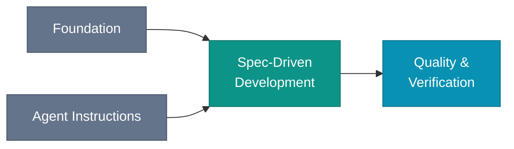

# Overview

The agent does not know what you decided. Intent Engineering is the practice of making your coding agent progressively less clueless about your system and your intention: the permanent decisions that constrain how anything is done, and the per-change specs that say what to do right now. Both live in the repo as plain text.

*Context (slate) is the prerequisite. Intent (teal) directs each change. Proof (cyan) closes the loop.*

## The four practices

| Practice | What it does | What breaks without it |
|---|---|---|
| [Foundation](/foundation/) | Repo structure as the agent's briefing: decisions, design docs, specs, and an agent-facing index | Agent improvises from training data instead of your decisions |
| [Agent Instructions](/agent-instructions/) | A single entry point and instruction hub that every session reads on load | Agent re-derives your conventions each session, inconsistently |
| [Spec-Driven Development](/spec-driven/) | A change-sized spec written before code, archived after the PR merges | Agent ships to its own design, not yours |
| [Quality & Verification](/quality/) | Tests that trace back to acceptance criteria in the spec | Spec aims; nobody checks if the agent hit the target |

[Team Workflows](/team/) covers how these practices scale across a team.

## How a session works

*You write the spec. The agent reads context and spec, then generates code and tests. The tests verify the spec was met. The PR merges.*

## Is this for you?

This book assumes you:

- ship production code and treat human review as non-negotiable
- already use a capability-class coding agent: reasoning-capable model, real tool use, enough autonomy to carry a plan across a session
- work on a codebase that outlives the session that started it
- want consistency across sessions, not only speed within one

## Where to start

| If you want to… | Start here |
|---|---|
| Understand the motivation first | [Foreword](/foreword), then [The Human-Agent Engineering Mindset](/human-agent-engineering-mindset), then [Introduction](/introduction) |
| Get into the practice immediately | [Foundation](/foundation/) |
| See what the practices look like in code | [Companion Repo](/appendices/companion-repo) |
| Evaluate whether to adopt at all | [Honest Maturity](/appendices/honest-maturity) |
