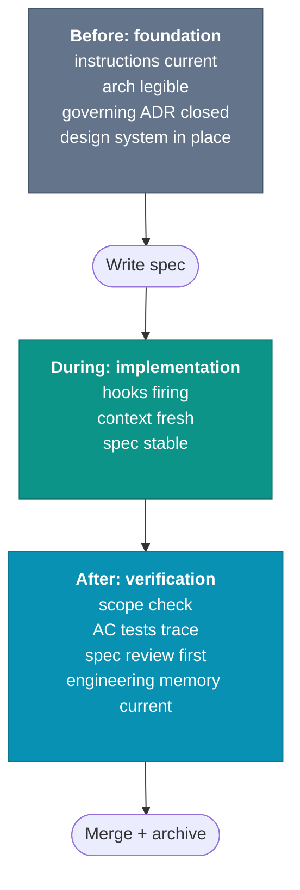

# Before, During, After: The Three Checkpoints

A change clears every gate at merge time and still runs wrong three weeks later. The spec is solid, the tests are real proof, and the PR lands clean. Then you find a comment pointing at a design document that no longer matches the code. The decision it depended on was reversed in a different PR, and nothing caught the mismatch because the change sat outside the diff anyone reviewed.

Quality is not a single gate. It is three, in sequence, and each catches a failure the other two miss.

- **Before:** did the work start from legible architecture, current agent instructions, and a reviewed spec?
- **During:** is the implementation running against that spec and the commit hooks, or has the session drifted?
- **After:** do the tests prove the acceptance criteria, and does the merged work update the engineering memory the next agent reads?

## Before: the foundation gate

The before-gate does not build the foundation. Earlier chapters did that: legible architecture (Foundation), agent instructions reachable from the `AGENTS.md` hub (Agent Instructions), a documented design system, and a test convention the agent reads before its first test ([Test Strategy and Convention](./test-strategy)). The gate asks one question about all of it: is each still current and reachable, or has it rotted since the last change?

That question is cheaper than it sounds because most of it is deterministic. A hub that points at a file that no longer exists loads nothing, and the agent codes against a convention it never saw. A repo-level checker catches structural failures like broken instruction links. The companion workflow adds file-size and index-staleness checks too. What stays manual is the judgment no scan makes: whether the architecture the docs describe is the architecture the agent will meet in the code.

[Keeping Documentation Up to Date](./keeping-docs-up-to-date) adds one more deterministic layer to this gate: a document declares which code it describes, and a validator flags the document when the code changed after the last review date. The check does not prove the prose is right. The check proves nobody has re-verified it since the source moved.

One input sits upstream of the spec itself: the architectural decision the spec executes. The chain runs ADR, then design doc, then spec ([Spec Lifecycle](../spec-driven/spec-lifecycle)). Freeze a spec against a decision still open, or against one reversed in a later PR, and the spec executes a decision the architecture no longer follows. The gate confirms the governing ADR is approved, and the design doc the spec leans on still says what the spec assumes. A link checker proves the reference resolves. Whether the decision still holds is the same manual judgment the architecture check already demands.

*Sources: Anthropic, "Building effective agents" (December 2024), preparing the agent's context before it starts work. AGENTS.md (agents.md, ongoing), AGENTS.md as a project-level entry point for agent instructions. The repo-level checker and companion-workflow examples in this section are this book's synthesis built on the documentation-drift and AGENTS.md-check patterns described elsewhere in the book.*

## During: the implementation gate

The during-gate watches three inputs while the agent codes: the spec it loaded, the hooks firing on each commit, and the state of the context window. The question is whether the implementation is still running against the right ones.

Freeze the spec first. A spec still under negotiation while the code is written is two moving targets, and the implementation drifts toward wherever the agent guesses it is heading. If it has to change, change it explicitly and restart the affected scenario rather than let the code chase a spec in motion.

The other two inputs split along the line this chapter keeps drawing. Hooks are deterministic: the pre-commit checks [Skills, Commands, and Hooks](../agent-instructions/skills-commands-hooks) installs are lint, secret detection, and AC-ID-to-tag verification, all firing unprompted.

Context erodes silently, the way [Context Window Management](../agent-instructions/context-window) described. A session three hours deep, window full, the spec buried under two unrelated tasks, writes worse code than the same session at its start.

The during-gate re-teaches neither. It enforces them. The tell that context has lapsed is the agent re-deriving in hour three an import path it had right in hour one.

The minimum during-checkpoint is three questions. Is the spec the same one the agent loaded? Are the deterministic checks still passing? Has the context window been refreshed in the last hour? Two no answers and the work should pause.

## After: the verification gate

The after-checkpoint runs on what was produced. The spec is done, the implementation is done, and the tests pass. The question is whether the artifact closes the loop.

The verification checks the things automation cannot catch on its own. Did the implementation introduce code unrelated to the spec? Scope creep in agentic PRs is common. The agent passes through a file, fixes things it noticed along the way, and those fixes ship without review. Do the new tests prove the acceptance criteria or behavior the agent invented? An AC ID linking a scenario to a test that asserts something different is the silent-drift failure mode.

State the split plainly:

| Check | Hard gate or advisory | What it checks |
|---|---|---|
| AC ID exists | hard gate | spec and tests are linked |
| positive/negative pair exists | hard gate | proof shape is present |
| test actually matches `GIVEN` / `WHEN` / `THEN` | advisory review | semantic alignment |
| scope creep beyond spec | advisory review | intent drift |

CI proving that `PAY-022` exists in both the spec and the test tags is useful. That same CI job does not prove the tagged test asserts timeout behavior. The test might only assert that one request returns `500`. The link exists. The meaning is still wrong. That second check stays with review.

One closing check has nothing to do with the diff and everything to do with what the diff invalidated. Reverse an earlier decision, and the ADR that recorded it along with any design doc citing it now describes a system no longer in the code.

The diff cannot flag this, because the stale document sits outside it: the failure this chapter opened on a comment pointing at a design doc whose decision was overturned in a separate PR. So the after-gate asks whether the change invalidated a recorded decision. If it did, was the ADR updated or marked superseded, and does the design doc still match what shipped?

Ask the same question at repo scale. Did the change invalidate the engineering memory the next agent will load? [Intent Engineering and the SDLC](../foundation/intent-engineering-and-the-sdlc) lists what that memory holds, and any of it counts when the release changed what it describes. The agent inspects the diff and proposes the affected artifacts. The reviewer decides whether the memory is current.

Small updates belong in the same PR. Larger architecture cleanup needs a follow-up with an owner named from the implementation PR. A release with no memory update and no explicit follow-up leaves stale context behind on purpose.

*Sources: The engineering-memory after-gate is this book's synthesis from the SDLC maintenance loop and documentation drift check.*

Refactoring is where most teams stop: the code worked, so it ships. The agent's first generation is rarely the right shape for the next change. The cheapest moment to fix that is now, while the spec and the code are both fresh, not in a follow-up PR three weeks later when the next developer is reverse-engineering unfamiliar generated code.

Review is the third part of the after-checkpoint, and the order is the one [Trunk-Based Development with Agents](../team/trunk-based-development) sets out: the spec first, then the diff against the spec, then the diff on its own merits. The after-gate is where that order is most often reversed under time pressure. Reverse it and the review checks whether the code looks reasonable, not whether it implements what was specified.

## A worked sequence

A small change runs through all three gates in sequence:

Each gate catches a different break. Skip the before-gate, and the agent works from stale docs, dead links, or a design decision the codebase already reversed. Skip the during-gate and the session keeps moving after the spec changed or the context window lost the thread. Skip the after-gate and the PR lands code the spec never asked for, backed by tests that prove something adjacent. The gates overlap less than they look.

## Where the attention goes

Every gate splits in two. Hooks and CI catch broken links, oversized files, missing AC IDs, and missing test pairs. Review handles the part the scanner cannot reach: whether the spec picked the right behavior, whether the code took the right shape, whether the test proves the named scenario instead of a nearby one. Push structure into automation. Spend review time on meaning.

This book treats deterministic checks as hard gates. Semantic AI review stays advisory unless your team has already proved a stronger workflow. A scanner proves linkage and shape. Review still proves meaning.

The work is uneven. The before-gate is mostly maintenance. The during-gate is mostly automation. The after-gate is the expensive one: scope creep and tests that assert adjacent behavior instead of the named scenario do not fail a CI check.

## The sequence is logical, not temporal

Read the order as a dependency, not a schedule. First, check the ground under the change. Then write the spec. Then code against that same spec. Then verify the result. A small change moves through all four steps in one sitting. The failure starts when teams treat those steps as phase gates with handoffs between them: docs first, code later, correction last.

These gates catch drift from the spec and drift from recorded architecture. They do not catch a missing constraint. If the spec never names the security boundary, and the codebase shows the agent an insecure pattern, every checkpoint here still passes. The next chapter deals with failures of that kind: code faithful to the examples, wrong in the way that matters.
