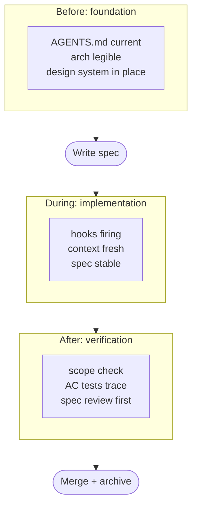

# Before, During, After: The Three Checkpoints

A change clears every gate at merge time and is still wrong by the time it runs. Picture one that does: the spec is solid, the tests are real proof, the PR lands clean. Three weeks later an on-call developer finds a comment pointing at a design document that no longer exists. The decision it depended on was reversed in a different PR, and nothing caught the mismatch, because the thing that changed sat outside the diff anyone reviewed.

Quality is not a single gate. It is three gates in sequence, each looking at something the others cannot see. Before: did the work start from a stable foundation? During: was the work carried out against a real spec, with the right context? After: does the artefact actually prove what it claims to prove?

## Before: the foundation gate

Before the agent writes a line, three things have to be in place. The architecture has to be legible enough that the agent can find what it needs. `AGENTS.md` has to point at the instructions and skills the work depends on. The design system, if there is one, has to be current.

Architecture legibility is the precondition for everything else. An agent working in a system whose modules have unclear boundaries will improvise boundaries of its own. The boundaries it improvises will not match the ones in the developers' heads. That mismatch shows up later as scope creep in PRs or as the agent placing code in the wrong layer. The fix is upstream: clearer ADRs, a current `docs/README.md` for the architecture overview, a `skeleton.md` if the codebase is brownfield.

`AGENTS.md` carries the live context. The before-checkpoint question for it is not "does the file exist?" That is given. The question is "does it still point at the right things?" An `AGENTS.md` that names an instruction file that was renamed last week is worse than no `AGENTS.md` at all. The deterministic checks for this are the cheap ones: a link checker, a file-size guard, an index-staleness scan. They run in CI and catch the cases that humans skip.

The design system is the part most teams skip until it breaks. UI components, API patterns, error response shapes, naming conventions. If these are documented, the agent uses them. If they are not, the agent improvises a different convention every session. The cost of the missing design system is paid in slow drift across PRs.

The test convention belongs here alongside the design system: which test types the project uses, which frameworks cover each, how `@Tag` annotations are applied, what the coverage thresholds are. A `docs/architecture/test-strategy.md` document that the agent reads before it writes its first test is the difference between a consistent test suite and one that accumulated all its patterns by accident. The [Test Strategy and Convention](./test-strategy) chapter covers what goes in it.

Sources: Anthropic, "Building effective agents" (Dec 2024), preparing the agent's context before it starts work. AgentPatterns.ai, "AGENTS.md: Project-Level README for AI Coding Agents" (ongoing), AGENTS.md pointing at the instructions and skills the work depends on.

## During: the implementation gate

The during-checkpoint is where the spec, the hooks, and the context-management discipline do their work. The work is happening now. The question is whether it is happening against the right inputs.

The spec is the first input. By this point it should be written, reviewed, and stable. A spec that is still being negotiated while the implementation is happening is two pieces of work running concurrently, and the implementation will drift to wherever the agent guesses the spec is heading. Hold the spec. Let the implementation catch up. If the spec needs to change, change it explicitly and restart the relevant scenario.

Hooks are the deterministic side of the during-gate. A pre-commit hook that runs the linter, a hook that catches secrets being committed, a hook that verifies every AC ID in modified specs has a corresponding tag in the test suite. These run without anyone asking. They catch the small, specific things that are easy to encode and would otherwise drift.

Context management is the harder one. A session that starts with a clean context window and a focused spec produces different output than the same session three hours later, with the window full and the spec mixed up with the last two unrelated tasks. The discipline is small sessions, focused tasks, explicit context loads. The book covered this in the Agent Instructions section; the checkpoint is reminding the developer to actually apply it. A drifting session is not visible in any diff. It is visible in the increasing rate of small mistakes the agent makes per hour.

The minimum during-checkpoint is three questions. Is the spec the same one the agent loaded? Are the deterministic checks still passing? Has the context window been refreshed in the last hour? Two no answers and the work should pause.

## After: the verification gate

The after-checkpoint runs on what was produced. The spec is done. The implementation is done. The tests pass. The question is whether the artefact actually closes the loop.

The verification checks the things automation cannot catch on its own. Did the implementation introduce code unrelated to the spec? Scope creep in agentic PRs is common; the agent passing through a file fixes things it noticed along the way, and those fixes ship without review. Did the tests added actually exercise the acceptance criteria, or did they assert behaviour the agent invented? An AC ID linking a scenario to a test that asserts something different is the silent-drift failure mode.

Refactoring is the after-checkpoint where most teams stop. The agent generated code; the code worked; ship it. The book's position is opposite: the agent's first generation is rarely the right shape for the next change. Refactor at the merge boundary, not in a follow-up PR three weeks later. The cost of the refactor while the spec and the implementation are both fresh is small. The cost when the next developer arrives and has to interpret unfamiliar generated code is large.

Review is the third part of the after-checkpoint, and the order is the one [Trunk-Based Development with Agents](../team/trunk-based-development) sets out: the spec first, then the diff against the spec, then the diff on its own merits. The after-gate is where that order is most often reversed under time pressure, and reversing it approves whether the code looks reasonable rather than whether it implements what was specified.

## A worked sequence

A small change runs through all three gates in sequence:

Each gate has its own failure mode. Skip the before-gate and the agent improvises against unknowns. Skip the during-gate and the work drifts inside the session. Skip the after-gate and the merged artefact does not match the merged intent. The three gates are not redundant. They catch different problems at different points in the lifecycle.

## What automation can and cannot do

Each gate has a deterministic part and a human part. The deterministic part is what tools like `iec check` enforce: link validity, file-size limits, AC-ID traceability, test-coverage pairing. The human part is what only attention does: is the spec describing the right thing, is the implementation in the right shape, is the test actually proving the scenario rather than something adjacent.

Effective teams maximise the deterministic part, because deterministic checks scale to agentic speeds. The hooks that run on every commit do not get tired. The link checker does not skip a file because it was busy. What humans contribute is the part that cannot be automated: the judgement about whether the work matches what the team actually needs. That judgement is scarce, and most quality programs fail by spending it on things automation could have caught.

The three-gate model is how to spend that judgement well. Use the before-gate to set up the conditions in which the agent succeeds. Use the during-gate to keep the work aligned. Use the after-gate to confirm the alignment held. Each gate has a small number of deterministic checks and one or two human questions. Anything more is overhead.

## The sequence is logical, not temporal

The gates are not project phases. A spec is not finished before implementation starts in a calendar sense; the during-gate happens immediately after the before-gate, in the same afternoon. The sequence is logical, not temporal. Forcing the sequence to map to days or weeks recreates waterfall, which is exactly the failure mode `Why Specs?` argued against.

The gates are also not equally costly. The before-gate is mostly maintenance: the architecture is already documented, `AGENTS.md` already exists, the design system already has its conventions. The during-gate is mostly automation. The after-gate is where most of the human attention goes, and it is also where the most value is created when the attention is spent well. Plan accordingly.

The three gates catch divergence from spec and drift from the architecture. They do not catch the case where the spec is silent and every pattern the agent finds in the codebase is valid, including the broken one. The next chapter covers security failure modes that survive because they match the examples the agent was shown, not because any check missed them.
