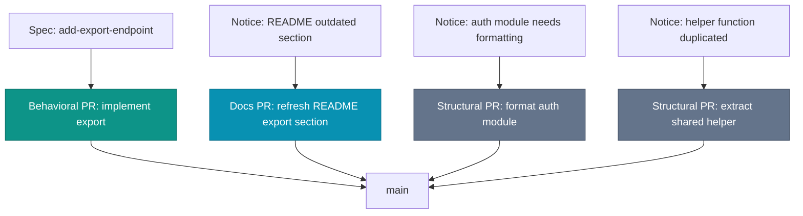

# PR Taxonomy

A pull request that does three unrelated things gets reviewed as if it did none of them. The description tells the story: fix the user profile bug, add the export endpoint, reformat the auth module. Three hundred lines. The reviewer scrolls, scrolls again, approves. A week later the auth module regresses, traced to the reformatting, which had quietly changed the order in which two middleware decorators ran. The fix was in the spec. The export endpoint was in the spec. The reformat was a free rider, and it broke production.

Bundling the three hid the regression. A reviewer cannot hold one class of change to a high bar while skimming the rest of the same diff.

## Three classes that should not mix

The taxonomy is small: three classes of change, each with its own review style, each shipped on its own PR.

| Class | Review style | Typical diff | Cognitive load | Risk |
|---|---|---|---|---|
| Docs | Reads accurately? Right file? | Small | Low | Inaccuracy slips through |
| Structural | New shape better? Call sites updated? | Large | Medium | Silent behavioral change |
| Behavioral | Spec, then diff, then the test | Small | High | Diverges from the spec |

Docs changes modify Markdown, comments, or other non-executable text. They do not affect runtime behavior. A docs PR that contains a single character of code change is no longer a docs PR.

Structural changes are reorganizations: renames, moves, formatting, refactors that preserve behavior. Review focuses on completeness rather than intent, because the intent is "no behavioral change". The danger is the refactor assumed safe that was not.

Behavioral changes modify what the code does. New endpoints, new logic, fixes that change observable output. The review is the one the previous chapters built: read the spec first, then the diff, then the test that proves the diff.

The split is conventional in Trunk-Based Development circles and has been for decades. What is new is that the agent does all three in one session, so bundling them feels like efficiency rather than the review hazard it is.

*Sources: Paul Hammant, [trunkbaseddevelopment.com](https://trunkbaseddevelopment.com/) (ongoing), the docs/structural/behavioral PR separation long-standing in trunk-based work. Dave Farley, "Modern Software Engineering" (Addison-Wesley, 2021), small, single-purpose changes as the reviewable unit.*

## Why mixing makes review harder

A reviewer opens a 300-line diff: 270 lines of formatting, 30 lines of behavioral change. The formatting comes first in the file, so the reviewer reads it first and reaches the behavioral change with a tired eye. The 30 lines that needed careful spec-aligned review get the same quick scan as the 270 that did not.

The agent's tendency to combine changes ("I noticed this could be cleaner while I was here") makes the mixed PR its default output. The fix is upstream of the review: do not let the agent combine classes in the first place.

## How to keep them separate when the agent wants to combine

The mechanism is the agent instructions and the PR-creation workflow.

In the agent instructions: behavioral changes do not include drive-by formatting. If the agent notices something worth reformatting while implementing a feature, it surfaces the observation in the PR description as a follow-up suggestion. It does not include the formatting in the diff. The same goes for refactors: a refactor worth doing is its own PR, not a free passenger on a feature PR.

In the workflow: the agent's first action on a feature task is to check whether the current branch contains structural or docs changes already. If it does, those land first, on their own PR, before the feature work continues. The branch state should match the PR shape. A branch with one feature spec and one cleanup commit is a branch that needs to split before the PR is opened.

Enforce it at the branch level and the PR shape takes care of itself: the behavioral change on its own branch, the docs and structural cleanup on their own short-lived branches and PRs.

## A worked example

The team implements a new export endpoint. The spec is in `openspec/changes/add-export-endpoint/`. The agent starts work and notices three things along the way.

Four PRs, four reviews, four merges. None takes longer than the equivalent slice of the bundled PR would have, and each is reviewable with a single style of attention: the export reviewer starts from the spec, the structural reviewers check that behavior is preserved and every call site updated, the README reviewer scans for accuracy.

If the agent had bundled all four into one PR, the export endpoint would have been buried in the middle. The auth-module formatting would have received the same level of attention as the export logic, and the duplicate helper extraction would have gone unreviewed because it looked like part of the export work. Each of the four cleanups is small. The combined PR would have been review-by-scrolling.

## When the rule has exceptions

A behavioral change that genuinely requires a structural change to land cleanly is a single PR. Adding a new endpoint that requires extending a router interface is one PR, not two. The structural change here is a precondition of the behavioral change, not a free passenger. The test of whether it belongs in the same PR is whether reverting the behavioral change while keeping the structural one would leave the codebase in a worse state. If yes, ship together. If no, ship apart.

The other exception is the small fix to documentation that lives inside the changed file. Updating a docstring on a function whose signature changed in this PR is part of the behavioral change. Updating an unrelated docstring in the same file is a separate docs PR. The boundary is "does the doc change describe what this PR did?" If yes, it stays. If no, it goes.

These exceptions exist, but they are narrow and the default is separation. A team that finds itself making exceptions on most PRs has stopped applying the taxonomy and is now using it as decoration.

## Convention, not law

The taxonomy is convention, not law. Different teams use different labels (`refactor`, `chore`, `feat`, `fix`, in conventional-commits style). The exact labels matter less than the discipline of one class per PR. What this book calls `structural`, conventional commits would split between `refactor` and `chore`. The mapping is straightforward. What matters is that the discipline is consistent within the team.

Some teams bundle short docs changes with the behavioral PR they describe. That works when the documentation is shorter than the diff. When the documentation section runs longer than a screen, it has become its own review burden. Ship it separately.

The agent will resist the discipline at first and offer combined PRs as the natural output of its work. The discipline lives in the agent instructions and in the developer's habits, not in any default the agent ships with. Expect to repeat the instruction several times before it sticks. The cost of the repetition is small, while the cost of letting it lapse is the 300-line mixed PR that broke production.

The taxonomy is what makes PRs reviewable. The next chapter looks at what runs alongside specs and tests when the team wants something more than reviewability: a way to encode the qualities the code is supposed to have, separately from the behavior it is supposed to exhibit.
