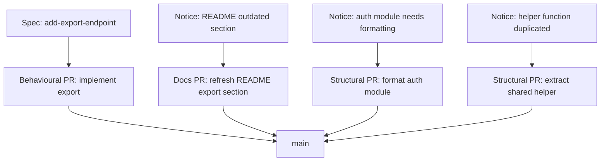

# PR Taxonomy

The PR description read: "Fix the user profile bug, add the new export endpoint, and reformat the auth module". The diff was three hundred lines. The reviewer opened it, scrolled, scrolled again, and approved. A week later the auth module had a regression that traced back to the reformatting, which had silently changed the order in which two middleware decorators applied. The reformatting had not been in the spec. The fix had been. The export endpoint had been. The third change was a free rider, and it broke production.

Mixed PRs make every kind of review harder. They mix high-stakes changes with low-stakes ones, intent-bearing changes with cosmetic ones, things that need careful review with things that need none. The reviewer is reduced to scanning, because reading carefully for one class of change while ignoring the rest is not how human attention works.

## Three classes that should not mix

The taxonomy is small. Three types of change, each with its own review style, each shipped on its own PR.

**Docs changes** modify Markdown, comments, or other non-executable text. They do not affect runtime behaviour. The review style is "does this read accurately and is it in the right file?" Review goes fast. Approval rarely blocks. A docs PR that contains a single character of code change is no longer a docs PR.

**Structural changes** are reorganisations: renames, moves, formatting, refactors that preserve behaviour. The review style is "is the new shape better, and are all the call sites updated correctly?" Review focuses on completeness rather than intent, because the intent is "no behavioural change". The diff is often large; the cognitive load is medium; the risk is the silent behavioural change that sneaks in because a refactor was assumed safe and was not.

**Behavioural changes** modify what the code does. New endpoints, new logic, fixes that change observable output. The review style is what the previous chapters described: read the spec first, then the diff, then the test that proves the diff. The diff is often small; the cognitive load is high; the risk is the implementation diverging from the spec.

Three classes. Three review styles. One PR per class. The taxonomy is conventional in Trunk-Based Development (TBD) circles and has been for decades; what is new is that agents make the temptation to mix them stronger, because the agent can do all three in one session and feels efficient bundling them.

*Sources: Paul Hammant, [trunkbaseddevelopment.com](https://trunkbaseddevelopment.com/) (ongoing), the docs/structural/behavioral PR separation long-standing in trunk-based work. Dave Farley, *Modern Software Engineering* (Addison-Wesley, 2021), small, single-purpose changes as the reviewable unit.*

## Why mixing makes review harder

The reviewer's attention is finite per PR. When the PR is one class of change, the attention budget can be spent on the questions that class needs. When it is three classes, the budget gets split, and the high-stakes class loses out.

The specific failure mode: a reviewer opening a 300-line diff that is 270 lines of formatting and 30 lines of behavioural change will read the formatting lines first (they come up first in the file) and arrive at the behavioural change with a tired eye. The 30 lines that needed careful spec-aligned review get the same quick scan as the 270 lines that did not.

This is not a hypothetical. It is the most consistent finding in the code-review literature: review quality degrades sharply with PR size, and degrades further when the PR mixes classes. The agent's tendency to combine changes ("I noticed this could be cleaner while I was here") is the modern accelerant. The fix is upstream of the review: do not let the agent combine classes in the first place.

## How to keep them separate when the agent wants to combine

The mechanism is `AGENTS.md` and the PR-creation workflow.

In `AGENTS.md`: an instruction that says behavioural changes do not include drive-by formatting. If the agent notices something worth reformatting while implementing a feature, it surfaces the observation in the PR description as a follow-up suggestion. It does not include the formatting in the diff. The same goes for refactors: a refactor worth doing is its own PR, not a free passenger on a feature PR.

In the workflow: the agent's first action on a feature task is to check whether the current branch contains structural or docs changes already. If it does, those land first, on their own PR, before the feature work continues. The branch state should match the PR shape. A branch with one feature spec and one cleanup commit is a branch that needs to split before the PR is opened.

Discipline at the PR level is easier when it is enforced at the branch level. A single change folder per branch. One PR per branch. The change folder is behavioural; the docs and structural cleanup live on their own short-lived branches with their own PRs. None of this is novel in trunk-based work; what is novel is the rate at which it becomes inconvenient when the agent could have done all three at once.

## A worked example

The team implements a new export endpoint. The spec is in `openspec/changes/add-export-endpoint/`. The agent starts work and notices three things along the way.

Four PRs, four reviews, four merges. None of them takes longer than the equivalent slice of the bundled PR would have, and each is reviewable with a single style of attention. The reviewer of the export implementation reads the spec first. The reviewer of the README update scans for accuracy. The reviewer of the auth-module reformat checks completeness. The reviewer of the helper extraction checks that the extraction preserved behaviour and is referenced everywhere it should be.

If the agent had bundled all four into one PR, the export endpoint would have been buried in the middle. The auth-module formatting would have got the same level of attention as the export logic. The duplicate helper extraction would have gone unreviewed because it looked like part of the export work. Each of the four cleanups is small. The combined PR would have been review-by-scrolling.

## When the rule has exceptions

A behavioural change that genuinely requires a structural change to land cleanly is a single PR. Adding a new endpoint that requires extending a router interface is one PR, not two. The structural change here is a precondition of the behavioural change, not a free passenger; the test of whether it belongs in the same PR is whether reverting the behavioural change while keeping the structural one would leave the codebase in a worse state. If yes, ship together. If no, ship apart.

The other exception is the small fix to documentation that lives inside the changed file. Updating a docstring on a function whose signature changed in this PR is part of the behavioural change. Updating an unrelated docstring in the same file is a separate docs PR. The boundary is "does the doc change describe what this PR did?" If yes, it stays. If no, it goes.

These exceptions exist; they are narrow; the default is separation. A team that finds itself making exceptions on most PRs has stopped applying the taxonomy and is now using it as decoration.

## Honest caveats

The taxonomy is convention, not law. Different teams use different labels (`refactor`, `chore`, `feat`, `fix`, in conventional-commits style). The exact labels matter less than the discipline of one class per PR. What this book calls `structural`, conventional commits would split between `refactor` and `chore`. The mapping is straightforward; what matters is that the discipline is consistent within the team.

Some teams skip the docs PRs entirely and bundle docs with the behavioural change they describe. This works as long as the docs are short and do not bury the behavioural change in the diff. It stops working when the docs grow large enough to become their own review burden. The threshold is hard to specify in advance; the symptom is the reviewer skipping the docs section because there is too much else to read.

The agent will resist the discipline at first. It will offer combined PRs as the natural output of its work. The discipline is an instruction in `AGENTS.md` and a habit in the developer; it is not a behaviour the agent comes with by default. Expect to repeat the instruction several times before it sticks. The cost of the repetition is small; the cost of letting it lapse is the 300-line mixed PR that broke production.

The taxonomy is what makes PRs reviewable. The next chapter looks at what runs alongside specs and tests when the team wants something more than reviewability: a way to encode the qualities the code is supposed to have, separately from the behaviour it is supposed to exhibit.
