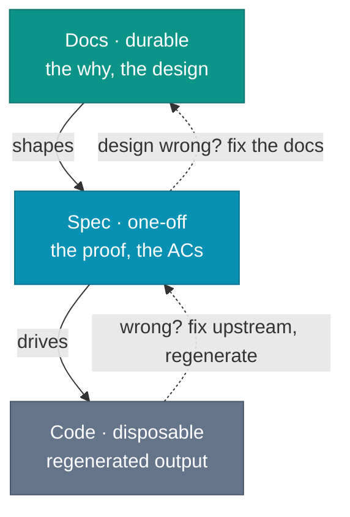

# Docs > Specs > Code

Delete the code. Keep the docs. Regenerate.

A vendor guide in June 2026 calls this the rebuild test: delete `src/`, point a fresh agent session at the specification files, regenerate, and see whether the test suite still passes. Treat it as a stress case, not a baseline. The check is safe only when the docs and tests are strong enough to catch regressions.

Now flip it. Delete the docs, keep the code, regenerate the docs.

The agent will infer: it can list routes, classes, and fields. What it cannot recover is why the retry count is three, why validation stayed in the controller, or which compromise should never have become the default. That is the difference between structure and intent.

*Sources: Augment Code, "The Spec as Source of Truth: Why Codebases Should Be Rebuildable from Documentation" (April 9, 2026, updated June 18, 2026), vendor-authored rebuild-test framing; "Spec-Driven Development: From Code to Contract in the Age of AI Coding Assistants" (OpenReview, January 30, 2026, modified April 2, 2026), spec-as-source as the strongest SDD form, and code as derivative.*

## The argument

In the 2025-2026 SDD material this chapter cites, code is increasingly treated as generated. Intent is authored.

Generated artifacts already have a familiar dependency rule. The compiled binary is downstream of the source code, the minified bundle is downstream of the modules, and the Docker image is downstream of the Dockerfile. Nobody treats the binary as the source of truth.

In agent-driven work, code starts to occupy the position the compiled binary used to. The authored intent above it lives in two places. The design, the decisions, and the reasons one option won over another live in docs. The testable behavior, the acceptance criteria, and the proof belong to the spec.

This is why the chain runs in one direction. Docs shape the spec. The spec drives the code. Code is the artifact you are most willing to throw away.

This is the compiler move from [the mindset chapter](/mindset) carried to its consequence: code becomes cheaper to regenerate, intent becomes more expensive to reconstruct, and the authored layer moves upward.

*Sources: Fission AI, OpenSpec, change folders, delta specs, and archive into canonical specs; LeanSpec, spec files as intent, constraints, and success criteria for AI implementation; Rick Hightower, "Agentic Coding: GSD vs Spec Kit vs OpenSpec vs Taskmaster AI" (February 27, 2026), SDD tools treating specs as primary artifacts; "Spec-Driven Development: From Code to Contract in the Age of AI Coding Assistants" (OpenReview, January 30, 2026, modified April 2, 2026), spec-first, spec-anchored, and spec-as-source spectrum; Dave Farley, "Modern Software Engineering" (Addison-Wesley, 2021), feedback loops and delivery of intent into production. The docs > specs > code ordering and compiler analogy are this book's synthesis.*

## Why this inverts the default

Before coding agents, modifying code was usually the expensive part. Writing the design down and then implementing from the design felt like duplicated effort. Code became the source of truth because code was the hard part.

The mantra is that code is self-documenting. It is not. Code tells you what it does, but not what was decided against, what assumptions it carries, or why the current structure won.

For bounded 2025-2026 agent-assisted changes, code modification is cheaper than it used to be. A small service, handler, or UI flow might fit in one agent session. Code that is inexpensive to replace should not outrank the documents that make replacement repeatable.

Farley's "Modern Software Engineering" argues for feedback loops and reliable delivery of intent into production. In this workflow, docs record the design decisions and the spec turns them into proof obligations.

*Sources: Dave Farley, "Modern Software Engineering" (Addison-Wesley, 2021), feedback loops and reliable delivery of intent into production; Augment Code, "The Spec as Source of Truth" (April 9, 2026, updated June 18, 2026), vendor-authored rebuild-test framing for bounded regeneration claims.*

## Who owns the ordering

The `>` is a rule the team writes down, not a property of the system. Whether an agent writes the code or drafts part of the spec, the agent does not decide which layer wins when they disagree.

The solid arrows run downward: docs shape the spec, and the spec drives the code. The dotted arrows point back up only when a developer acts on a mismatch the agent or the tests surfaced.

This rule has a direction. The machine moves down the layers, and only a person moves intent back up. If the docs are wrong, fix the docs. If the spec is wrong, fix the spec. If the code is wrong, regenerate or rewrite the code.

## The rollback path

Generated code sometimes looks wrong in ways that compound. Rolling back is quick. Improving the spec takes longer than a revert, but it is cheaper than debugging the same misunderstanding across several PRs.

When the result is wrong, discard the code first. Improve what produced it, the spec when the behavior was underspecified, the docs when the design itself was wrong, and regenerate.

This is Brooks's plan-to-throw-one-away from the preface at a smaller scale: for an agent-generated change with tests already in place, the discard cost drops from months to an iteration.

Vibe coding is a special case: the specification is chat history, ephemeral and uncommitted, which suits exploration and mockups. The transition to production runs the sequence in reverse: write the decisions into docs and the behavior into a spec, discard the prototype code, and regenerate from them.

*Sources: Frederick P. Brooks Jr., "The Mythical Man-Month" (Addison-Wesley, 1975; 20th anniversary ed. 1995), ch. 11 "Plan to Throw One Away", planned discard; Augment Code, "The Spec as Source of Truth" (April 9, 2026, updated June 18, 2026), vendor-authored rebuild-test framing; "From Vibe Coding to Spec-Driven Development," Towards Data Science (2025), extracting a spec from a vibe prototype before production; Simon Willison, "Not all AI-assisted programming is vibe coding" (simonwillison.net, March 19, 2025), vibe coding as a narrow mode distinct from disciplined AI-assisted work.*

## The bar a spec must clear

Not every document labeled "spec" earns this treatment. A spec trusted to drive code needs to be testable, traceable, small enough to read, and scoped to one change.

Testable: each acceptance criterion maps to an observable, verifiable outcome.

AC-tagged: each scenario has a stable identifier, such as `[FEAT-001]`. Tests reference the ID, not the prose.

Sized to be readable: the spec fits in a context window with room for the code.

Scoped to one change: one spec, one coherent change. Not a domain model. Not a quarter's worth of requirements.

Those bars are about behavior. The design behind the change, the why, and the alternatives weighed live in the ADRs and design docs under `docs/`.

*Sources: "Spec-Driven Development: From Code to Contract in the Age of AI Coding Assistants" (OpenReview, January 30, 2026, modified April 2, 2026), testable and verifiable specification qualities; LeanSpec, context economy, and spec files capturing intent, constraints, and success criteria; Cucumber, Gherkin tags, stable scenario tagging lineage; JUnit 5, test tagging as executable grouping. The AC ID format and minimum-bar checklist are this book's synthesis.*

## The hardest shift

Most developers reading this chapter are not convinced yet, and I sympathize. The intuition is that the code is what matters: the docs are overhead, the code runs in production, and the documents sit in a folder nobody opens.

The code runs. The docs do not. Both statements are true. The code shows what the agent implemented, while the docs and the spec show what the team asked for in the first place.

Stop treating code review as the only primary quality gate. In this workflow, spec review happens before or alongside code review. Read the spec for correctness before the diff for conformance.

This claim only holds if the spec is tied to something harder than intent: executable proof that the implementation delivers it. Intent without proof is still a document.

*Sources: "Spec-Driven Development: From Code to Contract in the Age of AI Coding Assistants" (OpenReview, January 30, 2026, modified April 2, 2026), SDD workflow checkpoints and spec-code alignment through tests; Dave Farley, "Modern Software Engineering" (Addison-Wesley, 2021), feedback loops and automated verification.*
