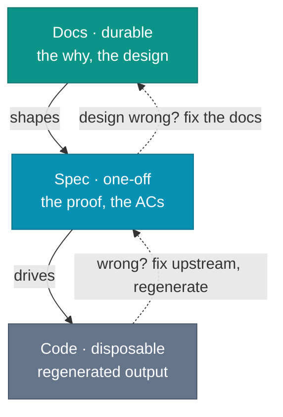

# Docs > Specs > Code

Delete the code. Keep the docs. Regenerate.

A vendor guide in June 2026 calls this the rebuild test: delete `src/`, point a fresh agent session at the specification files, regenerate, and see whether the test suite still passes. Treat the test as a stress case, not as a general industry baseline. The check is safe only when the docs and tests are strong enough to catch regressions. When the check works, the new implementation preserves the behavior the tests cover. The places where it diverges show which decisions lived only in the old code.

Now try the reverse: delete the docs, keep the code, regenerate the docs.

The agent will infer. It reads the code and produces a document describing what the code appears to do. The document misses the intent behind non-obvious decisions, describes hotfix paths as if someone designed them, and cannot tell you which validation method the team chose, or why. The result is an archaeology report, not a design record.

*Sources: Augment Code, "The Spec as Source of Truth: Why Codebases Should Be Rebuildable from Documentation" (April 9, 2026, updated June 18, 2026), vendor-authored rebuild-test framing; "Spec-Driven Development: From Code to Contract in the Age of AI Coding Assistants" (OpenReview, January 30, 2026, modified April 2, 2026), spec-as-source as the strongest SDD form, and code as derivative.*

## The argument

In the 2025-2026 SDD material this chapter cites, code is increasingly treated as generated. Intent is authored.

Generated artifacts already have a familiar dependency rule. The compiled binary is downstream of the source code. The minified bundle is downstream of the modules. The Docker image is downstream of the Dockerfile. Nobody treats the binary as the source of truth.

In agent-driven work, code starts to occupy the position the compiled binary used to. The authored intent above it lives in two places. The design, the decisions, the reasons one option won over another: those live in docs. The testable behavior, the acceptance criteria, the proof: those live in the spec. Agents derive code from both, but the design and the criteria do not reliably come back from code.

This has happened one level down already. Assembler was once the source a person reasoned in, until the compiler turned the instruction stream into emitted output and the developer's working line moved up to C and later languages. Nobody fixes a bug by hand-editing the instruction stream a compiler emits. The agent runs the same move one step higher: code becomes a generated artifact, and the working line climbs again, to the spec and the docs above it.

The boundary between authored and generated artifacts does not hold still. This book reads the current shift as a compiler move, not as a sourced law: the spec becomes the source, and the agent does the compilation step. That framing explains why spec-driven development matters now. If code is cheap to regenerate and intent is expensive to reconstruct, the authored layer moves upward.

So the chain runs in one direction. Docs outrank specs, specs outrank code: the design shapes the spec, the spec drives the code, and code is the artifact you are most willing to throw away. The spec sits in the middle on purpose. It is neither the durable record above nor the disposable output below, but the one-off artifact that turns a settled design into testable behavior for one change, then archives.

A workflow rule follows, one this book adopts rather than a law of nature: during a change, when the spec and the code disagree, treat the spec as canonical for behavior until the mismatch is resolved. When the design itself is wrong, the fix is upstream of the spec, in the docs. When the code is tangled beyond easy modification, regeneration from the docs and the spec becomes a viable option.

*Sources: Fission AI, OpenSpec, change folders, delta specs, and archive into canonical specs; LeanSpec, spec files as intent, constraints, and success criteria for AI implementation; Rick Hightower, "Agentic Coding: GSD vs Spec Kit vs OpenSpec vs Taskmaster AI" (February 27, 2026), SDD tools treating specs as primary artifacts; "Spec-Driven Development: From Code to Contract in the Age of AI Coding Assistants" (OpenReview, January 30, 2026, modified April 2, 2026), spec-first, spec-anchored, and spec-as-source spectrum; Dave Farley, "Modern Software Engineering" (Addison-Wesley, 2021), feedback loops and delivery of intent into production. The docs > specs > code ordering and compiler analogy are this book's synthesis.*

## Why this inverts the default

Before coding agents, modifying code was usually the expensive part. Writing the design down and then implementing from the design felt like a duplicated effort. Code became the source of truth because code was the hard part. Documentation became aspiration.

The mantra: code is self-documenting. It is not. Code tells you what it does, but not what was decided against, what assumptions it carries, or why the validation ended up in the controller rather than the service layer. The acceptance criteria do not tell you either. They pin the behavior, not the reasoning behind it. The docs do: the ADR that recorded the decision, the design doc that weighed the options and named the one that won.

For bounded 2025-2026 agent-assisted changes, code modification is cheaper than it used to be. A small service, handler, or UI flow might fit in one agent session. Regenerating without docs and a spec spends the same session budget and leaves the next developer reverse-engineering intent from output. Code that is inexpensive to replace should not outrank the documents that make replacement repeatable.

Farley's "Modern Software Engineering" argues for feedback loops and reliable delivery of intent into production. In this book's workflow, docs record the design decisions and the spec turns them into proof obligations. Without those artifacts, a deploy carries assumptions nobody checked. With them, a reviewer can follow the path from decision to spec to test.

*Sources: Dave Farley, "Modern Software Engineering" (Addison-Wesley, 2021), feedback loops and reliable delivery of intent into production; Augment Code, "The Spec as Source of Truth" (April 9, 2026, updated June 18, 2026), vendor-authored rebuild-test framing for bounded regeneration claims.*

## Who owns the ordering

The `>` is a decision someone records, not a property of the system. Whether an agent writes the code or drafts part of the spec, the agent does not decide which layer wins when they disagree. Ranking the layers is an intent question, and the intent is yours.

The diagram's solid arrows run downward: docs shape the spec, and the spec drives the code. The dotted arrows point back up only when someone acts on a mismatch the agent or the tests surfaced: a race the design never accounted for, a rate limit the upstream API enforces, a scenario the spec omitted. A person decides whether the fix belongs in the spec or further upstream in the docs.

This book's rule has a direction. The machine moves down the layers, and only a person moves intent back up. That upward arrow never moves on its own. A team that forgets to move it keeps docs reading as authoritative over code they no longer match. [Keeping docs up to date](../quality/keeping-docs-up-to-date) gives durable documents a feedback loop to catch that gap.

## The rollback loop

Generated code sometimes looks wrong in ways that compound. Rolling back is quick. Improving the spec takes longer than a revert, but it is cheaper than debugging the same misunderstanding across several PRs. Regenerate from the improved spec, and the second attempt has less room to repeat the same mistake.

This is the practical demonstration of the thesis. When the result is wrong, the code is what you discard first. Improve what produced it, the spec when the behavior was underspecified, the docs when the design itself was wrong, and regenerate. Each iteration sharpens the docs and the spec. The code is a snapshot.

Frederick P. Brooks called it in 1975: plan to throw one away. The first system will be discarded. The only question is whether you planned to. Brooks was describing projects where the throwaway cost months. For a small agent-generated change with tests already in place, the discard cost drops to an iteration.

Vibe coding is a special case. A vibe session usually produces no durable record: the specification is chat history, ephemeral and uncommitted. That makes the mode useful for exploration and mockups. The transition to production runs the loop in reverse: write the decisions into docs and the behavior into a spec, discard the prototype code, and regenerate from them.

*Sources: Frederick P. Brooks Jr., "The Mythical Man-Month" (Addison-Wesley, 1975; 20th anniversary ed. 1995), ch. 11 "Plan to Throw One Away", planned discard; Augment Code, "The Spec as Source of Truth" (April 9, 2026, updated June 18, 2026), vendor-authored rebuild-test framing; "From Vibe Coding to Spec-Driven Development," Towards Data Science (2025), extracting a spec from a vibe prototype before production; Simon Willison, "Not all AI-assisted programming is vibe coding" (simonwillison.net, March 19, 2025), vibe coding as a narrow mode distinct from disciplined AI-assisted work.*

## The bar a spec must clear

Not every document labeled "spec" earns the treatment described above. This book's minimum bar is deliberately mechanical. A spec trusted to drive code needs to be testable, traceable, small enough to read, and scoped to one change.

Testable: each acceptance criterion maps to an observable, verifiable outcome. Not "the API should handle errors gracefully", but "When the upstream service returns a 503, the API should retry once after 1 second, then return a 503 with `{ error: 'upstream unavailable' }`". The criterion is correct or it is not.

AC-tagged: each scenario has a stable identifier, such as `[FEAT-001]`. Not a description, but an ID. The ID remains stable through rewording, file moves, and section reordering. Tests reference the ID, not the prose. That is what keeps traceability from breaking when someone edits a heading.

Sized to be readable: the spec fits in a context window with room for the code. If it does not, it describes a change too large to implement in one PR without risk of incoherence.

Scoped to one change: one spec, one coherent change. Not a domain model. Not a system design. Not a requirements document for the next quarter. One proposed change, one set of criteria, one archive on merge.

Those bars are about behavior. The design behind the change, the why, and the alternatives weighed, clears a different bar in a different place: the ADRs and design docs under `docs/`. The spec proves the change does what was decided. It does not record the deciding.

*Sources: "Spec-Driven Development: From Code to Contract in the Age of AI Coding Assistants" (OpenReview, January 30, 2026, modified April 2, 2026), testable and verifiable specification qualities; LeanSpec, context economy, and spec files capturing intent, constraints, and success criteria; Cucumber, Gherkin tags, stable scenario tagging lineage; JUnit 5, test tagging as executable grouping. The AC ID format and minimum-bar checklist are this book's synthesis.*

## The hardest shift

Most developers reading this chapter are not yet convinced. The intuition is that the code is what matters: the docs are overhead, the code runs in production, and the documents sit in a folder nobody opens.

The code runs. The docs do not. This is true. It is also true that the code reflects what the agent decided to implement, and the docs and the spec reflect what a person decided to ask for. When the code and the intent disagree, one of them is wrong. Only one of them was authored by someone who understood why.

Stop treating code review as the only primary quality gate. In this book's spec-driven workflow, spec review happens before or alongside code review. A correct spec improves the odds of the correct code. A wrong spec lets code review approve a clean implementation of the wrong behavior. Review the intent first, then the diff.

This claim holds up only if the spec is connected to something harder than intent: not a document that describes expected behavior, but executable proof that the implementation delivers it. That proof is CI tests failing when the implementation diverges from the spec, not a human scanning the diff. Intent without proof is still a document.

*Sources: "Spec-Driven Development: From Code to Contract in the Age of AI Coding Assistants" (OpenReview, January 30, 2026, modified April 2, 2026), SDD workflow checkpoints and spec-code alignment through tests; Dave Farley, "Modern Software Engineering" (Addison-Wesley, 2021), feedback loops and automated verification.*
