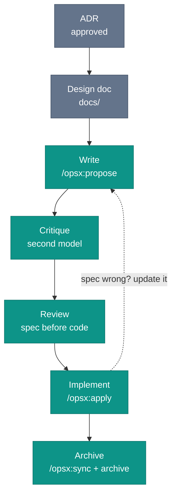

# Spec Lifecycle

Consider a spec with no lifecycle. It does not get retired. It sits there looking exactly like a live one.

Months later, an agent opens a change folder for a payment integration the team abandoned: never merged, never archived, still sitting in `openspec/changes/` with a `proposal.md` and `tasks.md` pointing at an upstream API the company already replaced. The agent, being helpful, starts implementing it.

A spec without a lifecycle accumulates. The agent cannot distinguish intent from archaeology.

## The stages

This chapter is the canonical reference for the OpenSpec change-folder lifecycle. The stages below are this book's synthesis. OpenSpec supplies the change folder and the archive step. The critique stage and intent-first review are the discipline this book adds around them.

One prerequisite before the first stage: the relevant architectural decision should be closed. An ADR establishes which path is taken. The spec describes how to execute it. Writing a spec against an open architectural question inverts the dependency: you risk finishing the implementation before discovering the intent was wrong at the decision level. The full chain runs ADR, then design doc, then spec, then implementation, then archive.



Three of these stages are OpenSpec commands. Critique and review are not, and that gap is the point: it is where this book adds discipline the tool leaves out. The command names below are the mid-2026 `opsx` profile. The stages outlast the names.

**Write** (`/opsx:propose`): create the spec when you are about to implement, not weeks in advance. One command generates the proposal, specs, design, and tasks together. A spec written speculatively drifts: by the time the work starts, the context has shifted. Purpose, acceptance criteria, scenarios with test assignments. Get the scope wrong at this stage and nothing downstream corrects it.

**Critique:** run the draft past a second model before human review. Not code review. Spec review. A different model finds the missing edge cases, the ambiguous criteria, and the scope the implementer quietly narrowed to make the work tractable, gaps a human reviewer who already heard the proposal skips over.

**Review:** the same PR review culture that applies to code applies here, with one difference. Review the spec before the implementation, not after, so the reviewer evaluates whether the intent is correct before judging whether the code matches it. [Code Review for Agent-Generated Code](../team/code-review-agent-code) works out why that order changes what the reviewer sees.

Approve the change folder on its own pull request, the spec, and its scenarios, and the intent is settled before a line of code is written. Implementation lands in one or more follow-up PRs, each checked against scenarios the team already agreed on. An agent helps here too, checking the implementation against the spec scenarios before the human reviewer opens the diff.

**Implement** (`/opsx:apply`): in the OpenSpec `opsx` workflow, the agent works through the tasks one by one, writes the code, runs tests, and ticks each checkbox, with the spec canonical for behavior throughout. `/opsx:verify` then checks the implementation against the artifacts. When the implementation reveals the spec is wrong, fix the spec and let the code follow, never the reverse.

**Archive** (`/opsx:sync`, then `/opsx:archive`): archive the moment the implementation merges and every task is checked off, not on a later cleanup pass. A folder left in `openspec/changes/` after merge is the dead spec from the top of this chapter, in-flight to the agent, finished to everyone else. `/opsx:sync` merges the delta specs into `openspec/specs/`. `/opsx:archive` moves the change folder to `openspec/changes/archive/`.

In this book's workflow, CI is the natural place to trigger both. The last task box ticked is the signal. The implementation is in git, the acceptance criteria are in the canonical spec, and the change history is in the archive. The design that shaped all three stays in `docs/`. Four things, four places, none of them confused.

*Sources: Fission AI, OpenSpec, the change-folder stages, and the archive-into-canonical-specs mechanism. Fission AI, OpenSpec, "commands.md" (github.com/Fission-AI/OpenSpec, accessed 2026), the `opsx:*` commands mapped to the stages: `propose` generates the artifacts, `apply` implements and checks off tasks, `verify` validates against artifacts, `sync` and `archive` merge and retire the change. Rick Hightower, "Agentic Coding: GSD vs Spec Kit vs OpenSpec vs Taskmaster AI" (Feb 27, 2026), multimodel critique as an emerging SDD step. The lifecycle framing (write, critique, review, implement, archive) is this book's synthesis.*

## Writing the task list

OpenSpec already does the mechanical part. `/opsx:propose` generates `tasks.md` alongside the proposal and specs. `/opsx:apply` works through the tasks one by one, writes the code, runs tests as needed, and marks each checkbox. You neither write the list nor tick it off.

What the agent will not do is decompose the way your team would. Left to its priors, it groups tasks by functional area, runs tests "as needed" rather than per criterion, and carries no thread from a scenario to the test that proves it. None of that breaks OpenSpec's rules, because OpenSpec has none here: requirements and scenarios are named, not ID'd, and a scenario is only a "potential test case", bound to nothing.

So you constrain the generation instead of performing it. Put the conventions in an instruction file next to the workflow, for example `.agents/instructions/openspec.md`, and patch nothing:

```markdown
# openspec.md (.agents/instructions/)
- Every acceptance criterion gets a unique AC ID (FEATURE-001, FEATURE-002, ...).
- Every task names the AC IDs it implements and ships a test per AC.
- State each test's type: unit, integration, end-to-end, etc.
- Do not defer tests to a final task. A task is done when its tests pass.
```

Now `/opsx:apply` runs a typed test for every criterion instead of testing at its own discretion, and `/opsx:verify` has a concrete trail to check. The AC ID travels from spec to test, so a large change splits across several PRs safely: each closes a handful of tasks, ships the tests that prove them, and merges on a passing suite. Leave tests to the agent's "as needed" and the early PRs merge unproven.

Fork the tool, and you own the merge conflict on its next release. Layer an instruction file and the conventions are yours while the workflow stays standard. The four lines above are the gist.

For sizing guidance on how many tasks belong in a list, and when a list that grows past ten signals a scope problem, see the Rule of Ten in [Why Small?](./why-small).

The task list makes the spec executable. It does not make the spec correct. That review happens next.

*Sources: Fission AI, OpenSpec (github.com/Fission-AI/OpenSpec, accessed 2026), the spec template naming requirements and scenarios rather than assigning IDs, and framing a scenario as a potential test case bound to no test; `/opsx:propose` generating `tasks.md` and `/opsx:apply` working through tasks and checking them off.*

## Multi-LLM critique

The single-model spec review has a blind spot: the model that wrote the spec and the model reviewing it share the same training and the same priors about what constitutes a complete scenario. The gaps they miss, they tend to miss together.

A second model from a different family does not share those priors. Writing the spec in your primary tool and critiquing it with a different model family catches different gaps than writing and reviewing within the same family. Rick Hightower lists this multimodel critique as an emerging step in spec-driven workflows. The difference is not always large, but for specs guiding production-critical implementations, it is often worth the pass.

The practical workflow: draft in your primary tool, then send the spec to a second model with the prompt "identify missing edge cases, ambiguous acceptance criteria, and any scenarios where the failure mode is not specified". How you do this depends on your setup: a second chat session, a different IDE plugin, a CLI agent pointed at the file. The mechanism does not matter. Iterate once. The critique adds a few minutes and catches the kind of scenario the first model never thinks to write: the empty list case, the concurrent update case, the API returning a 200 with an error payload in the body.

This is not a rigid practice. For small, low-risk specs, it is overhead. For specs touching security, payment, or anything that would constitute a long day when it goes wrong, the second-model pass is worth it.

*Sources: Rick Hightower, "Agentic Coding: GSD vs Spec Kit vs OpenSpec vs Taskmaster AI" (Feb 27, 2026), multimodel critique as an emerging step in spec-driven development.*

## The dead spec problem

A dead spec is not a deleted spec. It is a change folder left in `openspec/changes/`, marked in-flight, for work that already merged or got abandoned. The fix is the timing the Write and Archive stages prescribe: the active folder holds only what is being built right now, and everything else is noise the agent acts on.

## Tooling note

If you want to see this workflow in practice, the [`iec` companion repo](https://github.com/intent-engineering-for-coding-agents/cli) runs `iec check` on itself. The checks make lifecycle gaps visible before they become misleading instructions.

The archive is not an afterthought. It separates working intent from historical record. An agent that cannot distinguish the two treats the past as instruction. The archive is the mechanism that stops it. It is committed and kept, not pruned: the archived change folders are the record of why each capability reads the way it does, and deleting them throws that history away. The artifact most trusted when the code needs to change is likely not the one most developers would guess.

