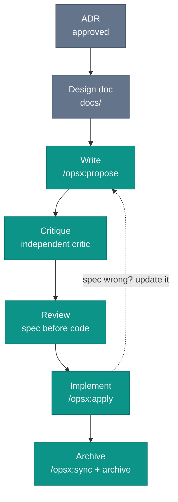

# Spec Lifecycle

Consider a spec with no lifecycle. It does not get retired. It sits there looking exactly like a live one.

Months later, an agent opens a change folder for a payment integration the team abandoned: never merged, never archived, still sitting in `openspec/changes/` (the OpenSpec change folder, if your team uses OpenSpec) with a `proposal.md` and `tasks.md` pointing at an upstream API the company already replaced. The agent, being helpful, starts implementing it.

A spec without a lifecycle accumulates. The agent cannot distinguish intent from archaeology.

## The stages

This chapter is the canonical reference for the OpenSpec change-folder lifecycle in this book. The stages below are book synthesis. OpenSpec supplies the change folder and the archive step. This book adds the critique stage and spec-first review.

One prerequisite before the first stage: the relevant architectural decision should be closed. An ADR establishes which path is taken. The spec describes how to execute it. Writing a spec against an open architectural question inverts the dependency: you risk finishing the implementation before discovering the intent was wrong at the decision level. The full chain runs ADR, then design doc, then spec, then implementation, then archive.



Three of these stages are OpenSpec commands. Critique and review are not, and that gap is the point: it is where this book adds discipline the tool leaves out. The command names below are the mid-2026 `opsx` profile. The stages outlast the names.

**Write** (`/opsx:propose`): create the spec when you are about to implement, not weeks in advance. One command generates the proposal, specs, design, and tasks together. A spec written speculatively drifts: by the time the work starts, the context has shifted. Purpose, acceptance criteria, scenarios with test assignments. Get the scope wrong at this stage and nothing downstream corrects it.

**Critique:** run the draft past an independent critic, a fresh session or a second model family, before human review. Which to use, and when both are worth it, is worked out below.

**Review:** the same PR review culture that applies to code applies here, with one difference. Review the spec before the implementation, not after, so the reviewer evaluates whether the intent is correct before judging whether the code matches it. [Code Review for Agent-Generated Code](../team/code-review-agent-code) works out why that order changes what the reviewer sees.

Approve the change folder on its own pull request, the spec, and its scenarios, and the intent is settled before a line of code is written. Implementation lands in one or more follow-up PRs, each checked against scenarios the team already agreed on. An agent run against the same spec checks each scenario for coverage before the reviewer opens the diff.

**Implement** (`/opsx:apply`): in the OpenSpec `opsx` workflow, the agent works through the tasks one by one, writes the code, runs tests, and ticks each checkbox, with the spec canonical for behavior throughout. `/opsx:verify` then checks the implementation against the artifacts. When the implementation reveals the spec is wrong, fix the spec and let the code follow, never the reverse.

**Archive** (`/opsx:sync`, then `/opsx:archive`): archive the moment the implementation merges and every task is checked off, not on a later cleanup pass. A folder left in `openspec/changes/` after merge is the dead spec from the top of this chapter, in-flight to the agent, finished to everyone else. The rule is binary: `openspec/changes/` holds only active work. `/opsx:sync` merges the delta specs into `openspec/specs/`. `/opsx:archive` moves the change folder to `openspec/changes/archive/`.

In this book's workflow, CI is the natural place to trigger both. The last checked task is the signal. The implementation stays in git, the acceptance criteria move into the canonical spec, the change history moves into the archive, and the design doc stays in `docs/`. Four artifacts, four locations.

*Sources: Fission AI, OpenSpec, the change-folder stages, and the archive-into-canonical-specs mechanism. Fission AI, OpenSpec, "commands.md" (github.com/Fission-AI/OpenSpec, accessed 2026), the `opsx:*` commands mapped to the stages: `propose` generates the artifacts, `apply` implements and checks off tasks, `verify` validates against artifacts, `sync` and `archive` merge and retire the change. Rick Hightower, "Agentic Coding: GSD vs Spec Kit vs OpenSpec vs Taskmaster AI" (February 27, 2026), multimodel critique as an emerging SDD step. The lifecycle framing (write, critique, review, implement, archive) is this book's synthesis.*

## Writing the task list

OpenSpec already does the mechanical part. `/opsx:propose` generates `tasks.md` alongside the proposal and specs. `/opsx:apply` works through the tasks one by one, writes the code, runs tests as needed, and marks each checkbox. You neither write the list nor tick it off.

What the agent will not do is decompose the way your team would. Left to its priors, it groups tasks by functional area, runs tests "as needed" rather than per criterion, and carries no thread from a scenario to the test that proves it. None of that breaks OpenSpec's rules, because OpenSpec has none here: requirements and scenarios are named, not ID'd, and a scenario is only a "potential test case", bound to nothing.

So you constrain the generation instead of performing it. Put the conventions in an instruction file next to the workflow, for example `.agents/instructions/openspec.md`, and hand-edit nothing:

```markdown
# openspec.md (.agents/instructions/)
- Every acceptance criterion gets a unique AC ID (FEATURE-001, FEATURE-002, ...).
- Every task names the AC IDs it implements and ships a test per AC.
- State each test's type: unit, integration, end-to-end, etc.
- Do not defer tests to a final task. A task is done when its tests pass.
```

Now `/opsx:apply` runs a typed test for every criterion instead of testing at its own discretion, and `/opsx:verify` has a concrete trail to check. The AC ID travels from spec to test, so a large change splits across several PRs safely: each closes a handful of tasks, ships the tests that prove them, and merges on a passing suite. Leave tests to the agent's "as needed" and the early PRs merge unproven.

Fork the tool, and you own the merge conflict on its next release. Layer an instruction file and the conventions are yours while the workflow stays standard. The four lines above are the gist.

For sizing guidance on how many tasks belong in a list, and when a list that grows past ten signals a scope problem, see the Rule of Ten in [Why Small?](./why-small).

The task list makes the spec executable. It does not make the spec correct. That review happens next.

*Sources: Fission AI, OpenSpec (github.com/Fission-AI/OpenSpec, accessed 2026), the spec template naming requirements and scenarios rather than assigning IDs, and framing a scenario as a potential test case bound to no test; `/opsx:propose` generating `tasks.md` and `/opsx:apply` working through tasks and checking them off.*

## Independent critique

The model that wrote the spec carries two kinds of bias into review. One comes from session history. The draft, the abandoned alternatives, and the little compromises are still in context, so the review tends to confirm them. The other comes from the model itself: the same priors about what counts as a complete scenario, the same habits in how edge cases get skipped.

A fresh session fixes the first problem. Start a new chat, load only the spec, and ask for missing edge cases, ambiguous acceptance criteria, and scenarios with no stated failure mode. That is the cheaper pass and often enough.

A second model family addresses the second problem. Different defaults catch different omissions. Rick Hightower lists this multimodel critique as an emerging step in spec-driven workflows. For small specs, skip the extra run. For payment, security, or production-critical behavior, the pass is usually worth a few minutes.

*Sources: Rick Hightower, "Agentic Coding: GSD vs Spec Kit vs OpenSpec vs Taskmaster AI" (February 27, 2026), multimodel critique as an emerging step in spec-driven development.*

## Tooling note

The [`iec` companion repo](https://github.com/intent-engineering-for-coding-agents/cli) runs `iec check` on itself. The checks make lifecycle gaps visible before they become misleading instructions.

The archive is not an afterthought. It separates live work from historical record. Without that split, the agent reads last quarter's abandoned change beside today's active one and treats both as instructions. Keep the archive committed. Those folders explain why each capability ended up with its current behavior.
