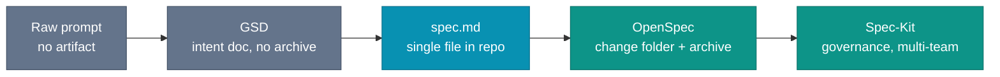

# The Spectrum

How much process does rename a config variable deserve? A full Spec-Driven Development framework gives it too much. The ceremony is right for a large API redesign, and absurd for a one-line rename. The structure that protects a risky change suffocates a trivial one.

Consider a team that writes no specs at all, operating on prompts and conversation history alone. Features work until a later session extends them. Then a reviewer asks why the validation is in the controller, and the only answer is `git blame`.

Through 2025 and into 2026, the Spec-Driven Development (SDD) tooling spread into a spectrum, from no artifact to full governance. SDD is the practice: per-change intent with testable acceptance criteria. GSD, `spec.md`, OpenSpec, LeanSpec, and Spec-Kit are implementations of it at different levels of formality. The tools below are a mid-2026 snapshot, not a settled field.

BMAD Method, Taskmaster, and other frameworks occupy the same category. The diagram below marks formality levels, not a ranking of the field.

Formality and audit trail rise left to right, and so does overhead. The rung that fits a change is the one whose ceremony matches its risk, not the heaviest one available.

## The light end

At the minimal end is the raw prompt. Describe the feature in the chat window and let the agent implement. No artifact, no audit trail. Acceptable for throwaway code, local experiments, prototypes that will not last the week.

One step up, GSD (Get Shit Done): structured prompting without a framework. Write a concise intent document, run the agent, commit. It produces a usable artifact but no archive, task log, or traceability trail. Hightower calls it "spec-driven development without the ceremony," and where OpenSpec's overhead exceeds a team's risk profile, it is the practical alternative.

Next is a `spec.md` file in the repo: a single Markdown file, no external framework, with purpose, scope, acceptance criteria, scenarios, task notes, and verification rules. Written before implementation, committed with the code. The GitHub post launching Spec-Kit describes this as where most teams start with spec-driven development.

For teams with stable review rules, `spec.md` becomes a local framework. The file starts small, then picks up house rules: where it lives, which headings are mandatory, who reviews it, how scenarios map to tests, when it becomes historical, and how stale specs stop acting as live instructions. Local formats stay viable when those rules match the team's existing review and release mechanics better than the generic template does.

The cost is ownership. A custom `spec.md` gives maximum fit and almost no tooling burden, but the team owns the lifecycle around it. Without those rules, `spec.md` is a better prompt. With them, it becomes a spec-driven workflow.

*Sources: Rick Hightower, "What Is GSD? Spec-Driven Development Without the Ceremony" (February 23, 2026), GSD as structured prompting that produces an artifact but no archive or traceability trail. GitHub Blog, "Spec-driven development with AI: Get started with a new open source toolkit" (September 2, 2025), the plain `spec.md` file as the common starting point for teams new to spec-driven development. The custom `spec.md` lifecycle framing is this book's synthesis.*

## OpenSpec

OpenSpec is the next level: a structured change-folder workflow with four parts, each answering a distinct question.

| Part | File | Question |
|---|---|---|
| Propose | `proposal.md` | What is changing, why does it matter, and what follows from it? |
| Design | `design.md` *(optional)* | Which implementation approach should stand? |
| Specs | `specs/<capability>/spec.md` | How should the capability behave after the change? |
| Tasks | `tasks.md` | What should be implemented, and in what order? |

Acceptance criteria are written in Gherkin's `WHEN/THEN` notation. The book borrows that notation as a specification language, not the practice it came from. The payoff is that the scenario reads the same whether the agent targets Java, Kotlin, Python, or Go: a reviewer checks the acceptance criteria without knowing the implementation language or its test framework, the same way nobody reviews behavior by reading the assembler a compiler emits.

This is not BDD: there are no step definitions, no Cucumber runtime, and the scenario is authored and approved before the code exists, then compiled to tests by the agent, rather than written against code that already runs. Why the spec outranks the code it produces is the argument in [Docs > Specs > Code](./docs-gt-specs-gt-code).

The change folder is lifecycle machinery around those scenarios. The specs are the part that changes the system. A change proposal is a delta on the capability model: acceptance criteria added, updated, or removed. When the change is archived, those criteria merge into the canonical `/openspec/specs/<capability>/spec.md` and the full change folder, proposal, design, and tasks, moves to `openspec/changes/archive/`.

OpenSpec is the workflow this book uses. It is not the only one that works. The closest alternative is the plain `spec.md` your team has already shaped into a local workflow. The durable part is the bundle of concerns: a statement of intent, an implementation approach when the change needs one, behavioral specs, an execution plan, and an archive rule. A framework with those pieces buys most of the same control.

The selection rule is simpler than the tool names make it sound: pick the lightest framework that is already closest to the artifact set and lifecycle you want. A plain `spec.md` plus four house rules for a proposal, tasks, archive, and review is already a framework. Pretending otherwise only hides the maintenance cost.

OpenSpec is the choice here because it supplies the lifecycle without hiding the files. One change folder holds a single unit of intent, carrying delta specs for the behavior changes, Gherkin-style scenarios to make the acceptance criteria concrete, and `tasks.md` for the agent's execution path. Archiving then keeps active intent apart from the historical record.

That archive becomes the canonical set of acceptance criteria for each capability. Later changes diff against those criteria, and CI tests trace back to them. The design those criteria serve does not live here. It lives in `docs/`. This split adds real file and process overhead, and it fits best where several developers are shipping changes into the same production codebase.

*Sources: Fission AI, OpenSpec, the four-part change-folder workflow, delta specs, `tasks.md`, and the archive as a canonical capability model. Cucumber "Gherkin reference" (ongoing), the `Given/When/Then` notation borrowed here as a spec language, not the BDD practice it originates from. The framework-selection rule and closest-alternative framing above are this book's synthesis.*

## LeanSpec and Spec-Kit

LeanSpec is the lightweight productized neighbor. It articulates the small-spec discipline the previous two chapters inherited: stay focused, keep specs short, finish before extending. Its tooling and adoption are thin next to OpenSpec, so this book takes LeanSpec's philosophy on scope and OpenSpec's machinery for lifecycle.

At the enterprise end, GitHub positions Spec-Kit for large-scale, multi-team environments with compliance requirements: tooling, integrations, governance hooks. The formality is designed for the scale.

*Sources: LeanSpec, the small-spec discipline this book absorbs while using OpenSpec for lifecycle and structure. GitHub Blog, "Spec-driven development with AI: Get started with a new open source toolkit" (September 2, 2025), Spec-Kit's targeting of large-scale, multi-team environments with compliance requirements.*

## Match formality to risk

Match formality to risk is LeanSpec's framing. The table below is this book's working synthesis of it. The error is not picking the wrong tool. The error is picking one tool and applying it to every change regardless of risk.

| Change type | Appropriate formality |
|---|---|
| Local prototype, will not merge | Raw prompt |
| Small bug fix, clear scope, no edge cases | `spec.md` or skip entirely |
| New feature, single developer, medium complexity | `spec.md`, LeanSpec, or OpenSpec if the project will keep accumulating specs |
| New feature, team collaboration, reviewable | OpenSpec change folder |
| Compliance-sensitive, multi-team, production | OpenSpec or Spec-Kit |

This is a heuristic, not a decision tree. The real question is the cost of discovering the wrong intent after implementation. Low cost, low formality. High cost, high formality.

Read the table per project, not only per change. A solo developer shipping one agent-assisted feature might stay with `spec.md`. A solo developer shipping twenty changes into the same codebase has a different problem: old intent, current intent, test evidence, and archive history start piling up. At that point, OpenSpec's lifecycle stops looking like a ceremony and starts looking like bookkeeping you were going to need anyway.

The same dial governs how you stage the change, not only which framework you reach for. A change carrying a real decision earns a spec PR before any implementation, so the intent is corrected while correcting it is cheap. A change whose intent is visible in the diff ships as one PR. The [trunk-based development chapter](/team/trunk-based-development) works the mechanics.

*Sources: Rick Hightower, "Agentic Coding: GSD vs Spec Kit vs OpenSpec vs Taskmaster AI" (February 27, 2026), the formality-to-risk tradeoffs that distinguish the SDD tools across the spectrum.*

## The trade-off

More formality means more audit trail, better traceability, less improvisation surface. It also means more upfront time, more overhead per change, and more places for the process to become theater if nobody tends it.

Teams underestimate the theater risk. A heavy framework adopted by a small team produces specs written to satisfy the framework rather than guide the implementation: correct structure, shallow content, twenty minutes from a developer who wants to get to the code. They look complete and are not.

The right level of formality is the one your team will maintain under deadline pressure. Start lower than you think you need. Add ceremony when you feel the pain of not having it.

Picking the rung is the easy part. The lifecycle that carries a spec from proposal to archive, and back into the codebase as proof, is where most of the work hides.
