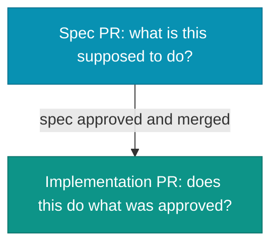

# Code Review for Agent-Generated Code

The PR has a spec delta, acceptance criteria, a constraint section, and three hundred lines of implementation. The reviewer opens the diff view.

Not from laziness. The code diff is what changed. Review tooling presents the diff view first. Every code review instinct from before coding agents was trained on code diffs. The spec is new, and opening it first is a deliberate choice the tooling does not prompt, and most reviewers have not built into habit.

[Trunk-Based Development with Agents](./trunk-based-development) names this as intent-first review: read the spec delta before the code diff, verify intent before implementation. The problem is not knowing the correct sequence. The problem is that review tooling, PR shape, and years of reviewer habit all point toward the diff view. Making intent-first review the default requires shaping the PR so the spec is the obvious starting point, not the disciplined one.

This chapter covers three things: how to shape the PR so intent-first review happens by default rather than by discipline, how to bring a second agent into the review to check what the implementation agent and the human reviewer each miss, and what each kind of reviewer reliably gets wrong.

## PR shape: the spec as the load-bearing document

A change folder plus an implementation in one PR creates a size and sequencing problem simultaneously. The spec delta is forty lines, the implementation is three hundred lines, and the diff view opens on the first file changed. If the implementation files appear before the change folder in the directory tree, the reviewer arrives at the acceptance criteria after reading three hundred lines of code with a model of the feature already formed.

A reviewer who has read the implementation first reads the spec to confirm what they already understood. They verify that the spec matches the code they read, not that the code matches the spec as written. The two documents contain different information, and reading them in the wrong order treats one of them as a formality.

The two-PR shape removes this problem by separating the documents. The first PR carries only the change folder: `proposal.md`, `design.md`, and the delta specs with their acceptance criteria. Nothing executable. The reviewer reads the spec as a spec, without implementation to bias them. Corrections to intent happen before any code exists. The second PR delivers the implementation and archives the folder. The reviewer arrives with an approved spec and reads the code diff against it. The review question changes from "what is this supposed to do?" to "does this do what was approved?"

When the split applies is the question [Trunk-Based Development with Agents](./trunk-based-development) already settles: if an intent-level correction found in review forces the implementation to be redone, the spec earns its own PR, otherwise spec and code ship together with the spec delta read first inside the single PR. What the review angle adds is why the split helps the reviewer. Once the spec PR has merged, reading the code diff before the intent is structurally harder, so intent-first review stops depending on discipline.

The [PR Taxonomy](../quality/pr-taxonomy) chapter establishes that `docs`, `structural`, and `behavioral` PRs use different review styles and should not mix. The spec PR, carrying only the change folder, is a docs change. The implementation PR is behavioral. The two-PR shape is the natural expression of that taxonomy for decision-heavy behavioral changes.

*Sources: Fission AI, [OpenSpec](https://openspec.dev/) (ongoing), the change folder as the unit of spec-first review.*

## AI-assisted coverage review

A common failure mode in reviewing agent-generated code: the implementation agrees with the tests, the tests agree with each other, and neither agrees with the acceptance criteria. All three artifacts are internally consistent. All three are wrong relative to the spec.

An agent brought into the review with the spec and the implementation checks one thing efficiently: does every acceptance criterion have a corresponding test, and does the test assert what the criterion requires? This is coverage tracing, tedious enough that human reviewers skip it in practice. The agent does not find it tedious.

Ask it to list each acceptance criterion, locate the corresponding test, and state what the test asserts. Flag any criterion with no test, any test whose assertion does not match the criterion's requirement, and any test with no corresponding criterion.

The output should read like a checklist, not a verdict. `SC-018 tag exists, but THEN says "reject duplicate email" and the test only checks malformed email` is a useful review comment. `coverage looks incomplete` is not. The second agent should name the broken link, not hand the reviewer another riddle.

The agent also checks scope. A behavioral implementation should deliver what the spec describes and nothing more. An agent working inside a long session accumulates context and adds small improvements: a helper function it needed, a config flag that seemed useful, a refactor it noticed while passing through. These additions are not in the spec. A reviewing agent, comparing the code diff against the acceptance criteria, flags each changed line with no criterion to trace to.

What the review agent does not catch reliably: integration failures, whether the acceptance criteria were right in the first place, or whether the feature will work as intended in production. Those require judgment. The coverage and consistency check does not require judgment. That is the point.

As of mid-2026, `iec` does not ship this as a command. Treat `check_spec_quality` as the planned shape of a future MCP check: compare an implementation against its spec, trace acceptance criteria to tests, and flag deviations and scope additions. The practice does not depend on the tool existing first.

*Sources: The acceptance-criterion trace, scope-drift check, and `check_spec_quality` command shape are this book's workflow guidance. The `check_spec_quality` command is a time-bounded companion-tool plan, not a shipped feature.*

## Multi-LLM critique

The fresh-session technique from [Spec Lifecycle](../spec-driven/spec-lifecycle) applies here with different inputs and a different goal. Pre-implementation, the second agent critiques the spec. At review, it traces the implementation.

The implementation agent has context that biases its review. It resolved the spec's ambiguities, decided which edge cases were in scope, and wrote tests that confirm its choices. Asking it to review the same code confirms the same choices again.

Open a fresh session with the approved spec and the implementation code diff, and no context from the implementation conversation. Run the same coverage trace described above: every acceptance criterion to its test, every changed line back to a criterion. The output is a checklist, not a verdict. The human reviewer uses it to direct attention toward the sections most likely to contain gaps.

This step is not free. For high-stakes behavioral changes with many acceptance criteria, the tracing is worth it. For a change with three acceptance criteria and three tests, skip it.

A fresh session of the same model removes the implementation bias. A genuinely different agent removes more: different training data, different defaults, different blind spots. Keeping `AGENTS.md` and `.agents/` vendor-neutral keeps the switching cost lower because the context was never tool-specific. The second opinion does not have to come from the same tool, and pointing a different agent at the same spec and code diff often costs little beyond the extra run itself. Run that across enough changes, and a second thing falls out: a rough read on which tool earns its keep on this codebase, not the one with the loudest release notes.

*Sources: Birgitta Böckeler, ["Navigating AI Development Workflows"](https://refactoring.fm/p/navigating-ai-development-workflows), Refactoring.fm, using a second model or fresh session to critique a spec without implementation-context bias.*

## What human reviewers miss, what agent reviewers miss

The gaps are complementary: each reviewer covers what the other does not. These are analytical observations from the structure of a spec-driven review, not sourced findings.

| Reviewer | Reliably misses | Why it slips through |
|---|---|---|
| Human | Competence heuristic | Polished, well-tested code reads as careful, so the reviewer notes the test exists without asking whether it asserts the right thing |
| Human | Unchanged context | The code diff shows what changed. A new dependency on a function three files away leaves no red or green line |
| Human | Constraints past the top | A reviewer who reads the acceptance criteria and skips the constraint section approves an edge case handled wrong, the constraint was in section three |
| Agent | Integration context | It reviewed the code and the spec, not the runtime: a latency the spec did not model, middleware ordered differently in production than in test |
| Agent | Silent ambiguity resolution | Ambiguous criteria resolve toward the simplest implementation, and the choice is never surfaced as a choice |

A human doing intent-and-integration review and an agent doing coverage-and-consistency review together cover more of the failure surface than either alone. Neither covers it completely.

## The review is one gate

These practices raise the quality of what ships. They are not a guarantee. Review catches divergences between spec and implementation, not divergences between the spec and reality or the user's need. Cognitive debt still accumulates when the spec itself is wrong, incomplete, or stale.

At agentic speeds, the review gate handles higher volume than before. The quality of what reaches it depends on the spec that preceded it. The quality of the spec depends on the discipline applied upstream: intent stated clearly, scope constrained, constraints at the top.

A disciplined review process is only as consistent as the conventions that back it. One reviewer who reads spec-first and another who reads code-diff-first, reviewing code generated by the same agent against the same spec, produce different results. The conventions that make intent-first review consistent across the team are the same conventions that make everything else consistent: a shared instruction set that every agent and every developer reads before the first session.

*Sources: ThoughtWorks Technology Radar Vol 34 (April 2026), cognitive debt as the failure mode review alone does not prevent.*
