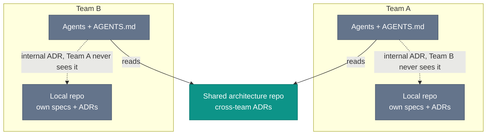

# Cross-Team Coordination

Consider two teams sharing an authentication boundary. Team A changes the token format and records the decision in an ADR marked Internal, inside Team A's repo. Team B's agents keep parsing the old format out of Team B's architecture docs because Team A's decision log never enters their context. Team B learns about the break the usual way, in production.

The ADR did its job for Team A. The mechanism that would have carried it to Team B did not exist.

Coordination across team boundaries is harder than coordination within a team, and coding agents add another failure mode. Each team's agents read their own architecture docs, their own instructions, and their own ADR log. The services share runtime behavior. The agents do not share context unless you wire it in.

## ADRs as the cross-team mechanism

Architectural Decision Records are the cross-team primitive this book uses because they already exist in the SDLC. They are durable, human-readable, usually checked into a repo, and record decisions with consequences that persist after the authors have moved on.

For cross-team decisions, the ADR location matters. An ADR checked into Team A's repository is private to Team A's agents and Team A's developers who read the repo. An ADR checked into a shared architecture repository, one all teams' agents are instructed to read, becomes cross-team context.

The shared architecture repository pattern is simple: a repository, or subdirectory in a monorepo, contains ADRs for decisions affecting more than one team. Team A's `AGENTS.md` tells agents to check the shared architecture repository before writing specs across service boundaries. Team B's instructions say the same. The authentication token format change goes into the shared repository, where both teams' agents load it.

This is not a new mechanism. It is the existing ADR practice applied at the organizational level rather than the team level. The agent-specific addition is a pre-spec context load from the shared repository.

*Sources: Michael Nygard, ["Documenting Architecture Decisions"](https://www.cognitect.com/blog/2011/11/15/documenting-architecture-decisions), Cognitect blog, November 15, 2011, ADRs as the durable, human-readable decision record.*

## Inner source for `.agents/` libraries

A team that has written useful skill files (a spec-quality checker, a test-strategy validator, a security-review skill) should not be the only team using them. The emerging pattern borrows from inner source: selected files from `.agents/` move into a shared library other teams pull from.

The mechanics resemble any shared library contribution. One team publishes the skill, documents what input it expects and what output it produces, and maintains it. Other teams pull or copy it into their `.agents/` directory.

The pragmatic shortcut for smaller organizations: a single `shared-agents` repository with skills and instruction files that teams include in their `AGENTS.md` by reference. The team's local `AGENTS.md` loads the shared file first, then layers project-specific conventions on top. The shared file changes less often, while the project-specific layer changes frequently.

The inner source for agent instructions is book synthesis. As of mid-2026, there is no widely adopted standard for packaging, versioning, or distributing `.agents/` libraries. Treat this as a borrowing from shared-library practice.

*Sources: AgentPatterns.ai, "AGENTS.md: Project-Level README for AI Coding Agents" (last reviewed June 9, 2026), AGENTS.md as a shared project instruction set. The inner-source distribution pattern for `.agents/` libraries is this book's synthesis.*

## Multi-repo realities

Most teams work in multi-repo environments: the payment service in one repository, the notification service in another, the authentication service in a third. Each has its own `openspec/`, its own `.agents/`, its own agent instructions. Coordination between them requires agents to cross a repository boundary the code already crossed years ago.

Navigation happens through ADRs and through explicit cross-repo references in specs. A spec in the payment service that depends on a notification service API should reference the notification service's ADR for that API, not copy the API definition into the payment service spec. The reference is a pointer, and the ADR is the canonical record. When the API changes, the ADR updates. The payment service spec reference remains valid.

MCP (Model Context Protocol) creates another path: agents fetch context from other repositories on demand, rather than reading only their local files. As of mid-2026, this is an emerging practice. An agent working in the payment service might call an MCP tool to fetch the current API contract from the notification service repository. The pattern depends on the MCP tooling available.

Multi-repo coordination is harder at the agent level than at the code level. Package managers already move code across repo boundaries. Context still moves mostly by hand: a developer reads another team's docs, then restates the relevant parts to the agent. That manual relay is the gap.

*Sources: Model Context Protocol documentation (ongoing), MCP as the agent-tool bridge used for external context fetches. The shared-context gap for multi-repo agent work is this book's synthesis from current tool limits.*

## OpenSpec's acknowledged gap

OpenSpec is strongest in single-repository work. The change folder model assumes one codebase, one spec directory, one PR. Multi-repo coordination, where a single feature requires coordinated change folders in two or three repositories, does not yet have a clean OpenSpec solution.

The current book pattern is one change folder per repository, each referencing the same cross-cutting ADR. Coordination between the change folders remains human: the developers from both teams agree on the ADR, then each creates that repository's change folder referencing it. The agent in each repository implements against its own spec. The integration is verified in an environment shared by both teams.

This reduces confusion, but it does not remove coordination. OpenSpec's Workspaces roadmap names multi-repo planning as an in-development team problem. As of mid-2026, teams building cross-repo features should plan for manual coordination overhead.

*Sources: Fission AI, [OpenSpec](https://openspec.dev/) (ongoing), single-repository change-folder model and Workspaces roadmap naming multi-repo planning as an in-development team problem.*

## Governance without bureaucracy is still unsolved

The shared architecture repository pattern works only when organizations maintain it. A shared repository with twenty teams committing ADRs requires clear ownership, contribution guidelines, and a review process for incoming decisions. The same organizational discipline that makes internal ADRs useful (consistent format, active maintenance, genuine use by teams and agents) applies doubly to a shared architecture repository.

The alternative, where cross-team decisions are not written down, is the pattern behind the hypothetical production incident at the start of this chapter. The overhead of the shared repository is real. So is the cost of not having it.

The tooling for cross-team coordination is still early. The community has repeatable patterns for one developer and one repository. The multi-repo story still has loose edges.

*Sources: Fission AI, [OpenSpec](https://openspec.dev/) (ongoing), multi-repo planning still treated as an in-development problem. Governance-without-bureaucracy is this book's open-problem framing.*
