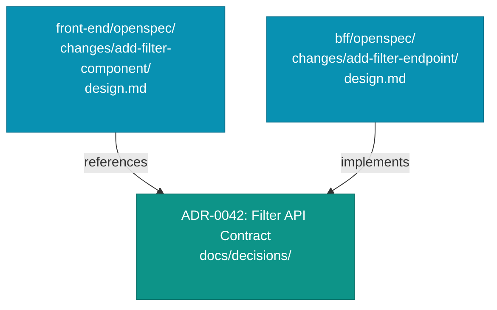

# OpenSpec Across Stacks

Give an agent the whole monorepo as context, and stack boundaries blur fast. It finds an API endpoint with the right name, the right path, the right method signature, and wires it into the new filter component without hesitation. Code review catches the mismatch later: the front end called the back-end service API instead of the Backend for Frontend (BFF) API, so the authorization checks in the BFF never ran.

This chapter is about that narrower failure. A single `openspec/` directory shared across three tiers gives every agent access to every tier's specs and leaves tier ownership implicit.

## One `openspec/` per stack

The fix is structural. Each stack (front-end, BFF, back-end) gets its own `openspec/` directory at the root of its repository, or of its subdirectory in a monorepo. The front-end agent never sees the back-end specs. It knows its contracts, its acceptance criteria, and its pending changes. The back-end specs are not its context.

```text
front-end/
  openspec/
    changes/
      add-filter-component/
        proposal.md
        design.md
        specs/
          filter-component/
            spec.md
        tasks.md

bff/
  openspec/
    changes/
      add-filter-endpoint/
        proposal.md
        design.md
        specs/
          filter-endpoint/
            spec.md
        tasks.md

back-end/
  openspec/
    changes/  # (unchanged by this feature)
```

A unified `openspec/` across stacks gives the agent three codebases of context it does not need and three sets of canonical specs it should not all trust. Every ambiguity resolution gets harder. Keeping stacks separate makes each agent's working set legible and bounded.

This is a book synthesis. There is no widely adopted standard for multi-tier spec organization. The pattern here follows from the general principle that context should be scoped to the work being done.

*Sources: Fission AI, [OpenSpec](https://openspec.dev/) (ongoing), the change-folder model this per-stack layout builds on. The multi-tier split itself is this book's synthesis.*

## Front-end context belongs outside the stack spec

The spec pattern for front-end work is identical to the pattern for back-end work. What changes is the permanent context the agent reads before implementation.

A back-end agent reads `docs/architecture/`, the API contract, and the test strategy. A front-end agent reads the design system document instead: component conventions, accessibility requirements, and state management patterns. Figma or another design source supplies the visual context, while the design system document supplies the durable convention.

The spec should still cover behavior: states, validation, edge cases, loading, error, and empty states. User flows and navigation logic belong in `docs/architecture/`, referenced by the spec. The design system doc answers how the component should look when it renders correctly.

*Sources: Framelink, [Figma-Context-MCP](https://github.com/GLips/Figma-Context-MCP) (ongoing), Figma files as extractable design context for coding agents. The split between front-end behavior specs and `docs/design/` convention instructions is this book's workflow mapping.*

## The integration contract belongs in an ADR

A change in the front-end spec that depends on a new BFF endpoint needs a source of truth shared by both stacks. That source of truth is not a spec, because specs are scoped to a single change folder and a single stack. The shared source is an Architectural Decision Record (ADR).

The ADR in `docs/decisions/` records the API contract: endpoint path, request shape, response shape, error handling, authentication boundary. Both stacks reference the same ADR in their respective change folders. The front-end spec says "see ADR-0042 for the BFF contract", while the BFF spec says "implements the contract in ADR-0042". When the contract changes, one ADR update is the source of truth. The specs do not need to repeat the contract details.



The ADR is permanent, while the change folders are temporary and archived after implementation. The contract outlives both.

*Sources: Michael Nygard, ["Documenting Architecture Decisions"](https://www.cognitect.com/blog/2011/11/15/documenting-architecture-decisions), Cognitect blog, November 15, 2011, ADRs as the cross-stack contract of record that outlives the change folders.*

## When a change spans tiers

Most features touch multiple tiers. A new filter endpoint requires front-end work, BFF work, and sometimes back-end work. The temptation is to create one change folder that covers all three.

That temptation compounds every problem described above. The front-end agent does not need the back-end implementation details, and the BFF reviewer does not need to read the front-end acceptance criteria. The archive of the change becomes three times as large and three times as hard to search.

When a change spans tiers, each tier gets its own change folder referencing the same cross-cutting ADR. Coordination happens at the ADR level, while implementation stays separate. Each PR is one tier, one spec, one reviewer context.

The rare exception: infrastructure changes that have no clean tier boundary. A change to how authentication tokens are propagated through the stack affects all three tiers simultaneously. These are genuinely cross-cutting and warrant a cross-cutting spec, but they are rare enough that the exception should be labeled as such, not treated as the default.

## This is book synthesis, not a field standard

Multi-tier spec organization is not a field standard. This pattern is the book's synthesis, derived from the OpenSpec change-folder model applied to multi-repo realities. Teams should expect to adapt it. A monorepo with shared libraries between front-end and back-end often needs a different boundary than the one described here. The principle is to scope the working set to the stack doing the work. The directory layout is one way to enforce that principle.

A multi-tier layout settles where the specs live. It says nothing about where they fit. The team already has Jira, PR review, a changelog, and an architecture board, and now a directory of change folders that has to coexist with all of them. Knowing which slot each artifact belongs in is the difference between OpenSpec fitting the workflow and fighting it.
