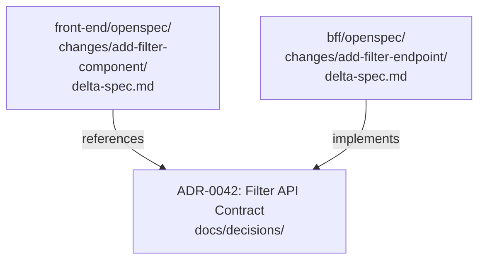

# OpenSpec Across Stacks

Give an agent the whole monorepo as context and it will confidently call the wrong half of it. It finds an API endpoint with the right name, the right path, the right method signature, and wires it into the new filter component without hesitation. Code review catches what the agent did not: it called the back-end service API, not the Backend for Frontend (BFF) API the front-end was supposed to use. The back-end API skipped the authorization checks the BFF enforced.

The spec never said which API to call. With every tier's specs in reach and no signal about which tier it was working in, the agent resolved the ambiguity the wrong way, and felt certain doing it.

This is not an agent failure. The context was ambiguous; the agent resolved the ambiguity as best it could. The problem is upstream: a single `openspec/` directory shared across three tiers of a system gives every agent access to every tier's specs, and no signal about which tier it is working in.

## One `openspec/` per stack

The fix is structural. Each stack (front-end, BFF, back-end) gets its own `openspec/` directory at the root of its repository or sub-directory. The agent working on the front-end never sees the back-end specs. It knows its contracts, its acceptance criteria, its pending changes. The back-end specs are not its context.

```
front-end/
  openspec/
    changes/
      add-filter-component/
        proposal.md
        delta-spec.md
        tasks.md

bff/
  openspec/
    changes/
      add-filter-endpoint/
        proposal.md
        delta-spec.md
        tasks.md

back-end/
  openspec/
    changes/  # (unchanged by this feature)
```

A unified `openspec/` across stacks gives the agent three codebases of context it does not need and three sets of canonical specs it should not all trust. It makes every ambiguity resolution harder. Keeping them separate makes each agent's context legible and bounded.

This is book synthesis. There is no widely-adopted standard for multi-tier spec organization. The pattern here follows from the general principle that context should be scoped to the work being done.

*Sources: Fission AI, [OpenSpec](https://openspec.dev/) (ongoing), the change-folder model this per-stack layout builds on; the multi-tier split itself is this book's synthesis.*

## Front-end context: design system and Figma

The spec pattern for front-end work is identical to the pattern for back-end work. What changes is the context the agent reads before it implements.

A back-end agent reads `docs/architecture/`, the API contract, and the test strategy. A front-end agent reads the design system document: component conventions, animation rules, accessibility requirements, state management patterns. What Figma captures visually, the design system doc captures as convention.

The design system document lives in `docs/design/` alongside the architecture documentation. It is not a one-time design artifact; it is a living brief. An agent implementing a new component reads it the way a back-end agent reads the architecture overview: not to understand the full system, but to understand the constraints it is working within.

User flows and navigation logic belong in `docs/architecture/`, referenced by the spec. The spec itself should cover behavior: states, validation, edge cases, loading/error/empty states. What happens when the network call fails? What does the component render when the list is empty? These are the questions the spec answers; the design system doc answers how it should look when it renders correctly.

## The integration contract belongs in an ADR

A change in the front-end spec that depends on a new BFF endpoint needs a source of truth both stacks can reference. That source of truth is not a spec. Specs are scoped to a single change folder and a single stack. It is an Architectural Decision Record (ADR).

The ADR in `docs/decisions/` records the API contract: endpoint path, request shape, response shape, error handling, authentication boundary. Both stacks reference the same ADR in their respective change folders. The front-end spec says "see ADR-0042 for the BFF contract"; the BFF spec says "implements the contract in ADR-0042". When the contract changes, one ADR update is the source of truth; the specs do not need to repeat the contract details.



The ADR is permanent. The change folders are temporary; they are archived after implementation. The contract outlives both.

*Sources: Michael Nygard, ["Documenting Architecture Decisions"](https://www.cognitect.com/blog/2011/11/15/documenting-architecture-decisions), Cognitect blog, Nov 15, 2011, ADRs as the cross-stack contract of record that outlives the change folders.*

## When a change spans tiers

Most features touch multiple tiers. A new filter endpoint requires front-end work, BFF work, and possibly back-end work. The temptation is to create one change folder that covers all three.

That temptation compounds every problem described above. The agent working the front-end change does not need the back-end implementation details. The reviewer of the BFF PR does not need to read the front-end acceptance criteria. The archive of the change is three times as large, three times as hard to search.

When a change spans tiers, each tier gets its own change folder referencing the same cross-cutting ADR. The coordination is at the ADR level; the implementation is separate. Each PR is one tier, one spec, one reviewer context.

The rare exception: infrastructure changes that have no clean tier boundary. A change to how authentication tokens are propagated through the stack affects all three tiers simultaneously. These are genuinely cross-cutting and warrant a cross-cutting spec, but they are rare enough that the exception should be labeled as such, not treated as the default.

## Honest caveats

Multi-tier spec organization is not a field standard. This pattern is the book's synthesis, derived from the OpenSpec change-folder model applied to multi-repo realities. Teams should expect to adapt it. A monorepo with shared libraries between front-end and back-end may need a different boundary than the one described here. The principle is scope context to the work being done; the directory layout is one way to enforce that principle.

Multi-tier layout settles where the specs live. It says nothing about where they fit. The team already has Jira, PR review, a changelog, and an architecture board, and now a directory of change folders that has to coexist with all of it. Knowing which existing slot each artifact belongs in is the difference between OpenSpec fitting the workflow and fighting it.
