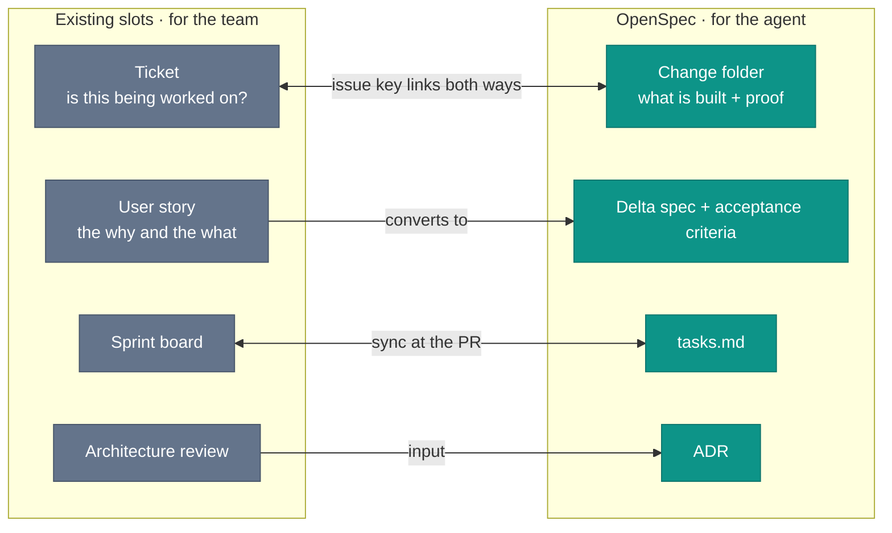

# OpenSpec in an Existing SDLC

You already have Jira. Sprint boards, PR review, a Confluence wiki, a changelog: all of it, working. Then you adopt OpenSpec because the Spec-Driven Development framing makes sense, and a question lands on the table. Where does the change folder sit relative to everything you already run? Does it replace the ticket? Does the spec replace the Confluence page? Is PR review now two reviews, one for the spec and one for the code?

None of those is the right frame. In this book's OpenSpec-first workflow, OpenSpec does not replace the existing workflow. It gives each existing slot a clearer artifact. The coordination problem already exists. The practical question is what lives where. If your team uses another spec tool, keep the mapping and substitute that tool's per-change artifact for the OpenSpec change folder.

## Change folder and ticket: the same event, different records

A Jira ticket (or GitHub Issue, or Azure DevOps work item) records that work is planned. The change folder records how that work was specified. These are not redundant. They serve different readers.

The ticket is for the team: priority, assignee, sprint assignment, status, and comments from the planning meeting. The change folder is for the agent: delta spec, acceptance criteria, task list, and archive record. The ticket answers "is this being worked on?" The change folder answers "what is being built and how do we know it is done?"

Practically: create the change folder when you start the spec and link the Jira issue ID in the proposal. The spec references the ticket for context, while the ticket links to the PR that implements it. The agent reads the spec. The sprint board reads the ticket. Neither replaces the other.

The reverse link is automatic if you use the issue key in commit messages. Jira's development panel surfaces every commit and PR that contains `XXX-123` in the message, without any manual linking. Include that convention in `AGENTS.md` and the agent will prefix its commits correctly. Then the change folder links forward to the ticket, and the commits link back.

When should you skip the ticket entirely? For small behavioral changes (a one-line fix, a config key rename) where the spec is the only record that matters. The threshold is whether anyone other than the implementing developer needs to track the work. If yes, ticket. If the spec and the commit message are the entire record, skip the overhead.

For the detailed OpenSpec lifecycle and `opsx:*` command mapping that this chapter assumes, see [Spec Lifecycle](/spec-driven/spec-lifecycle).

*Sources: Fission AI, [OpenSpec](https://openspec.dev/) (ongoing), the change folder as the spec-of-record. The ticket/change-folder split above is this book's workflow mapping, not an OpenSpec requirement.*

## User story to acceptance criteria: the conversion

A Jira user story provides the why and what: "As a user, I want to filter results by date so that I find recent items". The story does not provide the testable how: what happens when the date range is invalid? What does the empty state look like? What is the minimum acceptable date?

One story maps to one or more OpenSpec change folders. The story provides the intent, the spec provides the acceptance criteria, and the spec references the Jira story ID for traceability. Any reviewer reaches the planning decision that initiated it from the spec.

Where a Jira or Confluence Model Context Protocol (MCP) connector is available, the agent fetches story context and architecture pages during spec drafting. The agent instructions should tell the agent to check the linked Jira story before writing the spec, not to copy the story into the spec, but to ensure the acceptance criteria address what the story intended. The agent reads the story, and the developer reviews the criteria.

MCP connector availability for third-party tools is a mid-2026 snapshot. Permissions, supported clients, and exact tool names are product-specific. The durable pattern is the same: agents fetch ticket context before writing specs, and developers review the criteria.

*Sources: Rick Hightower, ["Agentic Coding: GSD vs Spec Kit vs OpenSpec vs Taskmaster AI"](https://pub.spillwave.com/agentic-coding-gsd-vs-spec-kit-vs-openspec-vs-taskmaster-ai-where-sdd-tools-diverge-0414dcb97e46), Spillwave, February 27, 2026, the spec layer as where planning intent becomes testable acceptance criteria. Model Context Protocol documentation, the connector pattern. Atlassian Rovo MCP Server and sooperset `mcp-atlassian` documentation (mid-2026 snapshot), Jira and Confluence MCP access as perishable tooling examples.*

## tasks.md and the sprint board

The `tasks.md` file in the change folder is the agent's execution checklist. It lists the implementation steps in order, with checkboxes, and the agent checks off tasks as it completes them. Not as a courtesy, but because an unchecked task is a task the agent might not have done.

The sprint board tracks the same work at team level. The story moves from "In Progress" to "In Review" when the PR is opened, and `tasks.md` is exhausted before the PR is opened. These are parallel, not competing.

The synchronization point is the PR. A change folder with incomplete tasks (`- [ ]` lines still present) is a change folder that should not have a PR open. The PR template checks for this, and the agent instructions should require verifying `tasks.md` is complete before pushing.

*Sources: Fission AI, [OpenSpec](https://openspec.dev/) (ongoing), `tasks.md` as part of the change-folder workflow. The sprint-board synchronization rule is this book's OpenSpec-first workflow mapping, not an OpenSpec requirement.*

## ADRs and the architecture review

An Architecture Decision Record (ADR) is the artifact that replaces an architecture review meeting when the team is disciplined about ADRs and supplements it when they are not.

Large organizations have architecture review boards (ARBs). The ADR is the input: the context, the options considered, the decision, the consequences. The ARB reads ADRs but does not generate them. Where there is no ARB, the ADR is its own review: posted to the team channel, merged after the comment period.

Cross-cutting decisions (API contracts, authentication models, data retention policies) always go into ADRs. These are the decisions that the agent in one stack needs to know about even though they were made in another context. The ADR is permanent, the spec is temporary, and the ADR outlives the change that necessitated it.

*Sources: Michael Nygard, "Documenting Architecture Decisions" (2011), ADRs as durable records for architecture decisions. The ARB mapping and cross-stack agent-context rule are this book's workflow guidance.*

## This assumes you already have the basics

The mapping described here assumes a reasonably mature team workflow: tickets exist, PRs have reviewers, ADRs are written when significant decisions are made. Teams without those basics need to establish them first. The spec does not replace the ticket. It assumes the ticket already exists and people know how to use it.

The MCP integrations described here (Jira and Confluence) are mid-2026 tools. The underlying patterns are stable even as the specific tooling evolves.

*Sources: Model Context Protocol documentation, the connector pattern. Atlassian Rovo MCP Server and sooperset `mcp-atlassian` documentation (mid-2026 snapshot), perishable Jira and Confluence connector availability. The ticket, PR, ADR, and changelog mapping is this book's synthesis for mature team workflows.*

The workflow fits because it follows branches. Short-lived branches, specifically. That is where trunk-based development has been pointing for decades.
