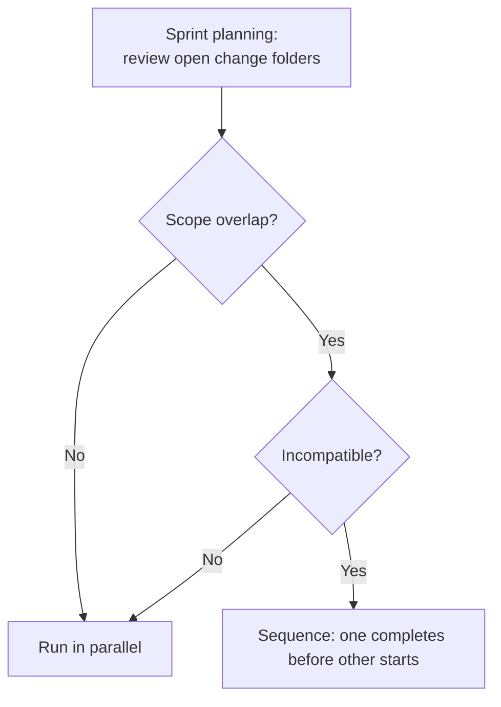

# Parallel Agents on the Same Codebase

Six agents running against the same monorepo on a Tuesday afternoon. Developer A's agent had the notification service. Developer B's agent had the payment service. Developer C's two agents had the user service, one writing the spec and one implementing an older spec. Developer D's agent had the shared utility library. The shared utility library is called by the notification service, the payment service, and the user service.

On Wednesday morning, three PRs were blocked. The shared utility library had changed its interface in two incompatible ways simultaneously. None of the agents had known about the others.

The problem is not parallelism. Parallelism is the point. The problem is invisible boundaries: work that could have run safely in parallel was running in the same shared space without anyone knowing.

## The change folder as isolation primitive

A change folder is not just a container for a spec. It is a declaration of scope: these are the components this change touches. When two change folders declare overlapping scope, the collision is visible before either branch is created.

This is the foundational practice for parallel agent work: create the change folder (including the proposal, which names the components affected) before creating the branch. Review the change folder for scope. If two change folders have overlapping scope, decide before implementation whether they should be sequenced (one after the other) or whether the scope can be split.

Scope overlap is not automatically a problem. Two changes to the same service that modify different methods are parallel-safe if the methods do not share state. Scope overlap is a signal to check, not a prohibition.

The practice is book synthesis, derived from the OpenSpec change-folder model applied to parallel development. There is no widely-adopted standard for this pattern; teams should expect to adapt it.

*Sources: Steve Yegge, ["Revenge of the junior developer"](https://sourcegraph.com/blog/revenge-of-the-junior-developer), Sourcegraph blog, Mar 22, 2025.*

## Architecture boundaries as the natural layer

The most reliable conflict-prevention mechanism is an architecture that does not share state across the components being modified in parallel. Services with clear APIs, components with defined props, modules with explicit exports: these give agents natural boundaries to work within.

When the architecture provides clear boundaries, parallelism is safe almost by default. Developer A's agent modifies the notification service; the only interface it crosses is the published API, which is governed by an ADR. Developer B's agent modifies the payment service; same constraint. They do not need to coordinate because the architecture has already coordinated for them.

When the architecture does not provide clear boundaries (shared utility libraries with broad surface areas, services that call each other directly rather than through contracts, components that mutate shared state), parallelism requires careful scope management. The change folder is the tool; the architecture is the environment.

The implication for architecture decisions: ADRs that establish service contracts and interface boundaries are not just documentation. They are the mechanism by which future parallel work stays safe. An architecture decision that allows direct internal calls between services is creating future coordination cost, even if it seems simpler now.

*Sources: Steve Yegge, ["Revenge of the junior developer"](https://sourcegraph.com/blog/revenge-of-the-junior-developer), Sourcegraph blog, Mar 22, 2025. Geoffrey Huntley, ["Everything is a Ralph loop"](https://ghuntley.com/loop/), Jan 17, 2026.*

## Conflict resolution when delta specs overlap

When two change folders have scope overlap that was not caught in planning, and both implementations are partially complete, the resolution depends on how far the work has progressed.

If both are still in the spec phase: merge the specs. Sit the two developers together (or their agents in a shared session) and produce one spec that addresses both sets of intent. The change folder count drops from two to one; the scope is now explicit and unified.

If one is implemented and the other is in the spec phase: the implemented change lands first. The in-progress spec updates to account for the interface as it now exists. This requires that the first branch is small enough to merge quickly (the short-lived branch discipline again).

If both are implemented and the branches have not yet merged: this is the expensive case. The resolution is identical to any merge conflict, with one additional step: after resolving the code conflict, review the delta specs for intent conflicts. If the code conflict was resolved correctly but the specs now contradict each other, one of the implementations is wrong. Find which one and fix it before merging.

The cost of catching scope overlap in planning is: one short conversation. The cost of catching it at the code-conflict stage is: several hours. The discipline of writing the change folder before creating the branch exists for this reason.

## What `AGENTS.md` and skills cannot substitute for

No agent instruction makes two isolated agents aware of each other's work. The `AGENTS.md` can instruct an agent to write a clear change folder proposal and to limit its scope to what is declared. It cannot instruct the agent to check whether another agent is working on the same components in a different session.

The coordination is human: sprint planning or a standing review of open change folders. An agent can support this review (a daily or sprint-start check of open change folders, looking for scope overlap), but a human decides whether the overlap is incompatible and what to do about it. This is not a limitation of current tooling that future agents will eliminate. It is the appropriate design: scope decisions have intent consequences that require the person who owns the intent to make.

Isolation works when the boundaries are visible. The boundaries are only visible if the team has agreed on them and written them down. That agreement lives in the shared AI instruction layer.
