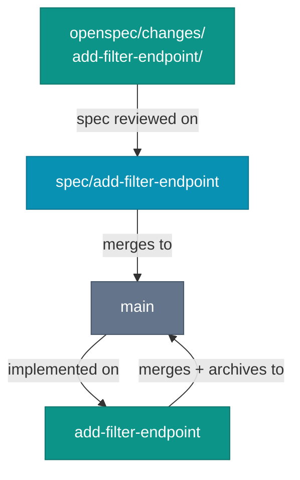

# Trunk-Based Development with Agents

The branch strategy predates coding agents by two decades. Paul Hammant has documented it since the early 2000s, and the core rule has not changed: commit to trunk frequently, keep feature branches short-lived, integrate continuously. The arguments for it are unchanged: early conflict detection, reduced merge pain, reliable CI signal. What has changed is what creates branches.

An agent opens and closes a feature branch in the time a human developer spends reading the ticket. At agentic speed, the question is not whether to use short-lived branches, but how to align the branch lifecycle with the change folder lifecycle. The two lifecycles should collapse into the same unit of work.

## The change folder is the branch

An OpenSpec change folder maps onto the branches that implement it. The change folder defines the scope. The branch is the vehicle. How many branches depend on one question: does the spec hold a decision worth locking before any code is written?

For a change with real intent to get right, such as business rules, edge cases, or an architectural choice, the spec rides its own PR first. The branch `spec/add-filter-endpoint` carries the change folder (`proposal.md`, `design.md`, delta specs, `tasks.md`) and no code. It is reviewed for intent, the acceptance criteria get corrected while correcting them is still cheap, and it merges. Then the implementation branch, named for the change folder slug, delivers the code against an already-approved spec and archives the folder on merge.

For a change whose intent is fully visible in the code diff, that split is pure ceremony. A bug fix, a mechanical refactor, a library bump like `Refactor observer to Jackson 3`: there is no acceptance criterion a reviewer would veto independently of the code, so locking the spec first buys nothing. One branch, one PR, spec delta and implementation together. Intent-first review still applies inside the single PR.

The test is not size, but whether an intent-level correction found during code review would force the implementation to be redone. If yes, the spec earns its own PR. If the only fix would be to the code, one PR is enough.

The rule covering both shapes is not a branch count. Every branch that traces back to this change folder carries its name and its scope, and nothing else rides along. The change folder is the unit of intent, and its branches are the units of delivery. A branch that folds in a second change folder's work is the violation, whether you used one branch or two.

*Sources: Paul Hammant, [trunkbaseddevelopment.com](https://trunkbaseddevelopment.com/) (ongoing) and "Trunk-Based Development and Branch by Abstraction" (Leanpub, 2020), short-lived branches and the trunk-based rule set the change-folder lifecycle maps onto. Dave Farley, "Modern Software Engineering" (Addison-Wesley, 2021), small changes integrated continuously.*

## Short-lived means days, not weeks

Hammant's trunk-based development (TBD) defines short-lived branches as lasting hours to days, not weeks. The underlying reason is feedback: a branch that has lived for two weeks accumulates two weeks of divergence from the trunk before it gets feedback from integration. A branch that lives for one day gets feedback within one day.

At agentic speed, even one day is long. A small feature spec can land in hours. The branch flow is simple: create the branch, write the spec in its change folder, implement, test, open the PR, review, merge.

Start to merge in hours, not days. If the implementation is taking days, the spec was too large. Split it.

The habit of keeping specs small, the ten-task, ten-file rule of thumb from [Why Small?](/spec-driven/why-small), is also the habit of keeping branches short-lived. A spec sized to one implementation PR is a branch that fits in one day. When the implementation branch sprawls past what a reviewer holds in one sitting, the spec was describing two changes, not one.

## Merge cadence with parallel changes

Multiple developers, multiple change folders, multiple branches. How often should they integrate?

Trunk-based development's answer is: as often as possible, with CI as the gate. Each branch merges when CI passes, not when "it is done". Integration happens continuously rather than all at once at the sprint end.

Spec deltas reduce merge pain in two ways. First, a clearly scoped spec is less likely to overlap with another clearly scoped spec. If two change folders are well-defined, their implementation boundaries are visible before the branches are created. A team standing up before the sprint catches spec collisions while they are still cheap to resolve.

Second, a spec delta makes merge-conflict resolution faster. When two branches conflict, the question is not "what was this trying to do?" The spec answers it.

Two specs that make incompatible claims about the same capability are the one collision worth heading off early. Because each change folder names its scope before the branch exists, that overlap is visible in the planning column of the sprint board, where it costs a conversation, not in the Friday morning integration run, where it costs a rollback.

## `AGENTS.md`, CI, and branch control

The agent will follow none of this unless `AGENTS.md` states it. Its default is to implement what it is given and push when done. It does not know the team's branch naming convention, that the implementation branch should match the change folder slug, that the spec for a decision-heavy change ships on its own PR first, or that a branch carrying two change folders is a problem.

The `AGENTS.md` file, or a skill file it references, should state three rules: the branch name matches the change folder slug, the spec PR precedes the implementation PR for changes with decision content, and `tasks.md` must be fully checked before the implementation PR opens. These are short instructions with a large effect.

Instructions drift. Checks do not. The two steps most worth promoting from instruction to CI gate are archiving and task completion.

A check that fails the implementation PR when its change folder is not archived, or when `tasks.md` still has unchecked boxes, turns a step the agent forgets under load into one it cannot skip. This is the verifier pattern: the check gates the merge but does not do the work.

`iec check` already plays that role for file-size limits and AC traceability. Gating it on an archived folder and a fully-checked `tasks.md` is the same move. The archive stays a one-line step the agent runs as its final task, visible in the code diff where a reviewer watches the spec promoted to baseline.

Two smaller mechanics finish the cycle. Turn on the platform's auto-delete-branch-on-merge setting so spent branches do not accumulate. That is a repository checkbox, not a pipeline. And mind the one gap the two-PR shape opens: a spec PR merges the change folder to `main` before implementation lands. Keep the two PRs in the same cycle and let the open implementation PR be the tracking link, so a half-built proposal is never mistaken for a finished one. [Spec Lifecycle](../spec-driven/spec-lifecycle) covers the archive rule and the dead-spec failure mode.

*Sources: Paul Hammant, [trunkbaseddevelopment.com](https://trunkbaseddevelopment.com/) (ongoing), branch naming and integration practice. Dave Farley with Jez Humble, "Continuous Delivery" (Addison-Wesley, 2010) and [continuousdelivery.com](https://continuousdelivery.com/) (ongoing), CI as the gate that turns a step the agent forgets into one it cannot skip.*

## Review at merge

A clean code diff is the easiest thing for an agent to produce and the easiest thing for a reviewer to wave through. That is why review order matters. Read the diff first and the spec becomes confirmation. Read the spec first and the diff has to answer to it.

[Code Review for Agent-Generated Code](./code-review-agent-code) is the chapter that works out the mechanics. The point here is narrower: trunk-based flow gives that review order a natural place to happen, either in a spec PR of its own or at the top of a single PR before the code diff takes over the screen.

Reviewers and agents miss different things in this review, and it works only when each covers the other's gaps: reviewers verify intent and integration, agents verify coverage and consistency. Which gaps fall to which reviewer is its own workflow question.

*Sources: Fission AI, [OpenSpec](https://openspec.dev/) (ongoing), the change folder and spec delta the review reads before the diff. Birgitta Böckeler, ["Navigating AI Development Workflows"](https://refactoring.fm/p/navigating-ai-development-workflows), Refactoring.fm, using a second model or fresh session to critique a spec before implementation.*

## Trunk-Based Development is not universal, and neither is the two-PR shape

Trunk-based development is not universally practiced. Many teams use longer-lived feature branches, Gitflow variants, or release branches that stay open for weeks. The practices described here work best with short-lived branches. They do not require them. A team using a release-branch model still keeps each change folder's scope on its own branch and the spec-before-implementation discipline for decision-heavy changes. The branches live longer.

The argument for TBD over Gitflow is Hammant's to make, and he has made it thoroughly. This chapter does not re-argue it. It describes how OpenSpec change folders fit into TBD for teams that have already adopted it.

The two-PR shape for decision-heavy changes is this book's recommended default, not an industry standard. Plenty of teams ship spec and code in one PR and review the spec delta first inside it. That works, and it is lighter. The split earns its second PR when locking the intent before implementation would have saved a rework and costs ceremony when it would not. Treat it as a dial, not a mandate.

The one-change-per-developer rule contains the work in a reviewable unit. What happens when that unit reaches the review queue is a different workflow entirely.
