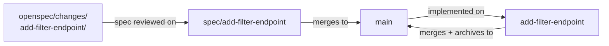

# Trunk-Based Development with Agents

The branch strategy predates AI coding agents by two decades. Paul Hammant has been documenting it since the early 2000s, and the core discipline has not changed: commit to trunk frequently, keep feature branches short-lived, integrate continuously. The arguments for it are unchanged: early conflict detection, reduced merge pain, reliable CI signal. What has changed is what creates branches.

An agent can open and close a feature branch in the time a human developer would read the ticket. At agentic speed, the question is not whether to use short-lived branches but how to align the branch lifecycle with the change folder lifecycle. They are, it turns out, the same thing.

## The change folder is the branch

An OpenSpec change folder maps onto the branches that implement it. The change folder defines the scope; the branch is the vehicle. How many branches depends on one question: does the spec hold a decision worth locking before any code is written?

For a change with real intent to get right (business rules, edge cases, an architectural choice), the spec rides its own PR first. The branch `spec/add-filter-endpoint` carries the change folder (proposal, design, tasks, delta spec) and no code. It is reviewed for intent, the acceptance criteria get corrected while correcting them is still cheap, and it merges. Then the implementation branch, named for the change folder slug, delivers the code against an already-approved spec and archives the folder on merge.

For a change whose intent is fully visible in the diff, that split is pure ceremony. A bug fix, a mechanical refactor, a library bump like `Refactor observer to Jackson 3`: there is no acceptance criterion a reviewer could veto independently of the code, so locking the spec first buys nothing. One branch, one PR, spec delta and implementation together. Intent-first review still applies; it just happens inside the single PR.

The test is not size. It is whether an intent-level correction found during code review would force the implementation to be redone. If yes, the spec earns its own PR. If the only fix would be to the code, one PR is enough.

The discipline that survives both shapes is not a branch count. Every branch that traces back to this change folder carries its name and its scope, and nothing else rides along. The change folder is the unit of intent; its branches are the units of delivery. A branch that folds in a second change folder's work is the violation, whether you used one branch or two.

*Sources: Paul Hammant, [trunkbaseddevelopment.com](https://trunkbaseddevelopment.com/) (ongoing) and *Trunk-Based Development and Branch by Abstraction* (Leanpub, 2020), short-lived branches and the trunk-based discipline the change-folder lifecycle maps onto. Dave Farley, *Modern Software Engineering* (Addison-Wesley, 2021), small changes integrated continuously.*

## Short-lived means days, not weeks

Hammant's trunk-based development discipline defines short-lived branches as lasting hours to days, not weeks. The underlying reason is feedback: a branch that lives for two weeks accumulates two weeks of divergence from trunk before it gets feedback from integration. A branch that lives for one day gets feedback within one day.

At agentic speed, "one day" is generous. An agent can implement a small-to-medium feature spec in hours. The branch lifecycle is: create branch, write spec (in the change folder on the branch), implement, test, open PR, review, merge.

Start to merge in hours, not days. If the implementation is taking days, the spec was too large. Split it.

The discipline of keeping specs small (the ten-task, ten-file rule of thumb from [Why Small?](/spec-driven/why-small)) is also the discipline of keeping branches short-lived. A spec sized to one implementation PR is a branch that fits in one day. When the implementation branch sprawls past the point a reviewer can hold in one sitting, the spec was describing two changes, not one.

## Merge cadence with parallel changes

Multiple developers, multiple change folders, multiple branches. The question is how often they integrate.

Trunk-based development's answer is: as often as possible, with CI as the gate. Each branch merges when CI passes, not when "it's done." The integration happens continuously rather than all at once at sprint end.

Spec deltas reduce merge pain in two ways. First, a clearly scoped spec is less likely to overlap with another clearly scoped spec. If two change folders are well-defined, their implementation boundaries are visible before the branches are created; a team standing up before the sprint can catch spec collisions while they are still cheap to resolve. Second, reviewing a PR that has a spec delta gives the reviewer a clear statement of what the PR is supposed to do, which makes merge-conflict resolution faster. When two branches conflict, the question is not "what was this trying to do?" It is answered in the spec.

Two specs that make incompatible claims about the same component are the one collision worth heading off early. Because each change folder names its scope before the branch exists, that overlap is visible in the planning column of the sprint board, where it costs a conversation, not in the Friday morning integration run, where it costs a rollback.

## `AGENTS.md`, CI, and the branch discipline

The agent will follow none of this unless the `AGENTS.md` states it. Its default is to implement what it is given and push when done. It does not know the team's branch naming convention, that the implementation branch should match the change folder slug, that the spec for a decision-heavy change ships on its own PR first, or that a branch carrying two change folders is a problem.

The `AGENTS.md` (or a skill file it references) should state: the branch name matches the change folder slug, the spec PR precedes the implementation PR for changes with decision content, and `tasks.md` must be fully checked before the implementation PR opens. These are short instructions with a large effect.

Instructions drift; checks do not. The two steps most worth promoting from instruction to CI gate are archiving and task completion. A check that fails the implementation PR when its change folder is not archived, or when `tasks.md` still has unchecked boxes, turns a discipline the agent forgets under load into one it cannot skip. This is the verifier pattern: the check gates the merge but does not do the work. `ase check` already plays that role for file-size limits and AC traceability; gating it on an archived folder and a fully-checked `tasks.md` is the same move. The archive stays a one-line step the agent runs as its final task, visible in the diff where a reviewer watches the spec promoted to baseline.

Two smaller mechanics close the loop. Turn on the platform's auto-delete-branch-on-merge setting so spent branches do not accumulate; that is a repository checkbox, not a pipeline. And mind the one gap the two-PR shape opens: a spec PR merges the change folder to `main` un-archived and un-implemented, which is a dead spec until its implementation PR lands. Keep the two PRs in the same cycle, and let the open implementation PR be the tracking link, so a half-built proposal is never mistaken for a finished one.

*Sources: Paul Hammant, [trunkbaseddevelopment.com](https://trunkbaseddevelopment.com/) (ongoing), branch naming and integration discipline. Dave Farley with Jez Humble, *Continuous Delivery* (Addison-Wesley, 2010) and [continuousdelivery.com](https://continuousdelivery.com/) (ongoing), CI as the gate that turns a discipline the agent forgets into one it cannot skip.*

## Review at merge

A clean diff is the easiest thing for an agent to produce, and the easiest thing for a reviewer to wave through. Imagine tidy, well-tested code, approved in ten minutes. Then a support ticket lands: the export endpoint skips validation on the `reason` field for premium-tier users. The spec listed exactly that as acceptance criterion `[EXP-004]`. The test for `[EXP-004]` existed but asserted the wrong tier, the implementation matched the wrong test, and every layer agreed with every other. The reviewer read the diff. Nobody read the diff against the spec.

The failure is not in the code. It is in the review sequence: the diff was read before the spec. The diff looked correct. It was the spec that would have caught the divergence.

Intent-first review reads the spec delta before the code diff. The questions to answer from the spec delta are: does this intent match what was planned? Is anything missing from the acceptance criteria? Are the edge cases named? Only after those questions are answered does the diff get opened. The diff-review question is different: does this implementation match the spec?

Human reviewers have biases: they read the changed lines and skip the unchanged context. They approve changes that match their mental model of the feature, even when the spec says otherwise. Agents have different gaps. They miss intent: a change that passes all checks but produces behavior the spec did not anticipate. They miss context: a component that looks correct in isolation but fails when integrated with something the agent did not read. The review process works when humans and agents each cover their own gaps. Humans verify intent and integration. Agents verify coverage and consistency.

*Sources: Fission AI, [OpenSpec](https://openspec.dev/) (ongoing), the change folder and spec delta the review reads before the diff. Birgitta Böckeler, ["Navigating AI Development Workflows"](https://refactoring.fm/p/navigating-ai-development-workflows), Refactoring.fm, using a second model or fresh session to critique a spec before implementation.*

## TBD is not universal, and neither is the two-PR shape

Trunk-based development is not universally practiced. Many teams use longer-lived feature branches, Gitflow variants, or release branches that stay open for weeks. The practices described here work best with short-lived branches; they do not require it. A team using a release-branch model can still keep each change folder's scope on its own branch and the spec-before-implementation discipline for decision-heavy changes. The branches just live longer.

The argument for TBD over Gitflow is Hammant's to make, and he has made it thoroughly. This chapter does not re-argue it; it describes how OpenSpec change folders fit into TBD for teams that have already adopted it.

The two-PR shape for decision-heavy changes is this book's recommended default, not an industry standard. Plenty of teams ship spec and code in one PR and review the spec delta first inside it. That works, and it is lighter. The split earns its second PR when locking the intent before implementation would have saved a rework, and costs ceremony when it would not. Treat it as a dial, not a mandate.

Shared conventions across the team are what make the one-change-per-developer rule hold without constant negotiation.
