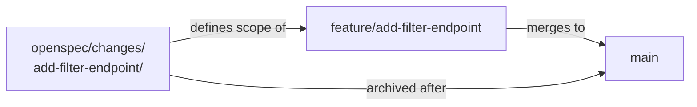

# Trunk-Based Development with Agents

The branch strategy predates AI coding agents by two decades. Paul Hammant has been documenting it since the early 2000s, and the core discipline has not changed: commit to trunk frequently, keep feature branches short-lived, integrate continuously. The arguments for it are unchanged: early conflict detection, reduced merge pain, reliable CI signal. What has changed is what creates branches.

An agent can open and close a feature branch in the time a human developer would read the ticket. At agentic speed, the question is not whether to use short-lived branches but how to align the branch lifecycle with the change folder lifecycle. They are, it turns out, the same thing.

## The change folder is the branch

An OpenSpec change folder maps one-to-one onto a short-lived branch. The change folder defines the scope of the change; the branch is the implementation vehicle for that scope.

When you create a change folder, you create a branch with the same name. When you archive the change folder, you merge the branch. The archive and the merge happen together; a merged branch with an unarchived change folder is a change folder the agent might still be writing against.

This correspondence is a discipline, not a technical constraint. Nothing prevents a developer from creating ten branches from one change folder. The discipline is: one change folder, one branch, one PR, one merge. The change folder is the unit of intent; the branch is the unit of delivery.

*Sources: Paul Hammant, [trunkbaseddevelopment.com](https://trunkbaseddevelopment.com/) (ongoing). Paul Hammant, *Trunk-Based Development and Branch by Abstraction* (Leanpub, 2020). Dave Farley, *Modern Software Engineering* (Addison-Wesley, 2021).*

## Short-lived means days, not weeks

Hammant's trunk-based development discipline defines short-lived branches as lasting hours to days, not weeks. The underlying reason is feedback: a branch that lives for two weeks accumulates two weeks of divergence from trunk before it gets feedback from integration. A branch that lives for one day gets feedback within one day.

At agentic speed, "one day" is generous. An agent can implement a small-to-medium feature spec in hours. The branch lifecycle is: create branch, write spec (in the change folder on the branch), implement, test, open PR, review, merge.

Start to merge in hours, not days. If the implementation is taking days, the spec was too large. Split it.

The discipline of keeping specs small (described in the Spec-Driven section) is also the discipline of keeping branches short-lived. A spec that fits in one PR is a branch that fits in one day.

## Merge cadence with parallel changes

Multiple developers, multiple change folders, multiple branches. The question is how often they integrate.

Trunk-based development's answer is: as often as possible, with CI as the gate. Each branch merges when CI passes, not when "it's done." The integration happens continuously rather than all at once at sprint end.

Spec deltas reduce merge pain in two ways. First, a clearly scoped spec is less likely to overlap with another clearly scoped spec. If two change folders are well-defined, their implementation boundaries are visible before the branches are created; a team standing up before the sprint can catch spec collisions while they are still cheap to resolve. Second, reviewing a PR that has a spec delta gives the reviewer a clear statement of what the PR is supposed to do, which makes merge-conflict resolution faster. When two branches conflict, the question is not "what was this trying to do?" It is answered in the spec.

Two specs that make incompatible claims about the same component are the one collision worth heading off early. Because each change folder names its scope before the branch exists, that overlap is visible in the planning column of the sprint board, where it costs a conversation, not in the Friday morning integration run, where it costs a rollback.

## `AGENTS.md` and the branch discipline

The agent will violate the one-change-folder-one-branch discipline if the `AGENTS.md` does not state it. The agent's default behavior is to implement what it is given and push when it is done; it does not know what the team's branch naming convention is, or that the change folder name should match the branch name, or that a branch with multiple change folders is a problem.

The `AGENTS.md` (or a skill file it references) should state: one change folder per branch, branch name matches the change folder slug, verify that `tasks.md` is fully checked before pushing. These are short instructions; they have a significant effect.

*Sources: Paul Hammant, [trunkbaseddevelopment.com](https://trunkbaseddevelopment.com/) (ongoing). Dave Farley with Jez Humble, *Continuous Delivery* (Addison-Wesley, 2010) and [continuousdelivery.com](https://continuousdelivery.com/) (ongoing).*

## Honest caveats

Trunk-based development is not universally practiced. Many teams use longer-lived feature branches, Gitflow variants, or release branches that stay open for weeks. The practices described here work best with short-lived branches; they do not require it. A team using a release-branch model can still have one change folder per branch and one PR per change folder. The branch just lives longer.

The argument for TBD over Gitflow is Hammant's to make, and he has made it thoroughly. This chapter does not re-argue it; it describes how OpenSpec change folders fit into TBD for teams that have already adopted it.

A short-lived branch that merges cleanly still needs a review. When the diff is agent-generated, the review changes shape.
