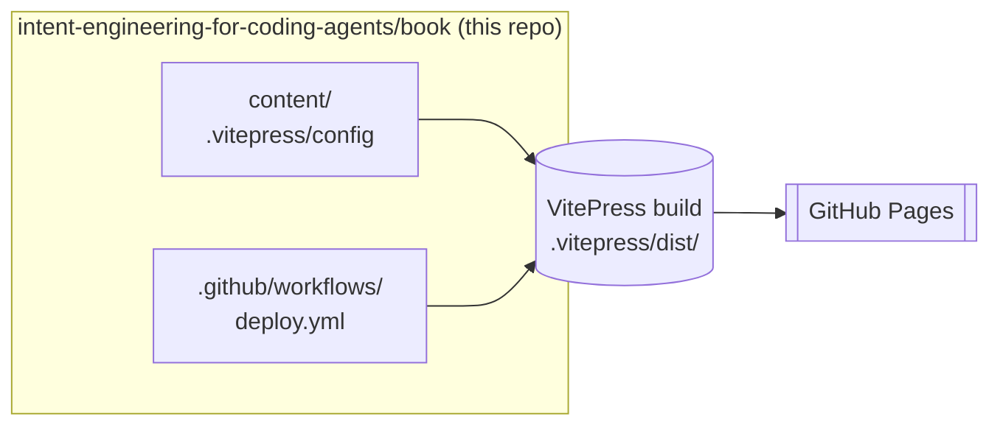

# Intent Engineering for Coding Agents — Architecture

Intent Engineering for Coding Agents is a VitePress site at a domain to be confirmed at launch, deployed to GitHub Pages via GitHub Actions. It teaches Intent Engineering practices and references `iec` throughout as live evidence.

This repo dogfoods its own convention: `docs/` holds project documentation; `content/` holds the book prose.

## Design



## Technology

| Concern | Choice | Why |
|---|---|---|
| Site generator | VitePress 1.x | Clean theme, Mermaid built-in, Vite-fast builds |
| Diagrams | vitepress-plugin-mermaid | Plain text, git-diffable, renders in GitHub too |
| Hosting | GitHub Pages | Free, git-native |
| CI/CD | GitHub Actions | Deploys on push to `main`, runs `iec check` on PRs |
| Package manager | npm | Standard for VitePress ecosystem |

## Directory structure

| Path | Purpose |
|---|---|
| `content/` | VitePress source — book prose, organized by topic |
| `docs/` | project documentation — architecture (this file), ADRs, design docs |
| `openspec/` | Change proposals, delta specs, tasks |
| `.agents/` | agent instruction hub (added Phase O) |
| `.vitepress/` | VitePress config and theme |
| `.github/workflows/` | CI — build+deploy, iec check |

## VitePress conventions

`srcDir` is set to `content/` in `.vitepress/config.mts`. VitePress reads pages from `content/` — not from the repo root or `docs/`. This is a deliberate architectural decision: `docs/` stays free for project documentation (see ADR-0002).

The Mermaid plugin is wired via `withMermaid()` in the config. Diagrams are authored in plain text inside fenced code blocks — no SVG exports, fully git-diffable.

## Build and deploy

```
npm run docs:dev     # local dev server (hot reload)
npm run docs:build   # builds to .vitepress/dist/
npm run docs:preview # preview built output locally
```

GitHub Actions (`deploy.yml`) builds on every push to `main` and deploys to GitHub Pages. The `docs/` directory is **not** the Pages source — the built artifact from `.vitepress/dist/` is uploaded directly.

## CI checks

`check.yml` installs `iec` and runs `iec check` on every push and PR. This validates that the book repo follows Intent Engineering conventions: AGENTS.md present, `docs/README.md` and `docs/INDEX.md` present, index not stale, INDEX.md links stay in scope.

## agent instruction hub

The repo-level [AGENTS.md](../AGENTS.md) is the entry point agents load first. It maps the `.agents/` directory — instructions ([writing](../.agents/instructions/writing.md), [voice](../.agents/instructions/voice.md), [VitePress](../.agents/instructions/vitepress.md), [review](../.agents/instructions/review.md), [index maintenance](../.agents/instructions/index-maintenance.md), [glossary maintenance](../.agents/instructions/glossary-maintenance.md)) and skills ([draft-section](../.agents/skills/draft-section.md), [review-chapter](../.agents/skills/review-chapter.md), [update-sidebar](../.agents/skills/update-sidebar.md), [update-index](../.agents/skills/update-index.md)). `docs/INDEX.md` is intentionally narrow — it maps `docs/` only; the AI hub lives outside that tree.

## Book topic structure

```
content/
├── foundation/         # Why structure, document types, plain-text-as-code
├── agent-instructions/    # AGENTS.md, .agents/ hub, skills, context
├── spec-driven/        # Why specs, lifecycle, Docs > Specs > Code
├── quality/            # Tests as proof, AC IDs, PR taxonomy
├── team-workflows/     # OpenSpec in an SDLC, TBD with agents
├── cross-team/         # ADRs, inner source, what's still evolving
└── appendices/         # Tooling, checklist, principles
```

The book is complete. The section `index.md` files under `content/` describe each part and its chapters; the sidebar in `.vitepress/config.mts` defines reading order. The `plan*.md` files are kept as project history and are no longer authoritative.

## ADRs

| ADR | Title | Status |
|---|---|---|
| [0001](decisions/0001-vitepress.md) | VitePress over alternatives | accepted |
| [0002](decisions/0002-content-dir.md) | `content/` for VitePress prose | accepted |

