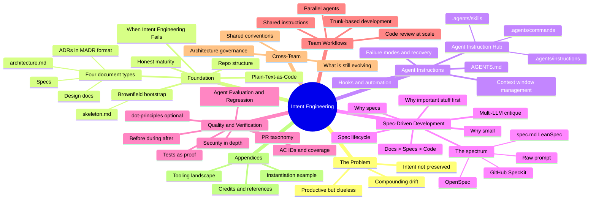

# Intent Engineering for Coding Agents

## The Problem

Your AI agent is productive, but clueless about your system and intention.

AI coding agents generate code faster than ever. But without context,
structure, and intent — they drift, invent scope, repeat mistakes, and
compound problems with every session.

This is not a model problem. It is an engineering problem.

## The Idea

A practical guide for senior developers and architects on how to
progressively make your AI agent less clueless — one step at a time.

- Nothing is mandatory
- Apply what you need, when you need it
- Compatible with existing SDLC and Spec-Driven Development practices
- Extends them — does not compete with them

The guide is structured around four topics. Each can be adopted on
its own at solo scale. At team scale they couple — and the book says
where. Each makes the others more effective.

## The Four Topics

```
FOUNDATION              Context: repo structure grounds the agent's execution
AGENT INSTRUCTIONS         Context: teach the agent your system
SPEC-DRIVEN DEV         Intent: state what the agent builds to
QUALITY & VERIFICATION  Intent: prove the agent understood
```

Context is the substrate. Intent is the point.

Beyond the core four, the guide covers team workflows, cross-team
coordination, and an honest look at what is still evolving in the field.

## The Format

A guide site built with VitePress, hosted on GitHub Pages.
Written in Markdown — plain text, git-native, no vendor lock-in.

The book references a companion tool — Intent Engineering Checker (`iec`) — built with the
same practices the book describes. Every check, every spec, every ADR
in that tool is living proof. Git history tells the story — each phase
is a git tag, each feature an OpenSpec change proposal. The reader can
checkout any tag and see what the practice looks like when applied.

## The Audience

Senior developers and architects already working with a capable CLI
agent — one that combines a thinking model, agent (tool-use)
capabilities, and a plan/architect mode. Tested across Claude
Sonnet/Opus 4+ (via Copilot and Claude Code), Codex/GPT 5.4+,
OpenCode + Deepseek 4 Pro, and Junie CLI. Other tools in the same
class should follow the same practices; IDE-only assistants and
completion-only tools are out of scope.

Readers want more control, more consistency, and better outcomes at
scale.

## What's Out of Scope

This is not an operations book.

- DevOps and SRE concerns (cloud vs on-prem, Kubernetes, observability
  stacks like Datadog or New Relic) — those belong in their own books.
- Cost economics for seat-licensed AI. One paragraph in the appendix;
  no chapter.
- IDE-only assistants and completion-only tools. The book targets CLI
  agents in the capability class; other tools may follow the patterns
  but are not the focus.
- Vendor comparison matrices. Tested-class tools are listed above; the
  book does not rank them.

The Farley test: *Modern Software Engineering* has no Operations
chapter — ops dissolves into feedback loops, where it already lives
inside Quality.

## The Guiding Principles

- The tool is the proof. Git history is the narrative.
- Capability-class targeting beats vendor-agnostic vagueness. The
  book targets CLI agents with thinking + agent + plan mode. The
  tested set is named; other class members should fit.
- Each document type has a different lifespan. ADRs are permanent.
  Specs are temporary. Conflating them corrupts both.
- Specs > Code. Specifications are more important than the generated
  code. The implementation is disposable; the canonical spec is the
  durable artefact. With agentic regeneration, code becomes downstream
  of intent.
- Put the most important context at the top — agents read top-down
  and lose focus.
- Small specs outperform large specs — an agent that finishes is
  better than one that drifts.
- Distinguish practiced from documented from CI-enforced from target
  state. Maturity honesty prevents process theatre.
- AI generates code faster than you can verify manually. Automated
  proof is not optional — it is mathematically required at agentic
  speeds.
- Give credit where credit is due. A book that hides its shoulders
  is weaker, not stronger.

## The Mindmap



## Key References

- Dave Farley / *Modern Software Engineering* (2021) and Paul Hammant /
  trunkbaseddevelopment.com — trunk-based development, continuous
  integration, feedback loop theory
- ADRs — Michael Nygard, "Documenting Architecture Decisions" (2011)
- MADR — Oliver Kopp, Anita Armbruster, Olaf Zimmermann (2018,
  adr.github.io/madr)
- LeanSpec (lean-spec.dev) — lightweight spec approach
- OpenSpec (openspec.dev) — structured spec with AC IDs
- GitHub Spec-Kit (github.com/github/spec-kit) — enterprise spec toolchain
- AGENTS.md (agents.md) and AgentPatterns.ai — TOC pattern for AI
  instruction files
- Andrej Karpathy — origin of the term "vibe coding" (Feb 2, 2025)
- .principles (https://dot-principles.github.io/) — principle-as-code,
  AI-native quality audit
