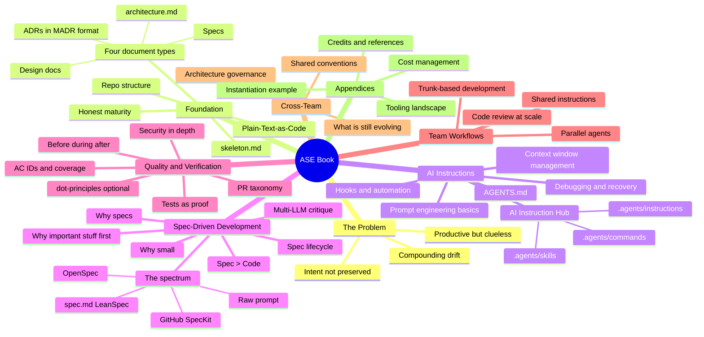

# The ASE Book — From Vibe to Pro

## The Problem

Your AI agent is productive, but clueless about your system and intention.

AI coding agents generate code faster than ever. But without context,
structure, and intent — they drift, invent scope, repeat mistakes, and
compound problems with every session.

This is not a model problem. It is an engineering problem.

## The Idea

A practical guide for senior developers and architects on how to
progressively make your AI agent less clueless — one step at a time.

- Nothing is mandatory
- Apply what you need, when you need it
- Compatible with existing SDLC and Spec-Driven Development practices
- Extends them — does not compete with them

The guide is structured around four independent topics. Each can be
adopted on its own. Each makes the others more effective.

## The Four Topics

```
FOUNDATION              Repo structure — the prerequisite for everything
AI INSTRUCTIONS         Teach the agent your system
SPEC-DRIVEN DEV         Teach the agent your intention
QUALITY & VERIFICATION  Prove the agent understood
```

Beyond the core four, the guide covers team workflows, cross-team
coordination, and an honest look at what is still evolving in the field.

## The Format

A guide site built with VitePress, hosted on GitHub Pages.
Written in Markdown — plain text, git-native, no vendor lock-in.

The book references a companion CLI tool — `ase-cli` — built with the
same practices the book describes. Every check, every spec, every ADR
in that tool is living proof. Git history tells the story — each phase
is a git tag, each feature an OpenSpec change proposal. The reader can
checkout any tag and see what the practice looks like when applied.

## The Audience

Senior developers and architects who already use AI coding tools and
want more control, more consistency, and better outcomes at scale.

## The Guiding Principles

- The tool is the proof. Git history is the narrative.
- Each document type has a different lifespan. ADRs are permanent.
  Specs are temporary. Conflating them corrupts both.
- Put the most important context at the top — agents read top-down
  and lose focus.
- Small specs outperform large specs — an agent that finishes is
  better than one that drifts.
- Distinguish practiced from documented from CI-enforced from target
  state. Maturity honesty prevents process theatre.
- AI generates code faster than you can verify manually. Automated
  proof is not optional — it is mathematically required at agentic
  speeds.
- Give credit where credit is due. A book that hides its shoulders
  is weaker, not stronger.

## The Mindmap



## Key References

- Dave Farley / Modern Software Engineering — trunk-based development,
  continuous integration, feedback loop theory
- MADR — Michael Nygard et al. (adr.github.io/madr)
- LeanSpec (lean-spec.dev) — lightweight spec approach
- OpenSpec (openspec.dev) — structured spec with AC IDs
- GitHub SpecKit — enterprise spec toolchain
- dot-principles (github.com/dot-principles) — principle-as-code,
  AI-native quality audit
