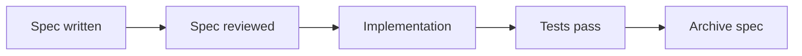

# IEC-FOUNDATION-DIAGRAMS-ARE-PLAIN-TEXT: Diagrams Live as Mermaid

**Layer**: 1
**Categories**: foundation, diagrams, plain-text
**Applies-to**: all
**Summary**: Diagrams live as Mermaid in fenced code blocks — diffable, renderable, and agent-readable.

## Principle

Every diagram that belongs in the repo belongs in Mermaid. Mermaid renders in VitePress, on GitHub, and in most Markdown viewers. It stays diffable as plain text. ASCII art is a picture made of punctuation with no structure underneath — the next agent reading the file sees a wall of characters, not a graph. PNG exports drift from the source and cannot be edited.

## Why it matters

An agent reading a Mermaid diagram can understand the structure — nodes, edges, labels. An agent reading ASCII art sees punctuation. A PNG is invisible. The diagram that the agent cannot parse is a diagram the agent cannot reason about.

## Violations to detect

- Diagrams committed as PNG, SVG, or JPEG without Mermaid source
- ASCII art diagrams (box-art made of `|`, `+`, `-`) where Mermaid would work
- Architecture diagrams stored in external tools (draw.io, Lucidchart) with no `docs/` equivalent

## Good practice



Stays in a fenced ` ```mermaid ` block. Renders on GitHub, VitePress, and in any Mermaid-compatible viewer. Diffable in `git diff`.

## Sources

- intent-book, *"Plain Text as Code" chapter*, foundation section.
- Mermaid.js, https://mermaid.js.org.
